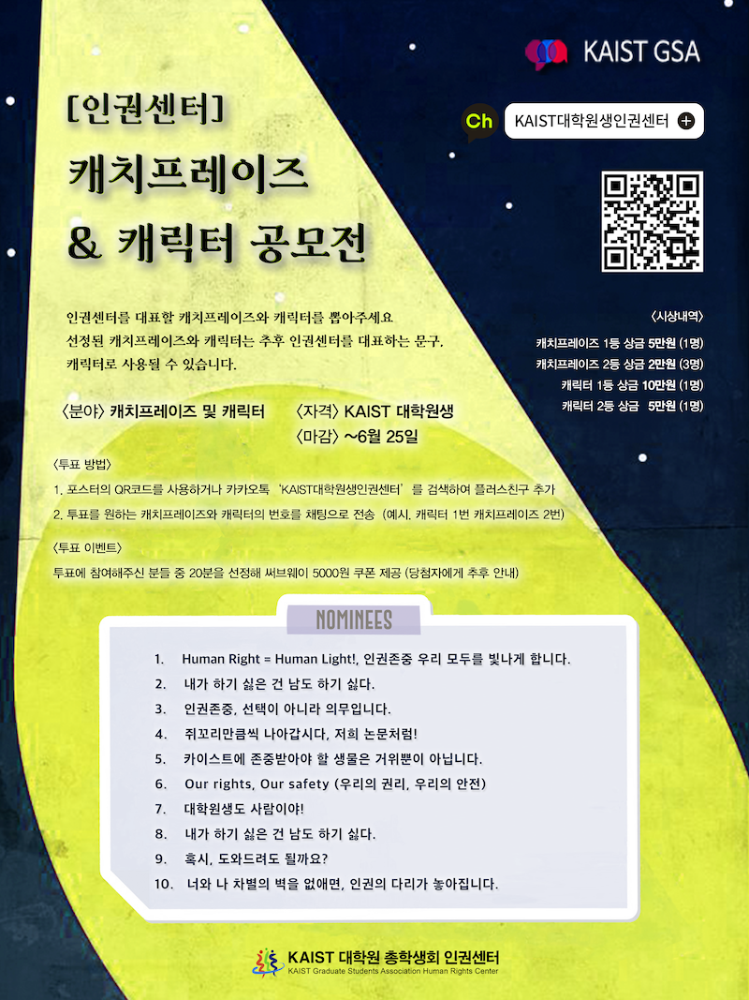
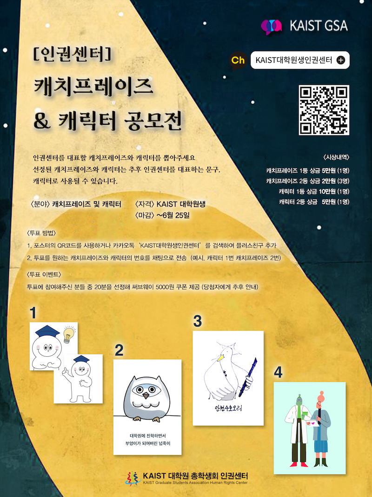

대학원생 인권센터: 2021년 상반기 인권윤리센터 협력 사업 사업보고서
===

## 담당자
- 대학원생 인권센터 센터장 

## 공식 사업명
- 인권윤리센터 협력사업 

## 추진 배경
- KAIST 대학원 인권센터가 있음에도 불구하고, 학생들이 정보의 부족으로 인권센터의 도움을 받지 못하는 경우가 있음.
- 인권센터에 대한 접근성을 강화하기 위해 인권센터 카카오톡 플러스 친구를 늘리고, 인권센터에서 도움을 받을 수 있는 점에 대한 홍보가 필요함.
- 특히 현재 사용하고 있는 메일을 통한 메일링 외에 더 가볍게 정보를 전달 할 수 있는 카카오톡 플러스 친구를 통한 메일링을 계획하고 있음
- 학생들이 인권센터를 더 친근하게 느낄 수 있도록  홍보 시 인권센터를 대표할 수 있는 캐릭터와 캐치 프레이즈가 필요 

## 사업 목표
- 인권센터 카카오톡 플러스친구 수를 늘리고 인권센터에서 받을 수 있는 도움을 홍보.
- 인권센터를 대표하는 캐릭터와 캐치 프레이즈 선정

## 일시 
- 2021년 6월 1일 ~ 6월 25일

## 장소 
- 캐치프레이즈 및 캐릭터를 온라인 구글폼으로 제출받고, 카카오톡 플러스친구 대상으로 캐치프레이즈 및 캐릭터 선정을 위한 투표 진행 예정.
- 카이스트 포탈, 원총 인스타그램, 인권센터 메일 등 다양한 창구를 통해 홍보 진행.

## 사업 진행 결과 
- 캐치프레이즈&캐릭터 공모전을 통해 인권센터를 홍보함과 동시에, 인권센터 카카오톡 플러스친구를 대상으로 투표를 진행함으로써, 홍보를 진행
- 공모전에는 총 15명 캐릭터 및 캐치프레이즈 투표에는 100명 가까운 학생들이 참여했고 모두 카카오톡 플러스친구로 유입됨.
- 추후 플러스 친구나 인권센터 홍보를 위한 캐릭터 및 캐치프레이즈 확보.

## 결산
- **총 300,000 원 중 0 원 집행** (인권윤리센터 지원)
    - 일반회계: 0 원
    - 학생회계: 0 원

|   내용  |   단가  |   수량  |   예산  |   결산  |   비고  |
|---|---|---|---|---|---|
|   예비비  |     |    |   300,000  |   0  |   학생회계  |
|   사업비 총액  |      |      |   300,000  |   0  |      |
|   일반회계 총액  |     |     |   -  |   -  |     |
|   학생회계 총액  |     |     |  300,000   |  -   |     |

(단위: 원)

## 사진

## 경품 수여자 학번, 성명 및 연락처
- 인권윤리센터 지급으로 생략
