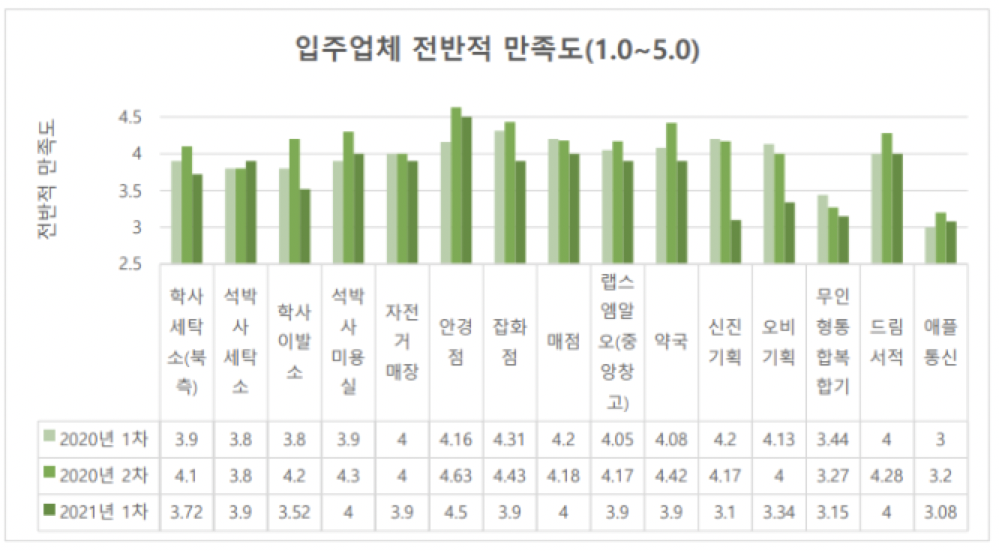
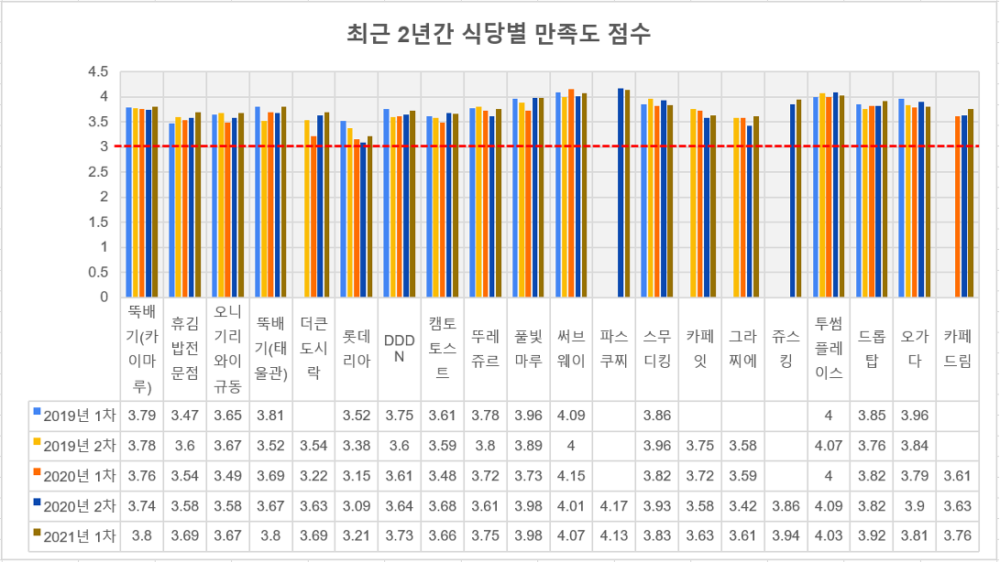
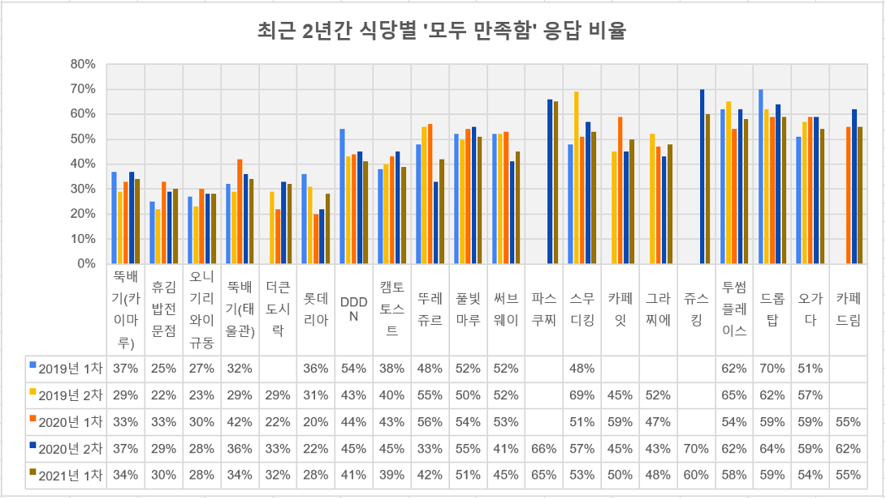
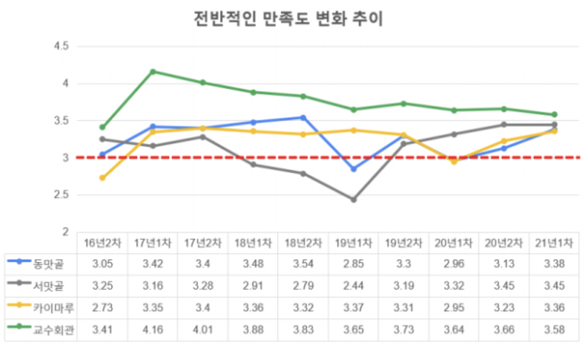

입주업체모니터링위원회: 2021년 상반기 입주업체만족도조사 사업보고서
===

## 담당자
- 입주업체모니터링위원회 위원장

## 공식 사업명
- 2021년도 상반기 입주업체만족도 조사 

## 추진 배경
- 입주업체모니터링위원회는 매년 2회 만족도조사를 실시하여 교내 요식업체 및 생활업체 운영에 만족도를 조사하고, 운영에 대한 학생들의 의견을 물어 개선방향을 설정하는 데 주된 근거로 활용
- 설문조사 결과는 실제로 입주업체 개선이나 주의/경고 부과로 이어졌고, 원총의 식당 관련 주요 의사 결정에 판단 근거 자료로도 활용됨

## 사업 목표
- 식당 운영 전반(맛/위생/서비스 등)과 입주업체 운영 전반 (서비스 품질/가격/친절도)에 대해 학생들이 직접 평가하고 위원회가 그 의견을 수렴
- 설문조사 결과를 학생들의 불만을 해소하고 업체 운영을 개선하는 데에 활용

## 일시 
- 온라인(단체급식식당, 일반요식업체, 생활업체 및 시설) 만족도조사를 5월 17일 ~ 28일에 진행.

## 장소 
- 온라인 설문조사: 구글 설문조사 활용하여 전체 메일링, 학내 게시판 및 식당내 식탁 등에 홍보

## 사업 진행 결과 
### 단체식당 입주업체 만족도 조사 결과
- 20년 2차 만족도조사와 대비하여 동맛골 3.13 → 3.38, 서맛골 3.45 → 3.45, 카이마루 3.23 → 3.36, 교수회관 3.66 → 3.58으로 전 단체 식당이 3점을 넘었음.
- 설문조사 결과는 총무팀을 통해 각 식당에 전달하고, 대학원 총학생회 홈페이지 내 모니터링위원회 게시판에 업로드하여 공개함. 추후 식당 개선 및 식당 재계약 평가를 위한 객관적 데이터로 사용될 예정임.
- 식습관 조사 결과: 중복인원을 제외하고 총 1513명이 식습관 또는 식이 원칙 조사에 응답하였으며, 그 결과는 표 1과 같음.

#### 표 1. 2년간 소수 식습관 비율
<table>
<thead>
  <tr>
    <th colspan="2">응답자가 평가한 식당</th>
    <th>카이마루 학사식당</th>
    <th>교수회관</th>
    <th>동맛골</th>
    <th>서맛골</th>
  </tr>
</thead>
<tbody>
  <tr>
    <td rowspan="4">채식 또는 할랄 비율(%)</td>
    <td>2019년 2차</td>
    <td>11.8</td>
    <td>2.4</td>
    <td>5.5</td>
    <td>4.8</td>
  </tr>
  <tr>
    <td>2020년 1차</td>
    <td>3.0</td>
    <td>1.2</td>
    <td>3.0</td>
    <td>4.3</td>
  </tr>
  <tr>
    <td>2020년 2차</td>
    <td>3.4</td>
    <td>3.8</td>
    <td>3.6</td>
    <td>3.9</td>
  </tr>
  <tr>
    <td>2021년 1차</td>
    <td>4.8</td>
    <td>3.2</td>
    <td>3.6</td>
    <td>5.1</td>
  </tr>
</tbody>
</table>

- 응답에 따른 각 단체급식식당별 개선이 필요한 부분
  - 동맛골: 전체적으로 식단 다양성과 음식의 맛이 공통적으로 지적되고 있으며, 코너별 만족도에서 2점대를 받은 평일석식, 주말/공휴일 식사는 크게 개선이 필요함. 
  - 서맛골: 조식, 중식, 석식을 모두 운영하는 식당 중에서 가장 만족도 점수가 높지만, 식단의 다양성 문제, 가격대비 만족도, 음식의 맛, 음식의 질에 대한 지적 사항이 있음. 이전 조사에서 일품 메뉴가 한주마다 반복적으로 나오는 것에 문제를 제기하는 경우가 꽤있었고, 이후 고기 국수, 중화비빔밥, 수육국밥, 냉소바 등 좀 더 다양한 음식들이 선보여지며 다양성에 대한 응답이 조금은 나아진 모습을 보였음.
  - 카이마루: 가장 개선이 필요하다고 생각되는 항목에 대한 응답으로는 양(249), 식단의 다양성(224), 맛(129)이었음. 과거 조사에 비해 양의 개선이 필요하다고 응답한 비율이 높아졌는데, 자율배식이라는 이름이지만 주찬의 리필을 제한한 경우가 많아서 이용자의 불만이 표출된 것으로 해석됨. 다양성과 맛의 문제는 계속해서 언급되고 있는 부분으로 식단의 다양성이 카이마루 학사식당의 고질적인 문제로 나타남.
  - 교수회관: 가장 개선이 시급한 항목에 대해서는 이전과 같이 유사한 식단이 반복된다는 의견이 대폭 증가하여 여전히 70%에 육박하여 개선이 필요한 것으로 보임. 탄수화물 위주의 식단에 대한 불만은 39.76% 에서 41.99% 로 다시 다소 증가하였음.
  - 설문조사 결과 보고서 전문은 원총 홈페이지에 업로드한 별도의 [첨부파일](https://gsa.kaist.ac.kr/rms_notice/182447)을 참조 바람.

#### 표 2. 2021년도 상반기 단체급식식당 만족도조사 전체 만족도 및 메뉴별 만족도 결과
<table>
<thead>
  <tr>
    <th>구분 (응답수)</th>
    <th colspan="2">동맛골 (531)</th>
    <th colspan="2">서맛골 (336)</th>
    <th colspan="2">카이마루 학사식당 (397)</th>
    <th colspan="2">교수회관 (249)</th>
  </tr>
</thead>
<tbody>
  <tr>
    <td>전체 만족도</td>
    <td colspan="2">3.38</td>
    <td colspan="2">3.45</td>
    <td colspan="2">3.36</td>
    <td colspan="2">3.58</td>
  </tr>
  <tr>
    <td rowspan="7">메뉴별 만족도 (1.0 ~ 5.0)</td>
    <td>조식(한식)</td>
    <td>3.36</td>
    <td>조식</td>
    <td>3.28</td>
    <td>자율배식(주중)</td>
    <td>3.28</td>
    <td>중식</td>
    <td>3.57</td>
  </tr>
  <tr>
    <td>조식(아메리칸)</td>
    <td>3.26</td>
    <td>한식(주중)</td>
    <td>3.37</td>
    <td>자율배식(주말)</td>
    <td>2.95</td>
    <td>석식</td>
    <td>3.36</td>
  </tr>
  <tr>
    <td>중식(카페테리아)</td>
    <td>3.38</td>
    <td>한식(주말)</td>
    <td>3.28</td>
    <td colspan="2" rowspan="5"></td>
    <td colspan="2" rowspan="5"></td>
  </tr>
  <tr>
    <td>중식(일품)</td>
    <td>3.23</td>
    <td>일품</td>
    <td>3.31</td>
  </tr>
  <tr>
    <td>평일 석식</td>
    <td>2.92</td>
    <td colspan="2" rowspan="3"></td>
  </tr>
  <tr>
    <td>2층 교직원</td>
    <td>3.33</td>
  </tr>
  <tr>
    <td>주말/공휴일 식사</td>
    <td>2.73</td>
  </tr>
</tbody>
</table>

#### 그림 1. 단체급식식당 입주업체만족도 점수 변화 추이

### 일반요식업체 입주업체 만족도 조사 결과
- 20년 2차 만족도조사와 대비하여 카이마루 뚝배기 3.74→3.8, 휴김밥전문점 3.58→3.69, 오니기리와이규동 3.58→3.67, 태울관 뚝배기 3.67→3.8, 더큰도시락 3.63→3.69, 롯데리아 3.09→3.21, DDDN 3.64→3.73, 캠토토스트 3.68→3.66, 풀빛마루 3.98→3.98, 써브웨이 4.01→4.07, 스무디킹 3.93→3.83, 카페잇 3.58→3.63, 그라찌에 3.42→3.61, 투썸플레이스 4.09→4.03, 드롭탑 3.82→3.92, 오가다 3.9→3.81, 카페드림 3.63→3.76점을 기록함.
- 전 업체 모두 만족도 점수가 3점을 넘었으며, 일반식당에서는 풀빛마루, 카페 및 베이커리에서는 파스쿠찌가 가장 만족도점수가 높았음.
- 설문조사 결과 보고서 전문은 원총 홈페이지에 업로드한 별도의 [첨부파일](https://gsa.kaist.ac.kr/rms_notice/182447)을 참조 바람.

### 생활업체 및 시설 입주업체 만족도 조사 결과
- 교내 세탁소, 이발소 등 생활 편의 업체 및 시설이 조사 대상이며, 각 업체에 대해 최근 6개월 간 사용한 경험이 있는 응답자들의 평가를 취합하여 작성하였으며, 총 213명이 만족도조사에 응답함.
- 위탁업체들의 만족도 점수는 지난 학기 조사와 비교하여 석박사세탁소를 제외한 모든 업체의 만족도가 하락하는 모습을 보였지만, 모두 3점을 넘어 경고 부과 대상은 없었음. 코로나 사태로 인한 이용자 수 감소 장기화로 업체의 경쟁력이 점점 하락하고 있다고 판단됨.
- 코로나 사태로 인해, 분기별/반기별 각 업체 직접 방문 및 서비스 품질 모니터링, 외부 동종 업체들과 가격 비교 작업 등은 미실시. 상황이 안정되면 추후 관련 활동을 진행할 예정임. 
- 설문조사 결과 보고서 전문은 원총 홈페이지에 업로드한 별도의 [첨부파일](https://gsa.kaist.ac.kr/rms_notice/182447)을 참조 바람.

| 업체명 	| 응답자(명) 	| 전체 만족도 	| 음식 맛 	| 음식 질 	| 음식 양 	| 가격 대비 만족도 	| 시설 및 위생 	| 친절도 및 서비스 	|
|---	|---	|---	|---	|---	|---	|---	|---	|---	|
| 뚝배기(카이마루) 	| 256 	| 3.80 	| 23% 	| 41% 	| 9% 	| 12% 	| 19% 	| 2% 	|
| 휴김밥전문점 	| 247 	| 3.69 	| 26% 	| 29% 	| 9% 	| 30% 	| 10% 	| 3% 	|
| 오니기리와이규동 	| 234 	| 3.67 	| 29% 	| 29% 	| 12% 	| 39% 	| 5% 	| 3% 	|
| 뚝배기(태울관) 	| 235 	| 3.80 	| 20% 	| 33% 	| 12% 	| 17% 	| 20% 	| 3% 	|
| 더큰도시락 	| 203 	| 3.69 	| 19% 	| 30% 	| 29% 	| 31% 	| 6% 	| 5% 	|
| 롯데리아 	| 250 	| 3.21 	| 33% 	| 32% 	| 20% 	| 48% 	| 10% 	| 12% 	|
| DDDN 	| 186 	| 3.73 	| 18% 	| 14% 	| 17% 	| 27% 	| 5% 	| 5% 	|
| 캠토토스트 	| 199 	| 3.66 	| 10% 	| 14% 	| 24% 	| 23% 	| 1% 	| 10% 	|
| 뚜레쥬르 	| 245 	| 3.75 	| 10% 	| 14% 	| 13% 	| 25% 	| 4% 	| 9% 	|
| 풀빛마루 	| 210 	| 3.98 	| 15% 	| 10% 	| 17% 	| 21% 	| 2% 	| 4% 	|
| 써브웨이 	| 296 	| 4.07 	| 3% 	| 6% 	| 9% 	| 16% 	| 9% 	| 29% 	|
| 파스쿠찌 	| 229 	| 4.13 	| 5% 	| 4% 	| 6% 	| 14% 	| 2% 	| 10% 	|
| 스무디킹 	| 158 	| 3.83 	| 11% 	| 8% 	| 6% 	| 24% 	| 4% 	| 8% 	|
| 카페잇 	| 129 	| 3.63 	| 14% 	| 12% 	| 9% 	| 25% 	| 5% 	| 4% 	|
| 그라찌에 	| 151 	| 3.61 	| 16% 	| 17% 	| 9% 	| 20% 	| 3% 	| 7% 	|
| 쥬스킹 	| 173 	| 3.94 	| 10% 	| 11% 	| 6% 	| 12% 	| 2% 	| 2% 	|
| 투썸플레이스 	| 232 	| 4.03 	| 4% 	| 4% 	| 5% 	| 22% 	| 5% 	| 9% 	|
| 드롭탑 	| 145 	| 3.92 	| 7% 	| 10% 	| 9% 	| 22% 	| 3% 	| 3% 	|
| 오가다 	| 160 	| 3.81 	| 6% 	| 7% 	| 9% 	| 30% 	| 4% 	| 5% 	|
| 카페드림 	| 137 	| 3.76 	| 16% 	| 14% 	| 10% 	| 19% 	| 2% 	|  	|

#### 그림 2. 일반 요식업체 별 최근 2년간 만족도 점수 및 ‘모두 만족함’ 응답 비율

#### 그림 3. 생활업체 및 시설 전반적 만족도 추이

## 결산
- **총 예산 1,840,000 원 중 1,361,800 원 집행 (학생회계)**

| 내용 	| 단가 	| 수량 	| 예산 	| 결산 	| 비고 	|
|---	|---	|---	|---	|---	|---	|
| 설문조사 경품 	| 100,000 	| 4 	| 400,000 	| 400,000 	| 학생회계 	|
| 설문조사 활동비(오프라인) 	| 100,000 	| 1 	| 100,000 	| 47,000 	| 학생회계 	|
| 회의비 	| 10,000 	| 23 	| 230,000 	| 205,200 	| 학생회계 	|
| 회식비 	| 30,000 	| 23 	| 690,000 	| 590,100 	| 학생회계 	|
| 교외식당 비교모니터링 지원 	| 10,000 	| 17 	| 170,000 	| 0 	| 학생회계 	|
| 생활분과 활동 실비 지원 	| 30,000 	| 5 	| 150,000 	| 30,000 	| 학생회계 	|
| 예비비 	| 100,000 	| 1 	| 100,000 	| 89,500 	| 학생회계 	|
| 사업비 총액 	|  	|  	| 1,840,000 	| 1,361,800 	|  	|
| 일반회계 총액 	|  	|  	| - 	| - 	|  	|
| 학생회계 총액 	|  	|  	| 1,840,000 	| 1,361,800 	|  	|

(단위: 원)

## 경품 수여자 학번, 성명 및 연락처
<table>
<thead>
  <tr>
    <th> 번호 </th>
    <th> 학번 </th>
    <th> 성명 </th>
    <th> 연락처 </th>
    <th> 경품 </th>
  </tr>
</thead>
<tbody>
  <tr>
    <td> 1 </td>
    <td> 201953** </td>
    <td> 강운* </td>
    <td> 010-2047-**** </td>
    <td> 10만원 문화상품권 </td>
  </tr>
  <tr>
    <td> 2</td>
    <td> 202134** </td>
    <td> 이상* </td>
    <td> 010-6854-**** </td>
    <td> 10만원 문화상품권 </td>
  </tr>
  <tr>
    <td> 3</td>
    <td colspan="3"> (학생회비 미납부로 인한 재추첨 예정) </td>
    <td> 10만원 문화상품권 </td>
  </tr>
  <tr>
    <td> 4</td>
    <td colspan="3"> (학생회비 미납부로 인한 재추첨 예정) </td>
    <td> 10만원 문화상품권 </td>
  </tr>
</tbody>
</table>
