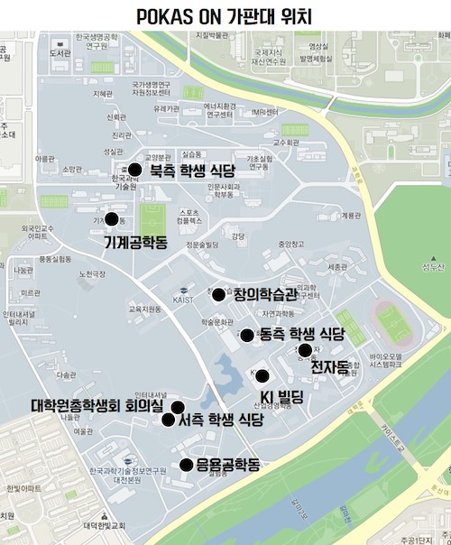
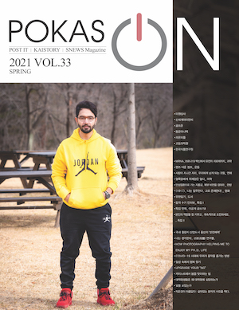
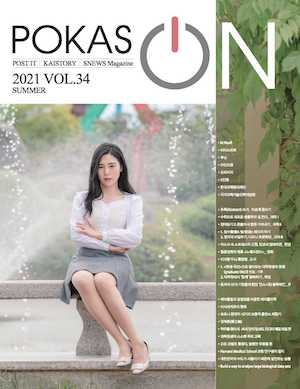

대학원 총학생회 집행부 2021년 상반기 POKAS ON 발간 지원 사업보고서
===

## 공식 사업명
- 2021년 상반기 이공계 대학원 공동 소식지 POKAS ON 발간지원

## 담당자
- 제49대 대학원 총학생회 대외협력부장

## 추진 배경
- 포스텍, KAIST, 서울대 총 세 개 대학에 다니는 대학원생들에게 각 대학 별 및 대학 간 소통의 장을 열기 위해 2015년부터 계간지 POKAS ON이 발간되고 있음.
- 대학원생들에 의한, 대학원생들을 위한 대학연합 계간지는 흔치 않은 상황 속에서 대학원생들에게 도움이 되는 연구, 진로, 연애, 대학생활 등 여러 주제를 망라한 POKAS ON의 발간을 지원함으로써 우리 학교 학생들에게 유용한 정보를 제공하고자 함. 
- POKAS ON을 대학원생 간의 소통과 교류, 화합의 장으로 삼아 차후 세 개 대학 간 혹은 대학원생 커뮤니티를 활성화할 수 있을 것으로 기대함.

## 사업 목표
- 계간지 POKAS ON에서 KAIST에 할당된 지면 및 기사를 작성 (한 건 당 최소 4편 이상)
- POKAS ON 발간을 주제로, 주기적인 회의 자리를 가지며 세 개 대학 간 소통을 활성화

## 일시

| 일시 | 내용 | 홍보물 | 
|---|---|---|
| 2021-03 ~ 2021-08 | - 가판대 관리 - 발간처 및 포스텍/서울대와의 상시 협력 - 학우 민원/건의 상시 대응 | |
| 2021-05-18 ~ 2021-05-21 | POKAS ON 여름호 기고글 모집 | [KAIST 포탈](https://portal.kaist.ac.kr/ennotice/student_notice/11621316258357) |
| 2021-08-10 ~ 2021-08-20 | POKAS ON 가을호 기고글 모집 | [GSA홈페이지](https://gsa.kaist.ac.kr/notice/185252) [KAIST 포탈](https://portal.kaist.ac.kr/ennotice/student_notice/11628567407449) |

## 장소
- 온라인 매거진: http://pokas.gsalab.co.kr/magazine/m_list?type=0
- 오프라인 매거진 가판대 위치  
    

## 사업 진행 결과

1. 기고글 모집
    - KAIST 구성원을 대상으로 GSA 홈페이지 내 서비스를 통한 기고글 [상시 모집](https://gsa.kaist.ac.kr/serviceForm?serviceId=819)을 진행하고 있음.
        - 3월호 4편, 6월호 4편으로 총 8편을 모집함.
    - 모집된 글의 분량 및 다양성을 고려하여 POKAS ON에 실을 기사를 확정함.
2. 검토 및 발간 작업
    - 오탈자 및 내용 확인 등 POKAS ON 기고글로서의 적절성을 검토함.
    - 6월호의 경우 KAIST에서 표지 모델의 섭외 및 인터뷰를 진행함.
    - POKAS ON 발간처(윌커뮤니티)와 협력 하에 계간지 완성 및 인쇄를 진행함.
3. 홍보 및 배포
    - 발간된 POKAS ON 배포 및 홍보를 진행함.
        - 서측 학생회관을 포함한 교내 10개 가판대를 통해 배포함.
        - 3월호 235부, 6월호 216부 배포
4. 원고료 지급
    - 기고자를 대상으로 원고료 지급 및 POKAS ON 인쇄본을 증정함.
        - 윌커뮤니티에서 지급하는 원고료에 부족분을 더해 10만 원으로 맞춰 지급함.
5. 협력
    - 6월 포스텍에서 POKAS ON 발간 회의를 가졌으며, 앞으로 방향성 및 컨텐츠 기획을 진행함.

## 결산: 총 예산 2,400,000 원 중 657,000 원 집행
- 일반회계: 0 원
- 학생회계: 2,400,000 원 중 657,000 원 집행 

| **내용** | **단가** | **수량** | **예산** | **결산** | **회계구분** |
|:---:|:---:|:---:|:---:|:---:|:---:|
| 원고료 지원(100,000 원/원고) | 100,000 | 10 | 1,000,000 | 657,000 | 학생회계 |
| POKAS ON 계간지 가판대 관리비 (1-2회 관리/주) | 100,000 | 12 | 1,200,000 | 0 | 학생회계 |
| 예비비 | 200,000 | 0 | 200,000 | 0 | 학생회계 |
| **사업비 총액** |  |  | **2,400,000** | **657,000** |  |
| **일반회계 총액** |  |  | **0** | **0** |  |
| **학생회계 총액** |  |  | **2,400,000** | **657,000** |  |

## 사진
  

## 경품 수여자
- 없음.