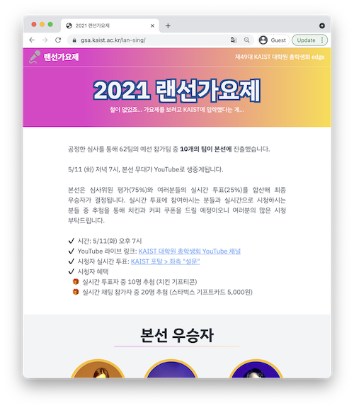
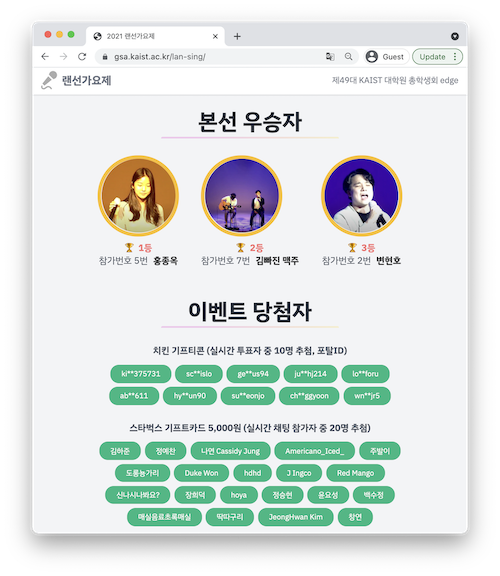
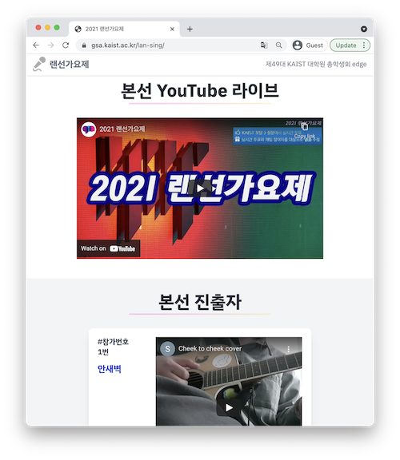
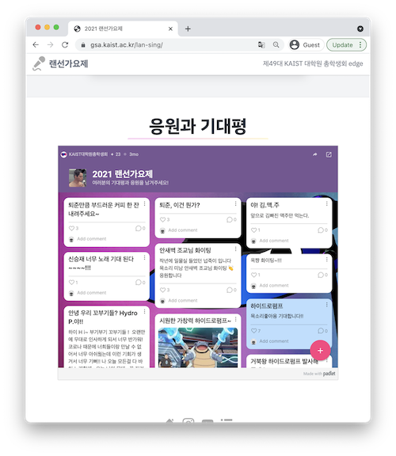
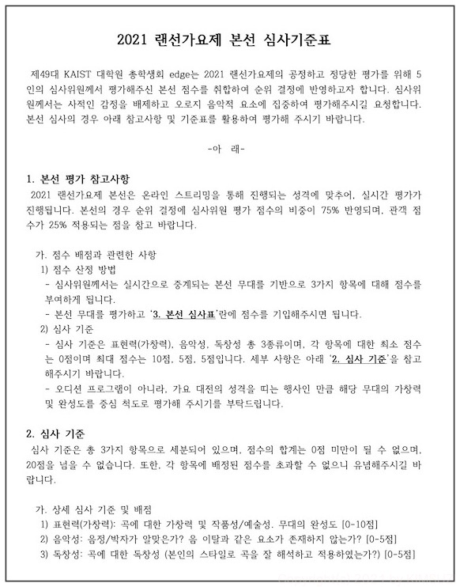
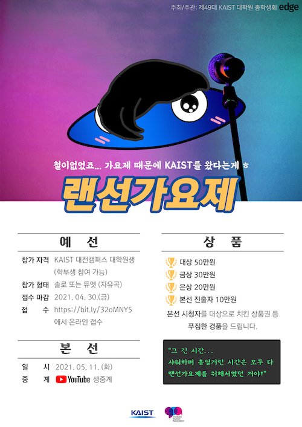
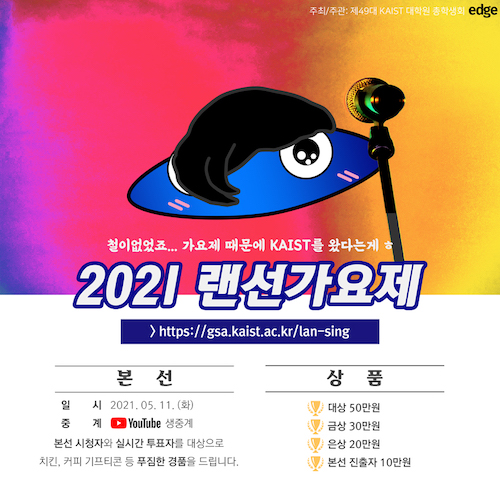

대학원 총학생회 집행부 2021년 상반기 랜선 가요제 사업보고서
===

## 공식 사업명
- 2021년 상반기 랜선 가요제

## 담당자
- 제49대 대학원 총학생회 생활부장

## 추진 배경
- 코로나 발생으로 인해 사회적 거리두기가 장기화 됨에 따라 학생들이 참여할 수 있는 행사와 공연이 적어짐.
- 학생들이 즐길 수 있는 온라인 공연을 개최하여 잠시나마 스트레스를 해소할 수 있도록 돕고자 함.

## 사업 목표
- KAIST 학생들이 다 같이 즐길 수 있는 온라인 가요제를 개최하여 친구들의 공연을 관람할 수 있도록 함.

## 일시
| 일시 | 내용 |
|---|---|
| 2021-04-19 | 예선 접수 시작 |
| 2021-04-30 | 예선 접수 마감 |
| 2021-04-30 ~ 2021-05-04 | 예선 심사 |
| 2021-05-11 오후 7시 | 본선 |
| 2021-05-12 ~ 2021-06-11 | 랜선 가요제 시청자 대상 이벤트 경품 배포 |

## 장소
- YouTube Live를 통한 온라인 중계
- 본선 장소: 월평아이빅실용음악학원 (대전광역시 서구 청사로123번길 41)

## 사업 진행 결과

### 1. 예선
   - KAIST 학부/대학원 학생을 대상으로 랜선 가요제 참가자 모집을 진행했으며, 총 62팀이 신청함.
   - 사전 녹화된 YouTube 영상링크를 통해 본선 참가자 10팀을 선발함.
   - 공연 진행 시 5인 미만으로 한 공간에 있도록 참가대상은 솔로 또는 듀엣으로만 한정함.

### 2. 본선
   - 방역 수칙 아래 참가자 동선을 분리한 상태로 오프라인 공연을 진행하고 이를 실시간 방송 플랫폼(YouTube)을 통해 온라인 중계함. 
   - 실시간 방송 호응을 높이기 위해 치킨 기프트콘과 스타벅스 쿠폰을 랜덤 지급함. 
   - 본선 심사는 심사위원 75% 온라인 투표 25%로 합계함.
   - 온라인 투표는 교내 구성원 대상으로 중복 투표를 방지하기 위해 KAIST 포탈 설문 기능을 이용함.
   - 랜선가요제 홈페이지를 통해 공연 영상, 참가자 안내, 이벤트 당첨자 안내를 공유함.
      - 웹사이트 링크: https://gsa.kaist.ac.kr/lan-sing/ 

         
   

### 3. 심사
#### 3.1 예선 심사 기준표

#### 4.1 본선 심사 기준표

## 결산: 총 예산 5,300,000 원 중 4,182,050 원 집행
- 일반회계: 2,900,000 원 중 2,150,000 원 집행 (가. 대학원생 문화증진사업)
- 학생회계: 2,400,000 원 중 2,032,050 원 집행

| **내용** | **단가** | **수량** | **예산** | **결산** | **회계구분** |
|:---:|:---:|:---:|:---:|:---:|:---:|
| 가요제 홍보 포스터 디자인비 | 300,000 | 1 | 300,000 | 0 | 일반회계 | 
| 가요제 신청 웹사이트 제작비 | 600,000 | 1 | 600,000 | 150,000 | 일반회계 | 
| 스튜디오 대여 및 방송 진행비 | 1,000,000 | 1 | 1,000,000 | 1,000,000 | 일반회계 | 
| 예선 심사위원비 | 100,000 | 5 | 500,000 | 500,000 | 일반회계 | 
| 본선 심사위원비 | 100,000 | 5 | 500,000 | 500,000 | 일반회계 | 
| 경품비 | 2,000,000 | 1 | 2,000,000 | 1,900,000 | 학생회계 | 
| 예비비 | 400,000 | 1 | 400,000 | 132,050 | 학생회계 | 
| **사업비 총액** |  |  | **5,300,000** | **4,182,050** |  |
| **일반회계 총액** |  |  | **2,900,000** | **2,150,000** |  |
| **학생회계 총액** |  |  | **2,400,000** | **2,032,050** |  |

## 사진

## 경품 수여자
### 수상자

| 번호 | 학번 | 성명 | 연락처 | 경품 |
|:--:|:--:|:--:|:--:|:--:|
| 1  | 201\*06\*9 | 홍\*옥 | 010-71\*2-63\*7 | 500,000 원 (1등 상금) |  
| 2  | 202\*53\*6 | 조\*준, 안\*주 (김빠진 맥주) | 010-96\*0-85\*9 | 300,000 원 (2등 상금) | 
| 3  | 201\*54\*3 | 변\*호 | 010-23\*5-96\*5 | 200,000 원 (3등 상금) | 
| 4  | 202\*54\*5 | 김\*준, 임\*태 (카페사장퇴준) | 010-68\*0-59\*9 | 100,000 원 (본선 진출자) |
| 5  | 201\*52\*6 | 최\*찬 (하이드로펌프) | 010-89\*5-18\*7 | 100,000 원 (본선 진출자) |
| 6  | 202\*30\*3 | 김\*수 (Sublé) | 010-34\*0-20\*4 | 100,000 원 (본선 진출자) |
| 7  | 202\*51\*8 | 신\*재 (‘가왕’ 김기수의 친구) | 010-47\*3-09\*8 | 100,000 원 (본선 진출자) |
| 8  | 201\*80\*7 | 안\*벽 | 010-20\*3-52\*8 | 100,000 원 (본선 진출자) |
| 9  | 202\*52\*5 | 이\*주 (졸업할수있을까?휴) | 010-89\*9-71\*5 | 100,000 원 (본선 진출자) |
| 10 | 202\*00\*6 | 김\*연 | 010-31\*9-13\*9 | 100,000 원 (본선 진출자) |

### 본선 중 실시간 투표자 중 10명 추첨

| 번호 | 학번 | 성명 | 연락처 | 경품 |
|:--:|:--:|:--:|:--:|:--:|
| 11 | 202\*50\*5 | 김\*재 | 010-62\*7-57\*1 | 치킨 기프티콘 (2만원 상당) | 
| 12 | 202\*53\*9 | 정\*영 | 010-34\*0-42\*7 | 치킨 기프티콘 (2만원 상당) | 
| 13 | 201\*33\*2 | 심\*서 | 010-45\*5-97\*1 | 치킨 기프티콘 (2만원 상당) | 
| 14 | 202\*53\*1 | 정\*지 | 010-82\*4-50\*5 | 치킨 기프티콘 (2만원 상당) | 
| 15 | 202\*34\*3 | 이\*담 | 010-51\*0-92\*4 | 치킨 기프티콘 (2만원 상당) | 
| 16 | 202\*31\*6 | 김\*선 | 010-56\*9-40\*1 | 치킨 기프티콘 (2만원 상당) | 
| 17 | 201\*51\*6 | 방\*은 | 010-89\*6-96\*6 | 치킨 기프티콘 (2만원 상당) | 
| 18 | 202\*36\*5 | 조\*현 | 010-66\*3-72\*9 | 치킨 기프티콘 (2만원 상당) | 
| 19 | 202\*33\*1 | 오\*균 | 010-86\*5-44\*9 | 치킨 기프티콘 (2만원 상당) | 
| 20 | 201\*03\*3 | 안\*석 | 010-66\*1-65\*5 | 치킨 기프티콘 (2만원 상당) | 

### 본선 중 실시간 채팅 참가자 중 20명 추첨 

- 2020년도의 제48대 대학원 총학생회에서 이월된 경품을 사용함.
- 총 20명을 추첨했으나 5명 미수령으로 총 15명에게 제공함. 

| 번호 | 학번 | 성명 | 연락처 | 경품 |
|:--:|:--:|:--:|:--:|:--:|
| 21 | 202\*31\*3 | 김\*준 | 010-53\*4-25\*6 | 스타벅스 기프트카드 (5,000원) |
| 22 | 202\*38\*7 | 정\*찬 | 010-49\*2-25\*9 | 스타벅스 기프트카드 (5,000원) |
| 23 | 201\*05\*9 | 정\*연 | 010-52\*5-34\*8 | 스타벅스 기프트카드 (5,000원) |
| 24 | 201\*05\*8 | 이\*안 | 010-66\*2-46\*8 | 스타벅스 기프트카드 (5,000원) |
| 25 | 202\*02\*6 | 박\*현 | 010-65\*7-35\*0 | 스타벅스 기프트카드 (5,000원) |
| 26 | 202\*32\*5 | 백\*연 | 010-65\*2-85\*0 | 스타벅스 기프트카드 (5,000원) |
| 27 | 201\*43\*6 | 김\*지 | 010-55\*1-73\*0 | 스타벅스 기프트카드 (5,000원) |
| 28 | 202\*35\*3 | 장\*덕 | 010-55\*7-61\*7 | 스타벅스 기프트카드 (5,000원) |
| 29 | 201\*50\*2 | 경\*기 | 010-73\*4-30\*0 | 스타벅스 기프트카드 (5,000원) |
| 30 | 201\*70\*3 | 윤\*성 | 010-40\*0-57\*6 | 스타벅스 기프트카드 (5,000원) |
| 31 | 200\*39\*8 | 임\*름 | 010-56\*2-18\*1 | 스타벅스 기프트카드 (5,000원) |
| 32 | 201\*51\*2 | 오\*렬 | 010-23\*8-05\*0 | 스타벅스 기프트카드 (5,000원) |
| 33 | 201\*05\*2 | 이\*수 | 010-32\*2-40\*8 | 스타벅스 기프트카드 (5,000원) |
| 34 | 201\*43\*3 | 김\*환 | 010-25\*8-09\*4 | 스타벅스 기프트카드 (5,000원) |
| 35 | 202\*30\*7 | 구\*연 | 010-48\*7-85\*6 | 스타벅스 기프트카드 (5,000원) |
