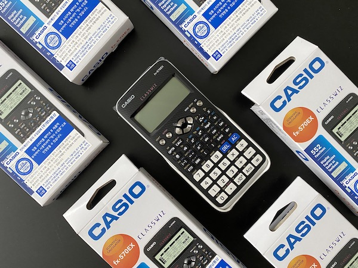
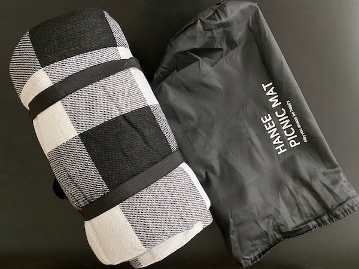
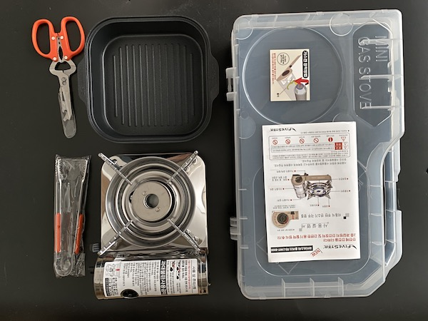
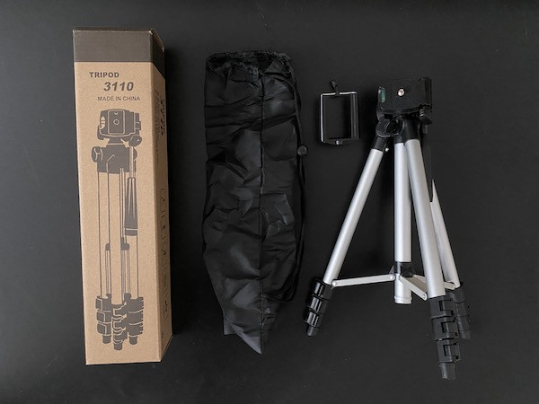
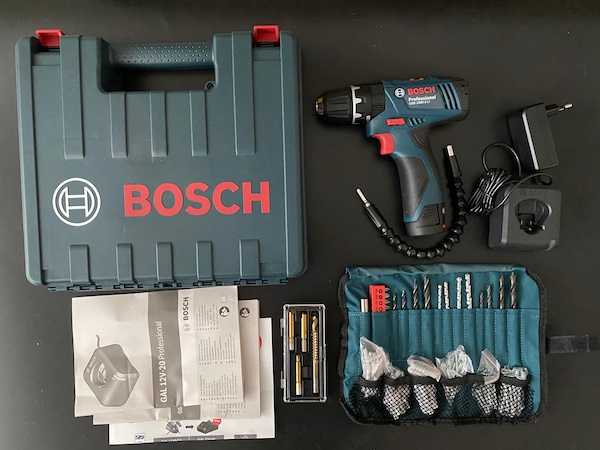
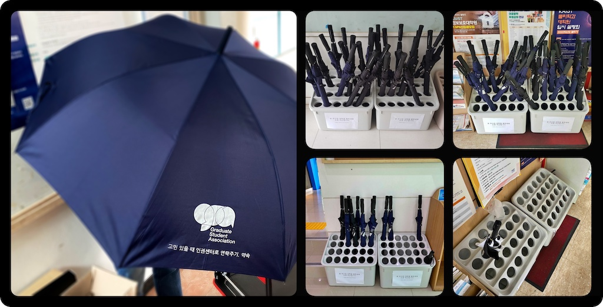

대학원 총학생회 집행부 2021년 상반기 물품대여사업 사업보고서
===

## 공식 사업명
- 2021년 상반기 물품대여사업

## 담당자
- 제49대 대학원 총학생회 생활부장

## 추진 배경
- 학우들이 대학원 총학생회를 좀 더 친근하고 가깝게 느끼게 할 필요가 있음.
- 대학원 총학생회에서 자주 사용하지 않는 물건을 파악하고, 학우 개인이 구비하기 어려운 물건은 대여해주어 더 널리 사용할 수 있게 할 수 있음.

## 사업 목표
- 대학원 총학생회에서 자주 사용하지 않는 물건을 파악
- 학우 개인이 구비하기 어려운 물건은 대여해 더 널리 사용할 수 있게 함.

## 일시
| 일시 | 내용 |
|---|---|
| 2021-03 ~ 2021-04 | 사업 기획 |
| 2021-04 ~ 2021-05 | 물품 구매 |
| 2021-06 ~ 2021-08 | 대여 진행 |

## 장소

| 내역 | 장소 | 
|---|---|
| 일반 물품 대여 및 반납 | 서측학생회관(W2) 대학원 총학생회 사무실(211호), 회의실(212호) | 
| 물품 보관 | 서측학생회관(W2) 창고(101호, 102호) | 
| 우산 배치 | 동측 학생식당(E5), 서측 학생식당(W2), 북측 학생식당(N11) | 

## 사업 진행 결과

- 구매를 진행한 물품 목록
  | 품명 | 수량 | 
  |---|---|
  | 공학용 계산기 | 10 |
  | 돗자리 | 2 |
  | 전동공구 | 1 |
  | 바베큐 세트 | 1 |
  | 삼각대 | 1 |
  | 손수레 | 2 |
  | 우산 | 100 |
- 물품은 대학원 총학생회 사무실에 상시 보관 중이며 추후 창고로 이전하여 관리하는 것이 필요해 보임.
- 우산의 경우 각 식당에 25개씩 배치하였으나 한 달이 지나고 동측을 제외하고 모두 사라졌기에, 남은 수량을 추가 배치 함. 동측의 경우도 우산이 배치된 출입문이 코로나로 인해 배치 이후 폐쇄되어서 남은 것으로 추정됨.
- 다양한 품목에 대해 물품 대여는 총 7건이 진행 완료되었으며, 예약 부도율(신청 후 방문 대여 진행하지 않은 경우)이 절반 정도였음. 
- 총 7건의 물품 구매 요청이 접수 되었으며, 추후 사업에 반영하여 구매 진행이 필요함.
  - 구매 요청 목록: 배드민턴, 레이저 포인터, 재무 계산기, 탁구채, 전원 릴선
- 온라인 신청을 통해 상시로 물품 대여와 물품 구매 요청을 받고 있음.
  - 물품 대여 신청 링크: https://forms.gle/5L8iAwiCGQwy3pew8 
  - 물품 구매 신청 링크: https://forms.gle/opFf2T3AQWyWSwZ38

## 결산: 총 예산 1,500,000 원 중 1,494,670 원 집행
- 일반회계: 1,000,000 원 중 1,000,000 원 집행 (다. 대학원생 건강증진사업)
- 학생회계: 500,000 원 중 494,670 원 집행

| **내용** | **단가** | **수량** | **예산** | **결산** | **회계구분** |
|:---:|:---:|:---:|:---:|:---:|:---:|
| 물품 구입비 | 1,000,000 | 1 | 1,000,000 | 1,000,000 | 일반회계| 
| 예비비 | 500,000 | 1 | 500,000 | 494,670 | 학생회계| 
| **사업비 총액** |  |  | **1,500,000** | **1,494,670** |  |
| **일반회계 총액** |  |  | **1,000,000** | **1,000,000** |  |
| **학생회계 총액** |  |  | **500,000** | **494,670** |  |

## 사진
- 대여를 진행하고 있는 물품 

## 경품 수여자
- 없음