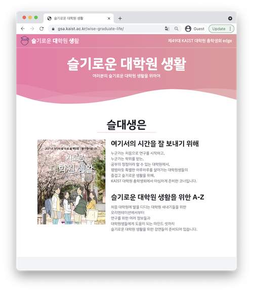
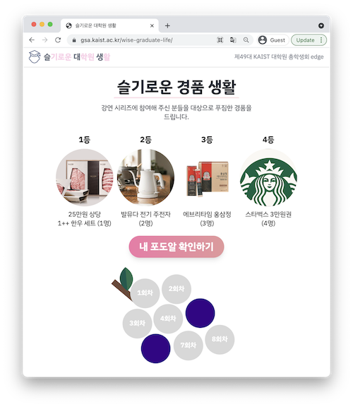
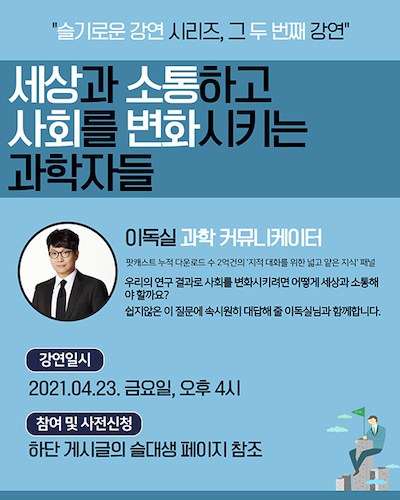
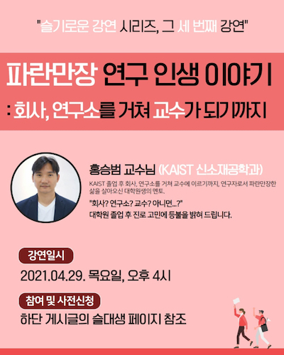
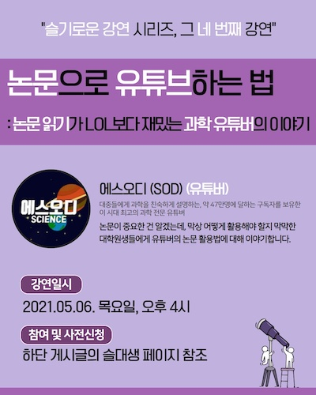
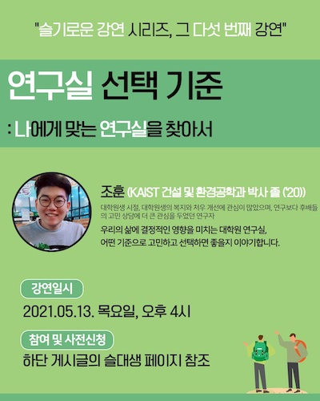
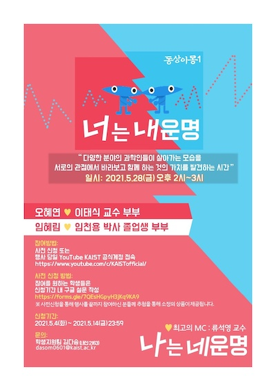
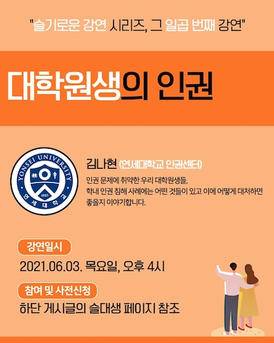
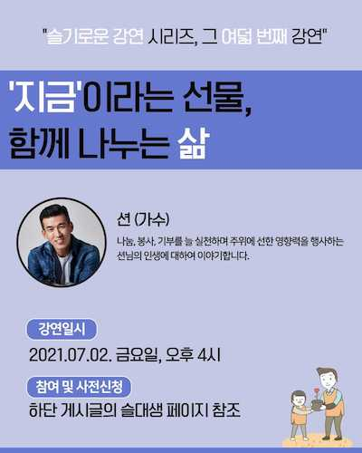

대학원 총학생회 집행부 2021년 상반기 슬기로운 대학원 생활 사업보고서
===

## 공식 사업명
- 2021년 상반기 슬기로운 대학원 생활 (구 2021년 상반기 석박사 유치원)

## 담당자
- 제49대 대학원 총학생회 기획부장

## 추진 배경
- 대학원 총학생회에서는 매년 대학원 신입생들을 대상으로 대학원 생활에 필요한 정보를 제공하고자 신입생 오리엔테이션을 진행해왔음.
- 신입생 오리엔테이션을 통해 제공되는 정보 외에도 대학원 신입생들이 궁금해하지만 답을 얻기 힘든 문제들이 많다는 의견이 제기되어옴.
- 2021년에는 신입생 오리엔테이션 외에도 연구실 선택방법 세미나를 비롯한 다양한 주제들을 선정하여 다회에 걸쳐 대학원 신입생들에게 도움이 되는 강연을 진행하기로 결정함.
- 2021년에는 코로나19 확산 방지를 위해 비대면 온라인 세미나 형식으로 진행함.

## 사업 목표
- KAIST 대학원 신입생들에게 대학원 생활에 도움이 되는 다양한 정보와 조언을 제공함.

## 일시

| 회차 | 일시 | 연사 | 제목 | 
|:---:|:---:|:---:|:---:|
| 1 | 2021-04-01 (목) 4PM | 최동혁 대학원 총학생회장 심재형 대학원 동아리연합회 회장 양인철 팀장님 (학생지원팀) 박철민 선생님 (장학복지팀) | 오리엔테이션 |
| 2 | 2021-04-23 (금) 4PM | 이독실 (과학 커뮤니케이터, 방송인) | 세상과 소통하고 사회를 변화시키는 과학자들 |
| 3 | 2021-04-29 (목) 4PM | 홍승범 교수님 (KAIST 신소재공학과) | 파란만장 연구 인생 이야기 |
| 4 | 2021-05-06 (목) 4PM | 유튜버 에스오디(SOD) | 논문으로 유튜브하는 법: 논문 읽기가 LOL보다 재밌는 과학 유튜버의 이야기 |
| 5 | 2021-05-13 (목) 4PM | 조훈 (건설 및 환경공학과 박사 졸 ('20)) | 연구실 선택 기준: 나에게 맞는 연구실을 찾아서 |
| 6 | 2021-05-28 (금) 2PM | 오혜연(전산학부)&이태식(산업및시스템공학과) 교수님 부부 임혜림(삼성전자)&임천용(전북대 전기공학과) 박사 졸업생 부부 | 동상이몽-너는 내 운명, 나는 네 운명 |
| 7 | 2021-06-03 (목) 4PM | 김나현 선생님 (연세대학교 인권센터) | 대학원생의 인권 |
| 8 | 2021-07-02 (금) 4PM | 션 (가수) | '지금'이라는 선물, 함께 나누는 삶 |

## 장소
- Zoom을 통한 온라인 세미나 형식

## 사업 진행 결과
- 신입생 가이드북을 제작하여 배포함.
    - 가이드북 링크: https://gsa.kaist.ac.kr/notice/176148
- 방송인, 교수, 유튜버, 연예인 등 다양한 직업을 가진 연사들을 섭외하여 각기 다른 주제로 총 8회의 강연을 진행함.
- 강연 전 이메일, 포탈 공지, SNS 등을 활용하여 학생들에게 강연에 대해 홍보하여 참가자를 모집함.
- 강연은 Zoom을 활용한 실시간 온라인 회의 형식으로 진행 되었고, 연사와 학생들 간의 활발한 질의응답이 이루어짐.
    - 실시간 채팅을 통한 질의응답 이외에도 Padlet을 이용한 사전 질문 플랫폼을 제공함.

    | 회차 | Padlet 링크|
    |:---:|:---:|
    | 1 | 미제공 | 
    | 2 | https://padlet.com/gsa10/wise_graduate_life_lec2 |
    | 3 | https://padlet.com/gsa10/wise_graduate_life_lec3 |
    | 4 | https://padlet.com/gsa10/wise_graduate_life_lec4 |
    | 5 | https://padlet.com/gsa10/wise_graduate_life_lec5 |
    | 6 | 미제공 |
    | 7 | https://padlet.com/gsa10/wise_graduate_life_lec7 |
    | 8 | https://padlet.com/gsa10/wise_graduate_life_lec8 |

- 일부 연사들로부터 강연자료를 공유 받아 학생들이 열람할 수 있도록 슬기로운 대학원 생활 웹사이트에 업로드 함. 
    - 웹사이트 링크: https://gsa.kaist.ac.kr/wise-graduate-life
      
- 매 강연마다 출석을 확인하여 포도알(출석 도장)을 지급하였으며, 강연이 모두 끝난 후 포도알의 개수를 집계하여 한우 세트, 전기 주전자, 홍삼정, 커피 기프트카드 등의 상품을 지급함. 

## 결산: 총 예산 6,000,000 원 중 4,344,388 원 집행
- 일반회계: 4,500,000 원 중 3,352,000 원 집행 (가. 대학원생 문화증진사업, 마. 대학원 신입생오리엔테이션)
- 학생회계: 1,500,000 원 중 992,388 원 집행

| **내용** | **단가** | **수량** | **예산** | **결산** | **회계구분** |
|:---:|:---:|:---:|:---:|:---:|:---:|
| 신입생 가이드북 제작 |	352,000 |	1 |	4,500,000 |	352,000 |	일반회계 |
| 연사 섭외 |	500,000 |	6 |	3,000,000 |	3,000,000 |	일반회계 |
| Zoom 프리미엄 및 Large Meeting |	246,488 |	1 |	1,500,000 |	246,488 |	학생회계 |
| 경품 구매 |	490,000 |	1 | 	 |	490,000 |	학생회계 |
| 경품 구매 |	255,900 |	1 |	 |	255,900 |	학생회계 |
| **사업비 총액** |  |  | **6,000,000** | **4,344,388** |  |
| **일반회계 총액** |  |  | **4,500,000** | **3,352,000** |  |
| **학생회계 총액** |  |  | **1,500,000** | **992,388** |  |

<!-- TODO: 표 수정 필요 (사업계획서와의 싱크가 필요함.) -->

## 사진
      

## 경품 수여자
| 번호 | 학번 | 성명 | 연락처 | 경품 |
|:---:|:---:|:---:|:---:|:---:|
| 1 | 202\*33\*2 | 안\*지 |  d\*\*\*3@kaist.ac.kr | 한우 세트 |
| 2 | 202\*81\*3 | 주\*송 |  j\*\*aes\*\*g@kaist.ac.kr | 발뮤다 전기 주전자 |
| 3 | 202\*80\*6 | 윤\*주 |  y\*\*4\*\*5@kaist.ac.kr | 발뮤다 전기 주전자 |
| 4 | 202\*36\*5 | 조\*현 |  s\*\*yeo\*\*o@kaist.ac.kr | 에브리타임 홍삼정 |
| 5 | 202\*35\*7 | 전\*영 |  s\*\*\*\*0@kaist.ac.kr | 에브리타임 홍삼정 |
| 6 | 202\*31\*3 | 남\*욱 |  8\*\*m\*\*8@kaist.ac.kr | 에브리타임 홍삼정 |
| 7 | 201\*80\*9 | 김\*종 |  k\*\*\*\*j@kaist.ac.kr | 스타벅스 기프트카드 (3만원) |
| 8 | 202\*53\*1 | 김\*욱 |  p\*\*core\*\*o@kaist.ac.kr | 스타벅스 기프트카드 (3만원) |
| 9 | 202\*81\*4 | 안\*송 |  j\*\*ong0\*\*5@kaist.ac.kr | 스타벅스 기프트카드 (3만원) |
| 10 | 202\*52\*7 | 이\*정  | s\*\*eong.\*\*e@kaist.ac.kr  | 스타벅스 기프트카드 (3만원) |
