대학원 총학생회 집행부 2021년 상반기 옆랩학생 엽서 사업보고서
===

## 공식 사업명
- 2021년 상반기 옆랩학생 엽서

## 담당자
- 제49대 대학원 총학생회 홍보부장

## 추진 배경
- 연구실 생활로 인해 스트레스를 겪는 대학원생들이 서로의 이야기를 공유하며 치유 받을 수 있는 창구를 제공하고자 본 사업을 기획함.
- 대학원 생활을 하며 겪었던 문제, 고민 등을 공유하는 엽서를 응모 받아 주 1회 구독자들에게 발송함.
- 사연이 선정된 응모자에게는 스트레스 해소 및 삶의 활력 증진에 도움이 되는 서적을 제공함.
- 2019년도 연구환경실태조사에 따르면 응답자의 15.17%가 지도교수님의 사적 업무에 동원되었다 응답했으며, 여전히 많은 학생들이 부적절한 연구실 공동자금, 부당한 저자 표기로 인한 스트레스를 표현함. 더불어 다양한 척도에 있어 경제적 환경, 연구 지도, 연구 프로젝트 및 행정업무로 인한 스트레스를 보임.
- 정책적인 접근을 통해 학생들의 고민을 근본적으로 해결하는 것뿐만 아니라 고민과 스트레스를 치유하기 위한 사업의 필요성이 대두됨.
- 단방향적인 치유가 아닌 대학원생 서로가 치유하고 치유받을 수 있는 창구를 마련해, 학우가 겪는 문제가 혼자만의 문제가 아닌 우리 모두의 문제임을 공유하고자 함.

## 사업 목표
- 대학원생을 대상으로 구독을 신청받아 주 1회 레터를 발송함.
- 대학원 생활을 진행하며 겪었던 문제, 고민등을 공유할 수 있는 창구를 마련함.
- 일상 혹은 특별한 순간을 통해 얻은 이야기와 이미지를 공유함으로써 공감과 위로를 나눌 수 있는 공간을 제공함.

## 일시
- 2021년 3월 ~ 6월 (주 1회 발송)

## 장소
- 이메일을 통한 뉴스레터 발송
- 발송된 엽서와 신규 엽서 신청은 옆랩학생 엽서 웹사이트를 통해 진행
    - 옆랩학생 엽서 웹사이트: https://gsa.kaist.ac.kr/yupyup  
      

## 사업 진행 결과
- 2021년도 총 13번의 옆랩학생 엽서를 발송하였음.
    - 발송된 뉴스레터 전문 확인하기: https://page.stibee.com/archives/83157
- 엽서를 신청한 학우를 대상으로 스타벅스 기프트카드 및 도서를 상품으로 제공함. 
    - 익명으로 접수된 건은 제외함.
- 해당 엽서에 대한 홍보는 [옆랩학생 엽서 웹사이트](https://gsa.kaist.ac.kr/yupyup), [대학원 총학생회 인스타그램](https://www.instagram.com/kaist_gsa/)을 통해 진행 되었으며, 이를 통해 약 10% 정도의 구독자 증가가 발생함.
- 옆랩학생의 운영 최적화와 다양성 확보를 위해 여름학기 시작 후 옆랩학생 운영 방안에 대해 논의 및 개편을 진행하였으며, 이를 통해 객원 에디터제 및 발송 주기 조정 등의 결론을 도출함.

## 결산: 총 예산 200,000 원 중 0 원 집행
- 일반회계: 200,000 원 중 0 원 집행 (가. 대학원생 문화증진사업)
- 학생회계: 200,000 원 중 0 원 집행

| **내용** | **단가** | **수량** | **예산** | **결산** | **회계구분** |
|:---:|:---:|:---:|:---:|:---:|:---:|
| 사연선정자 도서구매비 | 20,000 | 10 | 200,000 | 0 | 일반회계 |
| 예비비 | 200,000 |  - | 200,000 | 0 | 학생회계 |
| **사업비 총액** |  |  | **200,000** | **0** |  |
| **일반회계 총액** |  |  | **200,000** | **0** |  |
| **학생회계 총액** |  |  | **200,000** | **0** |  |

## 사진
- 발송 엽서  
 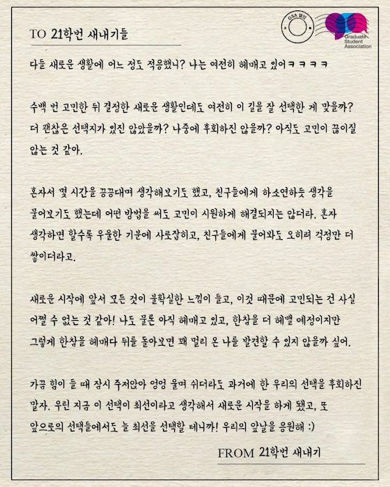 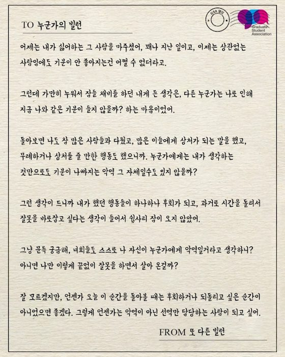 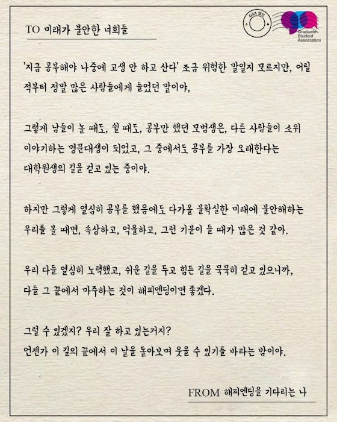 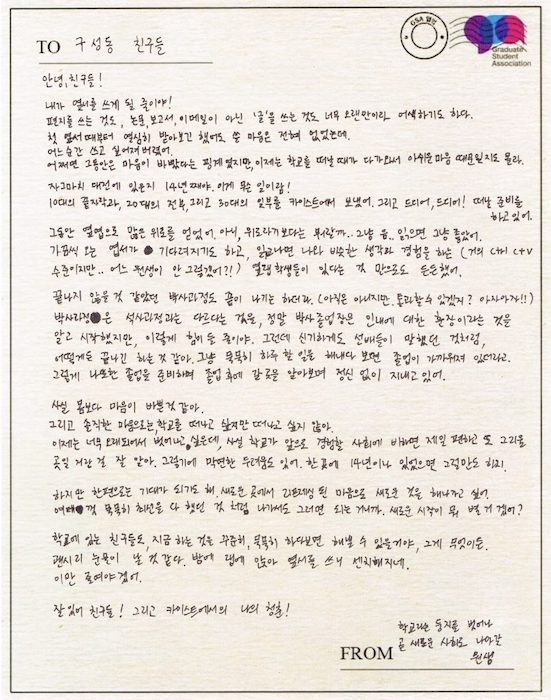 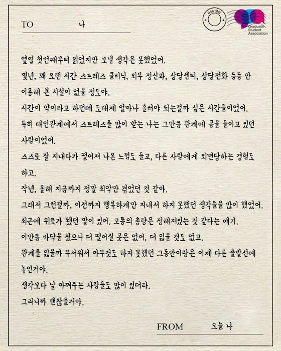 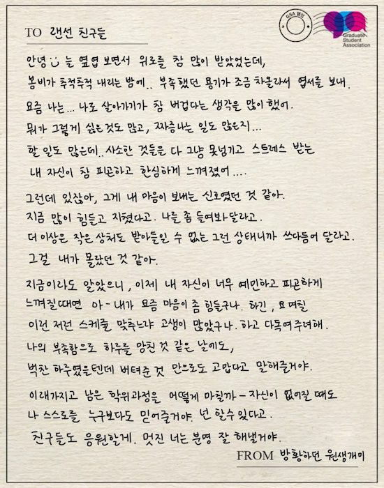 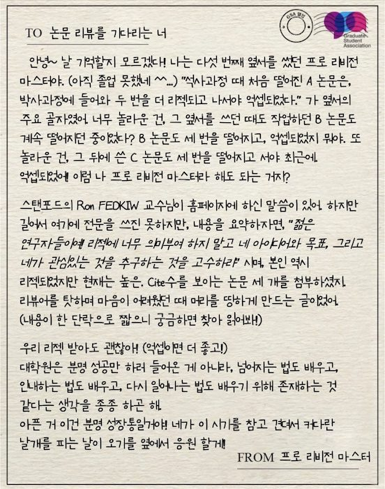 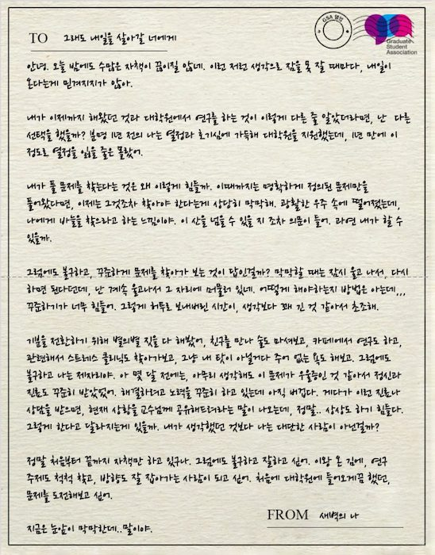 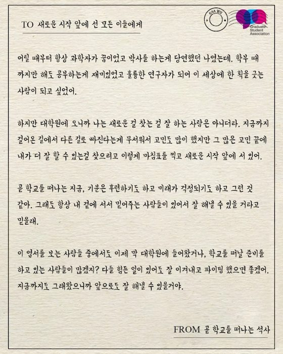 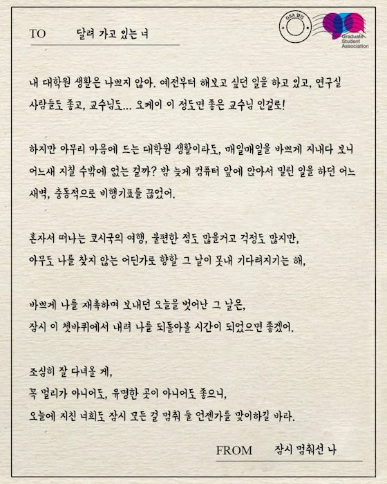 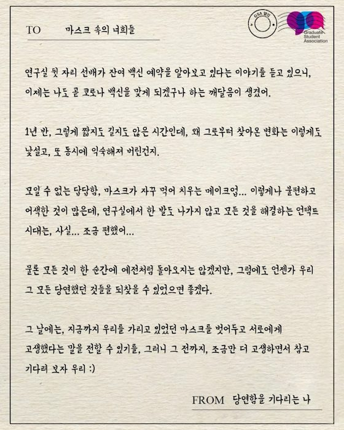 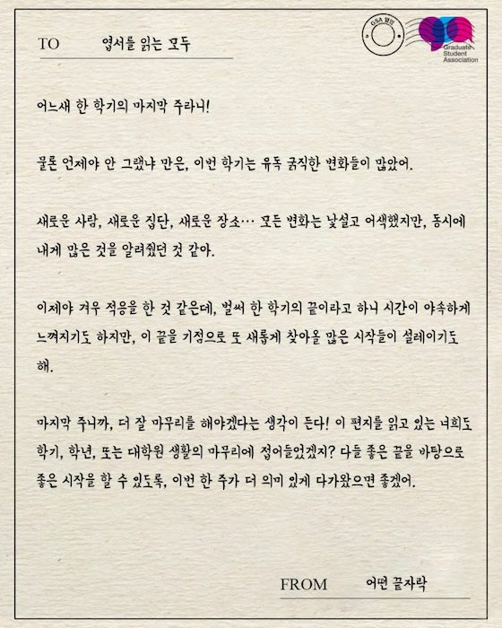

## 경품 수여자

* 2020년도의 제48대 대학원 총학생회에서 이월된 경품을 사용함.

| 번호 | 학번 | 성명 | 연락처 | 경품 |
|:---:|:---:|:---:|:---:|:---:|
| 1 | 202\*81\*2 | 박\*은 | `s**un*8@kaist.ac.kr` | 스타벅스 기프트카드 (5,000원), 도서 1권 | 
| 2 | 201\*53\*6 | 조\*경 | `c**md*5@kaist.ac.kr` | 스타벅스 기프트카드 (5,000원), 도서 1권 | 
| 3 | 201\*81\*6 | 조\*향 | `d**dj*06@nate.com` | 스타벅스 기프트카드 (5,000원), 도서 1권 | 
| 4 | 202\*36\*1 | 주\*영 | `s**eo*g@w*******udio.com` | 스타벅스 기프트카드 (5,000원), 도서 1권 | 
