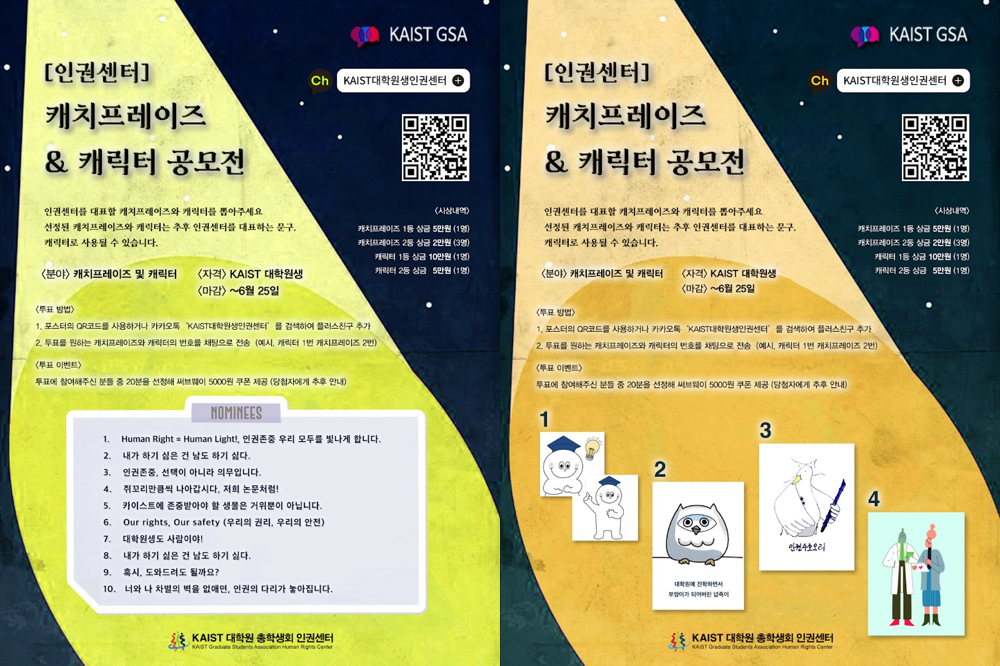

대학원 총학생회 집행부 2021년 상반기 인권 증진 위원회 활동 보고서
===

## 공식 사업명
- 인권증진위원회

## 담당자
- 대학원 총학생회 인권센터장

## 추진 배경
- 카이스트에는 학생들의 인권을 증진하기 위한 다양한 인권관련 케어링 기구들이 존재하고 있음. 
- 연구환경 실태조사에 따르면 그 중에서도 학생들의 이용률이 높고, 이용하고 싶은 의향이 높은 기구는 카이스트 총학생회 대학원생 인권센터임. 
- 하지만 학생들에 대한 홍보 부족과 접근할 수 있는 루트가 노후하고 한정되어 있어 센터를 이용하는데 불편함이 있음. 
- 또한 인권센터는 학생들만으로 구성된 교내 유일한 케어링 기구로서 다른 케어링 기구들의 문제점을 학생 입장에서 모니터링하고 피드백 할 수 있음. 
- 인권증진위원회는 케어링 기구 개선을 통한 대학원생의 인권 증진을 위해 인권센터 구성원으로 위원회를 구성하여 2021년 상반기에 활동함. 
- 위원장은 인권센터장이 담당하였으며, 2인의 학생상담원이 위원 역할을 수행함. 

## 위원회 목표
- 노후화된 인권센터 창구를 정비하고 새로운 방식의 창구를 마련하여 학생들의 접근성을 높임
- 인권센터가 학생들에게 더 친근하게 느껴질 수 있도록 인권센터 케릭터 및 캐치프레이즈 공모전을 진행하고, 새로운 창구의 근간이 되는 플러스친구 등록자 수 확보. 추후 플러스 친구 서비스를 통해 하반기부터 정기 메일링 진행 예정 (이메일이나 다른 메일링과는 다르게 좀 더 캐주얼한 내용을 전달 할 수 있는 장점이 있음)
- 학생의 입장에서 타 케어링 기구들의 문제점을 파악하고 피드백을 진행함으로 시스템 개선 추구

## 위원회 활동 일시
| 일시 | 활동내용 |
|---|---|
| 2021. 03. 12 | 인권증진위원회 마일스톤 설정 |
| 2021. 03. 30 | 학생지원팀과 소수자, 장애인, 관련 캠페인 논의, 인권센터 창구 개선 업무 진행(10대 메뉴얼을 기반으로 한 가상사례 작성, 학생들이 쉽게 상담 과정을 볼 수 있는 플로우차트 작성, 인권센터 홍보 및 창구의 일환으로 인권센터 우체통 구입) |
| 2021. 04. 27 | 인권센터 카카오톡 플러스친구를 늘리기 위한 목적으로 인권센터 홍보 및 학생 의견청취 창구를 만들기 위한 논의 진행. 구체적인 방안으로는 이모티콘 제작 및 배포를 통한 홍보, 오프고라인 포스터 제작을 통한 홍보, 마지막으로 인권센터 캐릭터 공모전을 통한 홍보 아이디어들이 제안됨. 홈페이지 개선 내용을 취합하고 정리. |
| 2021. 05. 11 | 스트레스 클리닉에서 학생 입장에서의 시스템 개선 피드백 요청, 1차 피드백 작성. 인권센터 캐릭터 캐치 프레이즈 공모전 확정. 공모전 관련 디테일한 내용 논의 진행 |
| 2021. 06. 08 | 인권센터 캐릭터 캐치 프레이즈 공모전 내용 확정 및 진행. (공모전 홍보, 포스터 제작, 구글 폼 제작, 후보작품 심사, 상품 구매 진행 등) |
| 2021.07.20 | 공모전 수상자 선정 및 최종 상금 지급, 공모전에서 당선된 작품들의 퀄리티를 높이고 해당 작품의 오리지널 파일을 전달. 투표 참여자를 랜덤으로 선택해서 서브웨이 상품권 지급, 사용하지 않은 상품권은 재안내 및 양도. |
| 2021 08. 24 | 전체 마무리 및 홈페이지 수정 내용 업로드 |

## 사업 진행 결과
- 2021년 상반기(현재까지) 동안 케어링 기구 창구 개선 사업 및 홍보의 명목으로 총 5회의 회의를 진행함. 
- 현재의 대학원 총학생회 홈페이지 내의 인권센터 페이지는 접근하기 힘들고 오래전의 정보를 그대로 가지고 있는 문제가 있음. 인권증진위원회에서는 페이지의 전반적인 내용을 수정하는 작업을 진행함. 특히 인권센터의 10대 메뉴얼을 기반으로 가상사례를 새롭게 업데이트하고 상담 과정을 한눈에 확인할 수 있는 플로우 차트를 통해 학생들에게 도움이 되는 정보를 제공. 또한 전반적으로 깔끔한 구성을 위해 새롭게 홈페이지 디자인 
- 케어링 기구 중 하나인 ‘스트레스 클리닉’에서 예약 시스템 등 접근성 개선을 위한 피드백을 요청. 인권증진위에서는 약 3번에 걸쳐 학생 입장에서의 개선점과 스트레스 클리닉에 도움이 될 수 있는 피드백을 전달. 
- 학생으로 대상으로한 인권센터 홍보와 새로운 창구인 플러스친구확보를 목적으로 인권센터 캐릭터 및 캐치프레이즈 공모전을 진행. 총 15명의 학생이 공모전에 참여하여 다양한 캐릭터와 캐치프레이즈를 제출하였으며, 약 100명에 가까운 학생들이 투표에 참여함. 투표에 참여하기 위해서는 카카오톡 플러스친구를 접속해야 하기 때문에 자연스럽게 인권센터 카카오톡 플러스친구 유입이 가능. 
- 학생들에게 더 친화적으로 접근하기 위해 카카오톡 플러스 친구 정기 메일링을 계획하고 있음. 플러스 친구를 통해 메일링을 진행하면 캐릭터 및 캐치프레이즈 공모전에서 우승한 넙부엉이(가명)을 기반으로 더 친근한 방법으로 학생들에게 접근할 수 있을 것으로 기대됨. 또한 추후 케어링 기구 홍보 시 캐치프레이즈 공모전에서 우승한 표어를 사용할 예정임. 

## 사진

## 기타
[홈페이지 개선안](https://docs.google.com/document/d/1AEuKD0kuus4WksGkxT3-yGWVWlu8P3XikZfHpuEHwJM/edit)
