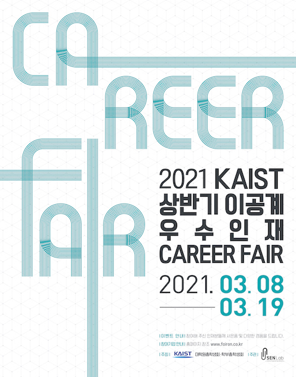
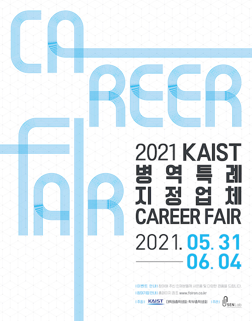

대학원 총학생회 집행부 2021년 상반기 취업박람회 사업보고서
===

## 공식 사업명
- 2021년 상반기 취업박람회

## 담당자
- 제49대 대학원 총학생회 복지부장

## 추진 배경
- 석/박사 경력직 채용 기업을 초청하여 학우들에게 취업 정보의 폭을 넓힘.
- 전문연구요원 T/O가 많은 중소기업을 포함하여 전문연구요원 편입이 가능한 기업을 초청하여 학우들의 기업 선택 기회를 넓힘.
- 특히 코로나19 사태 장기화 등으로 인해 취업난이 심화되고 구인 형태가 일부 변화함에 따라 취업 준비에 고충을 겪고 있는 학우들에게 취업에 대한 정보를 효과적으로 제공함.

## 사업 목표
- 대학원 학우들에게 석/박사 경력직 채용 및 전문연구요원 지정업체 입사에 관한 정보를 제공함.

## 일시

| 일시 | 내역 | 
|:---:|:---:| 
| 2021-03-08 ~ 2021-03-19 | 2021 상반기 취업박람회 | 
| 2021-05-31 ~ 2021-06-04 | 2021 병역특례 지정업체 CAREER FAIR | 

## 장소
- Zoom을 이용한 온라인 취업박람회

| 행사 제목 | 웹사이트 | 
|:---:|:---:| 
| 2021 상반기 취업박람회 | [링크](https://www.fairon.co.kr/?m=careerfair&m2=careerfairInfo&pkid=19) | 
| 2021 병역특례 지정업체 CAREER FAIR | [링크](https://www.fairon.co.kr/?m=careerfair&m2=careerfairInfo&pkid=34) | 

## 사업 진행 결과
- 각 참여 기업의 개별 페이지에서 온라인 사전 예약 기능을 제공해, 학우가 원하는 시간에 상담을 가능케 함. 
- 취업박람회 기간동안 원총 집행부원의 상시 모니터링을 시행함.
    - 온라인 취업박람회 서비스를 이용한 후 불편한 점, 개선할 점, 이용 후기 등을 구체적으로 작성하도록 함.
    - 발견된 문제점이나 건의사항은 시스템 관리자에게 즉시 보고 후 시정을 진행함.

#### 2021 상반기 취업박람회
- 총 38개 기업이 참석함.
    - 참여 기업명
        > 라이드플럭스, 아이쓰리시스템, 미원상사, 삼성SDS, 큐픽스, 스캐터랩, 삼성디스플레이, LS전선, 롯데케미칼, 자이냅스, 월드퀀트리서치, 컨트롤웍스, 레고켐바이오사이언스, 조이시티, 딥바이오, 데브시스터즈, 몰로코, 램리서치, 뷰노, 마이나비코리아, 고영테크놀러지, 한국항공우주연구원, 뉴로클, 씨알에스큐브, 현대제철, 카카오, 스페이스워크, 크레비스파트너스, 메쉬코리아, 샘표식품, 엔젤로보틱스, 피에스케이, 네이버랩스, 오름테라퓨틱, 팜캐드, 메디블록, 에스아이에이, 일진그룹

#### 2021 병역특례 지정업체 CAREER FAIR
- 총 37개 기업이 참석함.
    - 참여 기업명
        > 스캐터랩, 씨알에스큐브, 피에스케이, 스탠다드에너지, 날비컴퍼니, 리디, 디어젠, 서울로보틱스, 라온피플, 엔에스티정보통신, 퓨리오사에이아이, 슈프리마, 쿡앱스, 모라이, 머니브레인, 고영테크놀러지, 바움, 스페이스워크, 버즈빌, 당근마켓, 브이터치, 쎄트렉아이, 메디칼파크, 랩앤피플, 워프솔루션, 앤비젼, 인포보스, 파수닷컴, 원프레딕트, 애니메디솔루션, 디비하이텍, 룰루랩, 오이솔루션, 애드인텔리전스, 오픈엣지테크놀로지, 삼양사, 리스큐어바이오사이언시스, 

## 결산: 총 예산 1,500,000 원 중 0 원 집행
- 일반회계: 0 원 중 0 원 집행 
- 학생회계: 1,500,000 원 중 0 원 집행

| **내용** | **단가** | **수량** | **예산** | **결산** | **회계구분** |
|:---:|:---:|:---:|:---:|:---:|:---:|
| 스태프 수당 (9000원/시간) | 700,000 | 1 | 700,000 | 0 | 학생회계 | 
| 스태프 지원 식대 | 10,000 | 30 | 300,000 | 0 | 학생회계 | 
| 다과 및 음료 구매비 | 300,000 | 1 | 300,000 | 0 | 학생회계 | 
| 예비비 | 200,000 | - | 200,000 | 0 | 학생회계 | 
| **사업비 총액** |  |  | **1,500,000** | **0** |  |
| **일반회계 총액** |  |  | **0** | **0** |  |
| **학생회계 총액** |  |  | **1,500,000** | **0** |  |

## 사진
 

## 경품 수여자
- 주관사인 SENLab 측에서 추첨을 통해 편의점 쿠폰, 치킨 쿠폰(10만원), 커피 상품권, 아이패드, 에어팟 등을 제공함.

#### 2021 상반기 취업박람회

| 번호 | 이름 | 연락처 | 경품 | 
|:---:|:---:|:---:|:---:|
| 1 | 민*숙 | 010-7***-4406 | 아이패드 |
| 2 | 조*준 | 010-7***-4769 | 에어팟 |
| 3 | 이*은 | 010-2***-9103 | 에어팟 |
| 4 | 허*민 | 010-5***-0039 | 에어팟 |

- 출처: https://www.fairon.co.kr/?m=content&m2=winner_con&pkid=39

#### 2021 병역특례 지정업체 CAREER FAIR

| 번호 | 이름 | 연락처 | 경품 | 
|:---:|:---:|:---:|:---:|
| 5 | 이*규 | 010-5***-1831 | 치킨 쿠폰(10만원) |
| 6 | 김*현 | 010-9***-7573 | 치킨 쿠폰(10만원) |
| 7 | 김*준 | 010-5***-2576 | 치킨 쿠폰(10만원) |
| 8 | 조*준 | 010-7***-4769 | 치킨 쿠폰(10만원) |

- 출처: https://www.fairon.co.kr/?m=content&m2=winner_con&pkid=42