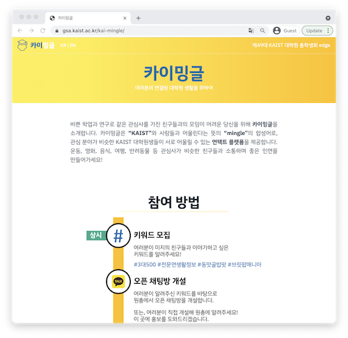
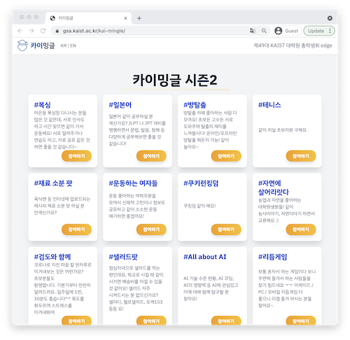
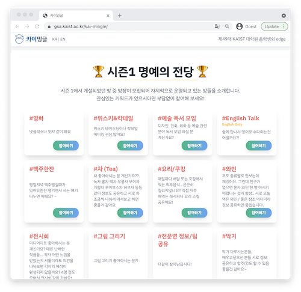
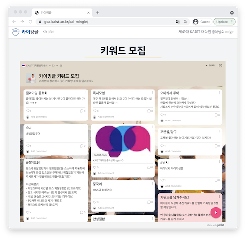
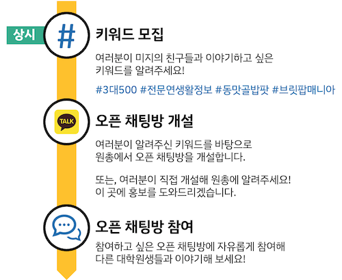
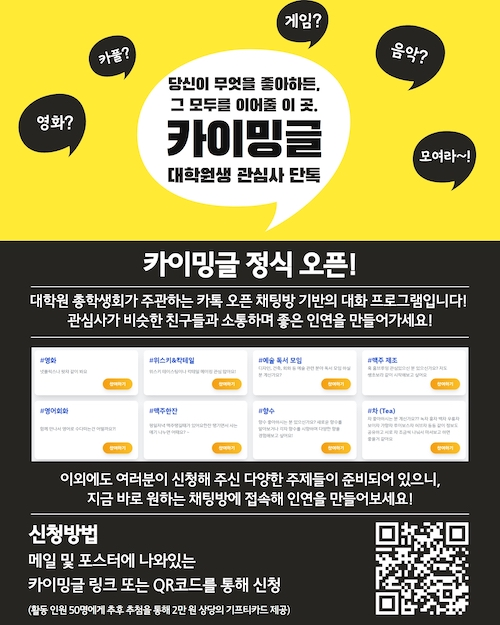
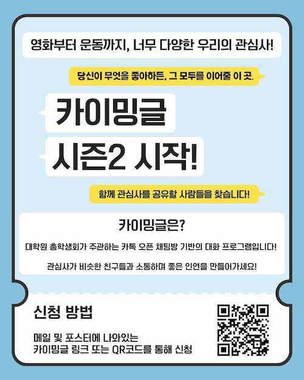

대학원 총학생회 집행부 2021년 상반기 카이밍글 사업보고서
===

## 공식 사업명
- 2021년 상반기 카이밍글 (구 2021년 상반기 카톡산장)

## 담당자
- 제49대 대학원 총학생회 소통부장

## 추진 배경
- 코로나와 이에 따른 사회적 거리두기에서 각종 오프라인 기반의 소규모 커뮤니티가 비활성화 되어가고 있음.
- 사회적 거리두기의 원칙을 지키되, 학생들의 사회적 격리에 따른 심리적 측면의 결핍을 총학생회의 입장에서 보완할 수 있는 수단을 강구할 필요가 있음.
- 같은 관심사를 지니면서 연결 수단이 없었던 이들에게 필요한 연결 고리를 생성, KAIST 학내 구성원의 보다 다양한 네트워킹이 필요함.

## 사업 목표
- 같은 관심사를 지닌 KAIST 구성원들로 이루어진 소규모 커뮤니티 형성
- 전술한 커뮤니티의 지속적인 유지 및 확대

## 일시

| 일시 | 내용 | 
|---|---|
| 2021-03 ~ 2021-05 | 카이밍글 기획 |
| 2021-05-17 ~ 계속 | 카이밍글 시즌 1 운영 |
| 2021-07-26 ~ 계속 | 카이밍글 시즌 2 운영 | 

## 장소
- 온라인
    - 카이밍글 웹사이트: https://gsa.kaist.ac.kr/kai-mingle/
       

## 사업 진행 결과
- 시즌 1, 2 각기 40개, 24개의 키워드를 기반으로 오픈카톡방을 개설함.
    - 시즌 1 키워드: 
        > 영화, 위스키&칵테일, 예술 독서 모임, 맥주 제조, 영어회화, 맥주한잔, 향수, 차 (Tea), 요리/쿠킹, 와인, 전시회, 카페투어, 그림 그리기, 전문연 정보/팁 공유, 캐치볼, 악기, 스타트업 창업/활동, 연극뮤지컬, 침착맨 연구회, 뚝딱뚝딱, 유학준비, 원데이클래스 공구방, 탁구, 노래, 사진 촬영, 추천시스템, 중국 여행, 졸업빨리하는, 대전 빵돌이 빵순이 모임, 등산, 귀여운거덕질, 교내식당밥친구, 고전음악, 맛집, 보드게임, 배드민턴, 러닝, 헬스모임, 쇼핑/맛집 할인/이벤트 정보, 롤
    - 시즌 2 키워드
        > 복싱, 일본어, 방탈출, 테니스, 재료 소분 팟, 운동하는 여자들, 쿠키런킹덤, 자연에 살어리랏다, 검도와 함께, 샐러드팟, All about AI, 리듬게임, 코인, 댄스와 댄스 뮤직, 식물 키우기, 주식, 마이프로틴 공동 구매, 모닝 자전거, 운전/드라이브, 포커, 영어 연기 수업, 고양이, International and Korean Student Group, 반려동물 사진 공유방
- 500명 가량의 KAIST 구성원들이 시즌 1 오픈카톡방에 참여함.
- 지속적인 활동을 원한 20개의 시즌 1 소속 오픈카톡방을 유지함.
- 사회적 거리두기 수칙을 지키며 몇몇 오프라인 모임이 이루어짐.
- 동아리 혹은 기존에 존재한 KAIST 학내 커뮤니티와 상호 보완적인 인적 교류가 진행됨.
- 시즌 1 종료 후 시즌 2 운영방안 및 피드백 반영을 위해 사업 피드백 설문을 진행함. 

## 결산: 총 예산 1,100,000 원 중 TODO2 원 집행
- 일반회계: 100,000 원 중 0 원 집행 (가. 대학원생 문화증진사업)
- 학생회계: 1,000,000 원 중 TODO6 원 집행
<!-- TODO: 예산 입력 필요 -->

| **내용** | **단가** | **수량** | **예산** | **결산** | **회계구분** |
|:---:|:---:|:---:|:---:|:---:|:---:|
| 활동 지원금 | 100,000 | 10 | 1,000,000 | TODO | 학생회계 |
| 홍보물 제작비 | 100,000 | 1 | 100,000 | TODO | 일반회계 |
| **사업비 총액** |  |  | **1,100,000** | **TODO2** |  |
| **일반회계 총액** |  |  | **100,000** | **0** |  |
| **학생회계 총액** |  |  | **1,000,000** | **TODO6** |  |

## 사진

## 경품 수여자

#### 시즌 1 우수 참여자 대상 경품 증정
- 시즌 1 우수 참여자 중 총 47명을 선정해 경품 증정함.
    - 우수 참여자 선정 기준: 1) 총 글자수 2) 메시지 빈도 3) 고유 참여일을 정량적으로 평가
    - 여러 카이밍글방에 중복해 참여한 경우, 개별방이 아닌 참여하고 계신 전체 카이밍글방을 통합해 2021-07-15까지의 대화를 기준으로 계산함.

| 번호 | 학번 | 성명 | 연락처 | 경품 |
|:--:|:--:|:--:|:--:|:--:|
| 1  | 202\*51\*3 | 김\*승 | 010-93\*9-34\*6 | 스타벅스 기프트카드 (2만원권) | 
| 2  | 202\*30\*7 | 김\*우 | 010-75\*9-48\*3 | 스타벅스 기프트카드 (2만원권) | 
| 3  | 201\*54\*6 | 김\*영 | 010-22\*6-57\*9 | 스타벅스 기프트카드 (2만원권) | 
| 4  | 202\*81\*1 | 조\*호 | 010-54\*2-03\*3 | 스타벅스 기프트카드 (2만원권) | 
| 5  | 202\*81\*4 | 강\*민 | 010-47\*4-99\*4 | 스타벅스 기프트카드 (2만원권) | 
| 6  | 201\*81\*0 | 황\* | 010-85\*7-48\*3 | 스타벅스 기프트카드 (2만원권) | 
| 7  | 201\*53\*5 | 최\*혁 | 010-40\*8-02\*2 | 스타벅스 기프트카드 (2만원권) | 
| 8  | 202\*35\*0 | 정\*식 | 010-99\*2-93\*2 | 스타벅스 기프트카드 (2만원권) | 
| 9  | 201\*51\*5 | 박\*준 | 010-89\*0-23\*7 | 스타벅스 기프트카드 (2만원권) | 
| 10 | 202\*45\*0 | 전\*승 | 010-31\*9-75\*9 | 스타벅스 기프트카드 (2만원권) | 
| 11 | 202\*33\*5 | 성\*창 | 010-29\*3-16\*2 | 스타벅스 기프트카드 (2만원권) | 
| 12 | 201\*55\*2 | 임\*현 | 010-23\*5-13\*3 | 스타벅스 기프트카드 (2만원권) | 
| 13 | 201\*80\*3 | 신\*수 | 010-34\*5-13\*5 | 스타벅스 기프트카드 (2만원권) | 
| 14 | 202\*31\*3 | 김\*진 | 010-39\*7-56\*5 | 스타벅스 기프트카드 (2만원권) | 
| 15 | 202\*34\*3 | 윤\*연 | 010-64\*8-29\*9 | 스타벅스 기프트카드 (2만원권) | 
| 16 | 201\*81\*7 | 신\*재 | 010-71\*5-65\*6 | 스타벅스 기프트카드 (2만원권) | 
| 17 | 202\*56\*5 | 채\*나 | 010-39\*4-70\*0 | 스타벅스 기프트카드 (2만원권) | 
| 18 | 202\*37\*5 | 박\*하 | 010-63\*9-18\*0 | 스타벅스 기프트카드 (2만원권) | 
| 19 | 201\*45\*6 | 최\*영 | 010-46\*3-70\*0 | 스타벅스 기프트카드 (2만원권) | 
| 20 | 201\*44\*9 | 최\*윤 | 010-37\*0-86\*5 | 스타벅스 기프트카드 (2만원권) | 
| 21 | 202\*38\*0 | 한\*국 | 010-84\*5-98\*6 | 스타벅스 기프트카드 (2만원권) | 
| 22 | 202\*33\*1 | 신\*근 | 010-20\*4-28\*5 | 스타벅스 기프트카드 (2만원권) | 
| 23 | 202\*53\*8 | 한\*연 | 010-28\*7-11\*5 | 스타벅스 기프트카드 (2만원권) | 
| 24 | 202\*81\*8 | 김\*윤 | 010-91\*5-76\*7 | 스타벅스 기프트카드 (2만원권) | 
| 25 | 202\*31\*6 | 김\*석 | 010-56\*1-33\*1 | 스타벅스 기프트카드 (2만원권) | 
| 26 | 201\*52\*0 | 이\*원 | 010-44\*8-32\*9 | 스타벅스 기프트카드 (2만원권) | 
| 27 | 201\*07\*1 | 최\*학 | 010-29\*0-15\*2 | 스타벅스 기프트카드 (2만원권) | 
| 28 | 201\*43\*3 | 남\*\*상 | 010-36\*9-52\*9 | 스타벅스 기프트카드 (2만원권) | 
| 29 | 202\*55\*3 | 전\*영 | 010-90\*3-43\*3 | 스타벅스 기프트카드 (2만원권) | 
| 30 | 202\*37\*1 | 황\*훈 | 010-51\*7-24\*5 | 스타벅스 기프트카드 (2만원권) | 
| 31 | 202\*55\*8 | 성\*석 | 010-74\*7-73\*6 | 스타벅스 기프트카드 (2만원권) | 
| 32 | 516\*5  | 강\*현 | 010-99\*7-08\*8 | 스타벅스 기프트카드 (2만원권) | 
| 33 | 201\*42\*8 | 김\*숙 | 010-35\*8-84\*7 | 스타벅스 기프트카드 (2만원권) | 
| 34 | 202\*30\*7 | 강\*진 | 010-63\*6-90\*9 | 스타벅스 기프트카드 (2만원권) | 
| 35 | 202\*37\*5 | 안\*현 | 010-73\*0-03\*2 | 스타벅스 기프트카드 (2만원권) | 
| 36 | 201\*52\*1 | 이\*빈 | 010-72\*0-82\*5 | 스타벅스 기프트카드 (2만원권) | 
| 37 | 201\*81\*4 | 박\*\*름 | 010-64\*3-89\*8 | 스타벅스 기프트카드 (2만원권) | 
| 38 | 202\*82\*5 | 진\*수 | 010-23\*2-20\*0 | 스타벅스 기프트카드 (2만원권) | 
| 39 | 202\*50\*0 | 김\*태 | 010-64\*3-80\*4 | 스타벅스 기프트카드 (2만원권) | 
| 40 | 201\*81\*3 | 문\*훈 | 010-74\*8-80\*7 | 스타벅스 기프트카드 (2만원권) | 
| 41 | 202\*81\*0 | 이\*  | 010-66\*3-68\*3 | 스타벅스 기프트카드 (2만원권) | 
| 42 | 202\*32\*7 | 박\*영 | 010-48\*0-49\*9 | 스타벅스 기프트카드 (2만원권) | 
| 43 | 202\*53\*3 | 최\*원 | 010-29\*8-18\*2 | 스타벅스 기프트카드 (2만원권) | 
| 44 | 202\*50\*3 | 강\*훈 | 010-90\*9-19\*9 | 스타벅스 기프트카드 (2만원권) | 
| 45 | 202\*41\*4 | 조\*희 | 010-99\*4-98\*2 | 스타벅스 기프트카드 (2만원권) | 
| 46 | 201\*81\*9 | 최\*선 | 010-31\*2-24\*4 | 스타벅스 기프트카드 (2만원권) | 
| 47 | 202\*33\*7 | 오\*원 | 010-94\*4-59\*6 | 스타벅스 기프트카드 (2만원권) | 

#### 시즌 1 만족도 조사 응답자 대상 경품 추첨 
- 총 5명을 선발했으며 8월 말에 증정 예정임.
    - 2020년도의 제48대 대학원 총학생회에서 이월된 경품을 사용할 예정임. (스타벅스 기프트카드 5,000원권 5장) 
