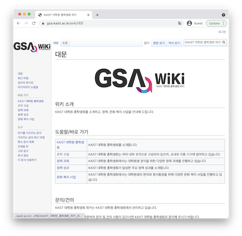

대학원 총학생회 집행부 2021년 하반기 원총위키 운영 사업계획서
===

## 공식 사업명
- 2021년 하반기 원총위키 운영

## 담당자
- 제49대 대학원 총학생회 정책부장

## 추진 배경
- 원총위키는 원총(대학원 총학생회)이 어떤 단체인지, 무슨 일들을 하는지, 나와는 어떤 관련이 있는지 궁금해하는 학우들에게 상세한 정보를 전달하기 위해 2020년에 만들어진 채널임.
- 기존 정보의 아카이빙을 위해 사용되었던 원총위키를, 학우들에게 직접적으로 도움이될만한 정보의 전달을 목표로 사용하기 위해 운영할 필요가 있음.

## 사업 목표
- 대학원 총학생회의 정책 과제와 성과에 대한 아카이브와 함께 차후 정책 과제 목표 수립에 활용함을 목적으로 함.
- 아카이빙을 넘어 대학원 생활 전반적인 정보를 담은 콘텐츠 확장을 목표로 함.
- 학우뿐만 아니라 교내구성원들을 대상으로 원총위키의 콘텐츠를 홍보하고자 함.

## 일시
- 2021년 9월 ~ 2022년 2월 

## 장소
- 원총위키 웹사이트: https://gsa.kaist.ac.kr/wiki  
    

## 사업 내용
- 2021년 대학원 총학생회 하반기 사업 아카이빙 및 홍보를 진행함.
- 연속성이 중요한 정책 과제의 특성을 고려한 정책 과제 및 성과 페이지 개편안 작업을 진행함.
- 원총위키의 홍보를 위한 이벤트를 예정함.

## 예산: 총 400,000 원
- 일반회계: 0 원
- 학생회계: 400,000 원 

| **내용** | **단가** | **수량** | **예산** | **회계구분** |
|:---:|:---:|:---:|:---:|:---:|
| 원총위키 홍보비 | 200,000 | 1 | 200,000 | 학생회계 |
| 예비비 | 200,000 | 1 | 200,000 | 학생회계 |
| **사업비 총액** |  |  | 200,000 | |
| **일반회계 총액** |  |  | 0 | |
| **학생회계 총액** |  |  | 400,000 | |
