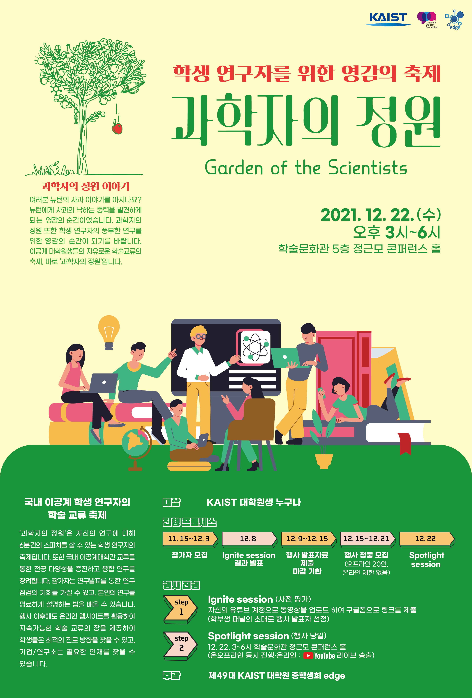

대학원 총학생회 집행부 2021년 하반기 과학자의 정원 사업보고서
===

## 공식 사업명
- 과학자의 정원

## 담당자
- 제49대 대학원 총학생회 연구문화부장

## 추진 배경
- 국내 이공계 대학교 대학원생들이 교류할 수 있는 플랫폼 부재.
- 연구 교류 활동은 학회 등 공식적인 행사 등을 통해서 대체로 이루어지고 있으며, 새로운 인적 교류를 위한 네트워크 역시 부재.
- 코로나19로 인한 비대면 상황이 지속됨에 따라, 온라인 상에서도 연구교류할 수 있는 다양한 방안들이 논의되고 있음.
- TED talk은 10여 분 동안 자신의 콘텐츠를 청중들에게 전달하는 강연 형식이며, 유사한 형식으로 3MT(3 Minute Thesis)라는 행사는 3분 동안 자신의 연구주제에 대해 스피치하는 컴피티션 프로그램도 있음.
- 국내에는 세바시(세상을 바꾸는 시간, 15분)이라는 콘텐츠를 전달하는 플랫폼이 있음. 
- 원총에서 국내 이공계 대학원생들의 연구 교류를 촉진하기 위해 위와 같은 플랫폼을 만들고자 함.
- 플랫폼 구축 시 대학원생 연구자에게는 아래와 같은 이점이 있을 것으로 예상됨.
- 학과 내 연구발표회에 그치지 않은 학과간 / 학교간 interactive한 discussion이 불러올 장점이 있음. 
- 발표자 뿐만 아니라 학생들의 적극적인 토론을 장려하여 질문하는 방법과 자세를 갖추게 함. 
- 본인의 연구를 짧고 강렬하게 설명하여 상대방을 이해시키고, 해당 주제에 매료되게 하는 방법을 배움.
- 장기적으로 KAIST 대학원 총학생회가 국내 이공계 대학원생들의 교류의 중심이 되며, 한국과학기술계에 이바지함으로써 대학원생 연구환경 개선의 토대로 삼고자 함.

## 사업 목표
- 최소 3개 대학, 4개 분야, 행사 당일 발표자 12명, 청중 20명 모집.
- 포스텍은 이미 유사한 사업을 진행한 경험이 있고, 서울대, 포스텍, 4대 과기원 학생회와 이미 사전 논의를 마친 상황임.
- 1회는 연구보안과 행사 안착을 위하여 카이스트 내 대학원생으로 한정함.
- 플랫폼 구축을 위한 웹사이트 제작.
- 해당 발표에 대해 언제든 질문할 수 있는 플랫폼 개발이 적용될 예정.

## 일시

| 일시 | 내용 | 홍보물 | 
|---|---|---|
| 2021년 9월 |  기획 단계 완료 | |
| 2021년 10월 | 홍보 및 참가자 모집 및 플랫폼 구축 시작 완료 | |
| 2021년 11월 8일 | 온라인 홍보 시작 (인스타, 메일, 아라 등) 완료 | |
| 2021년 11월 12일 | 홍보 포스터 부착 완료 | |
| 2021년 11월 15일 ~ 12월 3일 | 예선 참가자 모집 완료 | |
| 2021년 11월 15일 ~ 11월 30일 | 예선 학부생 평가단 모집 완료 | |
| 2021년 12월 8일 | 본선 발표자 확정 완료 | |
| 2021년 12월 8일 ~ 12월 20일  | 오프라인 행사 청중 모집 완료 | |
| 2021년 12월 15일 | 본선 발표 자료 수집 완료 | |
| 2021년 12월 22일 | 행사 당일 (잠정중단) | |

## 장소
- 없음.

## 사업 진행 결과
- 예선 진행 완료, 본선 발표자 선정까지 완료되었으나, 코로나 정부지침으로 인한 본행사 잠정 중단.
- 웹사이트: https://gsa.kaist.ac.kr/garden-of-scientists/

## 결산: 총 예산 9,930,000 원 중 6,122,300 원 집행
- 일반회계: 2,000,000 원 중 2,000,000 원 집행
- 학생회계: 7,930,000 원 중 4,122,300 원 집행 

| **내용** | **단가** | **수량** | **예산** | **결산** | **회계구분** |
|:---:|:---:|:---:|:---:|:---:|:---:|
| 웹사이트 유지보수비 | 1,000,000 | 1 | 1,000,000 | 1,000,000 | 학생회계 |
| 웹사이트 유지보수비 | 2,000,000 | 1 | 2,000,000 | 2,000,000 | 일반회계 |
| 참가자 기념품 제작 | 3,000,000 | 1 | 3,000,000 | 1,862,300 | 학생회계 |
| 스태프 수당 (9천원X10시간X15인) | 90,000 | 15 | 1,350,000 | 1,080,000 | 학생회계 |
| 예비비 | 2,400,000 | 1 | 2,400,000 | 0 | 학생회계 |
| 웹사이트 영문 번역 | 180,000 | 1 | 180,000 | 180,000 | 학생회계 |
| **사업비 총액** |  | | **9,930,000** | **6,122,300** |  |
| **일반회계 총액** |  | | **2,000,000** | **2,000,000** |  |
| **학생회계 총액** |  | | **7,930,000** | **4,122,300** |  |

## 홍보물

| **홍보일** | **제목** | **매체** |
|:---:|:---:|:---:|
| 2021-11-09 | 연구 이야기 마음껏 나눠 볼까요? 이공계 학술 교류 축제 “과학자의 정원: Garden of the Scientists”을 소개합니다 / Introducing science festival for student researchers, “Garden of the Scientists”  | [GSA 홈페이지](https://gsa.kaist.ac.kr/notice/190410), [KAIST 포탈](https://portal.kaist.ac.kr/ennotice/student_notice/11636431565398), [ARA](https://newara.sparcs.org/post/239467), 단체 메일, [인스타그램](https://www.instagram.com/p/CWCdQXsPAm4/) |
| 2021-11-15 | 연구 교류 축제 “과학자의 정원”의 학부생 패널을 모집합니다! (패널 활동비 지급) | [GSA 홈페이지](https://gsa.kaist.ac.kr/notice/190738), [KAIST 포탈](https://portal.kaist.ac.kr/ennotice/student_notice/11636957437329), [ARA](https://newara.sparcs.org/post/239590), 단체 메일 |
| 2021-11-16 | “과학자의 정원” Ignite session 발표자를 모집합니다 / Recruiting speakers for “Garden of the Scientists” Ignite session | [GSA 홈페이지](https://gsa.kaist.ac.kr/notice/190835), [KAIST 포탈](https://portal.kaist.ac.kr/ennotice/student_notice/11637047368439), [ARA](https://newara.sparcs.org/post/239693), 단체 메일, [인스타그램](https://www.instagram.com/p/CWU3bh9PIxQ/) |
| 2021-11-23 | 내 연구 이야기로 강연을 할 수 있다고? / I can present a talk regarding my research? | [GSA 홈페이지](https://gsa.kaist.ac.kr/notice/191138), [KAIST 포탈](https://portal.kaist.ac.kr/ennotice/student_notice/11637652111321), [ARA](https://newara.sparcs.org/post/239794), 단체 메일, [인스타그램]() |
| 2021-11-30 | 과학자의 정원: KAIST에서 “TED”, “세바시” 같은 행사가 열린다고? / Garden of the Scientists: there will be a TED-style event at KAIST?  | [GSA 홈페이지](https://gsa.kaist.ac.kr/notice/191623), [KAIST 포탈](https://portal.kaist.ac.kr/ennotice/student_notice/11638273128865), [ARA](https://newara.sparcs.org/post/239961), 단체 메일, [인스타그램](https://www.instagram.com/p/CWnTAhtv6sa/) |
| 2021-12-09 | 과학자의 정원이 학회보다 나은 3가지 이유 (사례비 20만원, ~12/11까지 접수 기한 연장) / Why Garden of the Scientists is better than academic conference(Speaker fee 200,000 won, application deadline extended until 12/11) | [GSA 홈페이지](https://gsa.kaist.ac.kr/notice/192099), [KAIST 포탈](https://portal.kaist.ac.kr/ennotice/student_notice/11639023433010), [ARA](https://newara.sparcs.org/post/240096), 단체 메일 |

## 사진

## 경품 수여자
- 없음.
