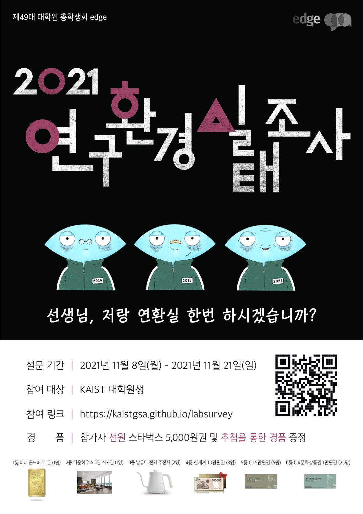

대학원 총학생회 집행부 2021년 하반기 연구환경실태조사 사업보고서
===

## 공식 사업명
- 2021년 하반기 연구환경실태조사 

## 담당자
- 제49대 대학원 총학생회 총무부장 

## 추진 배경
- 2004년부터 매년 KAIST 대학원생들의 연구 환경 실태 파악 및 원활한 연구 환경을 조성하기 위한 목적으로 전 대학원생을 대상으로 설문조사를 진행해 옴. 
- 설문조사를 바탕으로 당해연도 및 연도별 추이를 분석, 정리하여 KAIST 대학원생 및 교내 구성원에게 연구 환경 실태를 공유하고 관련 문제점을 해결하기 위한 자료로 사용할 필요가 있음. 

## 사업 목표
- 대학원생들의 연구 환경에 대한 정보를 공유하고 관련 문제점을 해결하는데 기여하고자 함. 

## 일시
- 설문조사 기획: 2021년 9월 ~ 2021년 11월
- 설문조사 실시: 2021년 11월 8일(월) ~ 2021년 11월 21일(일)
- 설분조사 분석 및 시각화: 2021년 11월 ~ 2022년 1월

## 장소
- Google Form 등의 온라인 서비스를 이용 

## 사업 진행 결과
- 연구환경실태조사 문항 개선을 위한 전문가(사회통계 전공 교수진 등) 피드백 진행 
- 연구환경실태조사 (가. 대학원 생활 / 나. 연구 수행 환경 / 다. 연구 및 진로 지도 / 라. 경제적 환경 / 마. 연구 과제 및 행정 업무 / 바. 연구 윤리 및 관행 / 사. 2021년 연구 환경 변화 / 아. 재학 정보 / 자. 인적사항 / 차. 기타 의견) 및 인권실태조사 설문조사 항목 작성 및 구성 
- 오프라인 홍보(포스터, 현수막) 진행 및 전체 메일, 포탈, 인스타그램, GSA 홈페이지 등을 통한 온라인 홍보 진행 
- 수집된 응답을 바탕으로 결과 분석 및 시각화 진행 
- 대학원생 권리 향상을 위한 연구 및 정책 분석 목적을 위하여 데이터 공개 시스템 마련. 추후 대학원생이 연구 목적으로 신청 시 심사 후 연구위원 계약 및 일부 데이터 제공 예정(단, 연구윤리 등 민감한 항목이나 주관식 응답 등은 데이터 제공 불가) 
- 경품 추첨 및 경품 배포 (미니 골드바 두 돈 / 타운하우스 2인 식사권 / 발뮤다 전기 주전자 / 신세계 10만원권 / CJ 5만원권 / CJ 또는 문화상품권 1만원권 / 스타벅스 5,000원권) 
- CJ 또는 문화상품권 1만원권과 스타벅스 5,000원권을 제외한 모든 경품은 학생회비 납부자를 대상으로 추첨. 스타벅스 5,000원권을 제외한 모든 경품은 집행부원 제외하여 추첨 
- 응답자의 익명성 보장을 위해 경품 코드 시행 
- 총 1,648명 응답 

## 결산: 총 예산 18,700,000 원 중 18,689,310 원 집행
- 일반회계: 14,700,000 원 중 14,700,000 원 집행 
- 학생회계: 4,000,000 원 중 3,989,310 원 집행 

| **내용** | **단가** | **수량** | **예산** | **결산** | **회계구분** |
|:---:|:---:|:---:|:---:|:---:|:---:|
| 홍보비 (디자인, 배너 제작 등) | 700,000 | - | 700,000 | 700,000 | 일반회계 | 
| 설문조사자 커피 제공 | 5,000 | 1,600 | 8,000,000 | 8,000,000 | 일반회계 | 
| 설문조사 인프라 구축 및 유지보수 수당 (IT팀, 홍보팀) | 1,850,000 | 1 | 1,850,000 | 1,850,000 | 일반회계 | 
| 설문조사 문항 검토 및 개선 수당 (기획팀) | 1,150,000 | 1 | 1,150,000 | 1,150,000 | 일반회계 | 
| 설문조사 결과 분석 및 시각화 수당 (분석팀, 시각화팀, 인권센터팀) | 3,000,000 | 1 | 3,000,000 | 3,000,000 | 일반회계 | 
| 설문조사자 경품 (추첨) | 1,000,000 | - | 1,000,000 | 1,000,000 | 학생회계 | 
| 문항 컨설팅비용 | 2,000,000 | - | 2,000,000 | 2,000,000 | 학생회계 | 
| 예비비 | 1,000,000 | - | 1,000,000 | 989,310 | 학생회계 | 
| **사업비 총액** |  |  | **18,700,000** | **18,689,310** |  |
| **일반회계 총액** |  |  | **14,700,000** | **14,700,000** |  |
| **학생회계 총액** |  |  | **4,000,000** | **3,989,310** |  |

## 홍보물

| **홍보일** | **제목** | **매체** |
|:---:|:---:|:---:|
| 2021-09-27 | 사회 통계 분야 연구 위원 모집(연구환경실태조사 GoGo!) |  [GSA 홈페이지](https://gsa.kaist.ac.kr/notice/187703), [KAIST 포탈](https://portal.kaist.ac.kr/ennotice/student_notice/11632721863830), 단체메일, [ARA](https://newara.sparcs.org/post/238469) | 
| 2021-11-08 | 2021 연구환경실태조사(전원 스타벅스 기프트 카드 제공) |  [GSA 홈페이지](https://gsa.kaist.ac.kr/notice/190305), [KAIST 포탈](https://portal.kaist.ac.kr/ennotice/student_notice/11636336251640), 단체메일, [ARA](https://newara.sparcs.org/post/239408), [인스타그램](https://www.instagram.com/p/CWCUag2vyto/) | 
| 2021-11-15 | 설문만 참여해도 스타벅스 5천원권이?! (1등 경품: 미니 골드바) |  [GSA 홈페이지](https://gsa.kaist.ac.kr/notice/190714), 단체메일, [ARA](https://newara.sparcs.org/post/239592) | 
| 2021-12-19 | 2021 연구환경실태조사 참가상 배포 안내 및 경품 추첨 결과 |  [GSA 홈페이지](https://gsa.kaist.ac.kr/notice/192652), [KAIST 포탈](https://portal.kaist.ac.kr/ennotice/student_notice/11639973507853), 단체메일, [ARA](https://newara.sparcs.org/post/240299) | 
| 2022-01-21 | 2021 연구환경실태조사 결과 공유 / 2021 Research Environment Survey result |  [GSA 홈페이지](https://gsa.kaist.ac.kr/notice/194690), [KAIST 포탈](https://portal.kaist.ac.kr/ennotice/student_notice/11642815590213), 단체메일 | 

## 사진
 

## 경품 수여자

| 번호 | 학번 | 성명 | 연락처 | 경품 |
|:---:|:---:|:---:|:---:|:---:|
| 1 | 201850** | - | *wa***@kaist.ac.kr | 미니 골드바 두 돈 | 
| 2 | 201953** | - | *dw***@kaist.ac.kr | 타운하우스 2인 식사권 | 
| 3 | 202152** | - | *iv***@kaist.ac.kr | 발뮤다 전기 주전자 | 
| 4 | 202135** | - | *nc***@kaist.ac.kr | 발뮤다 전기 주전자 | 
| 5 | 202155** | - | *yu***@kaist.ac.kr | 신세계 10만원권 | 
| 6 | 202053** | - | *wa***@kaist.ac.kr | 신세계 10만원권 | 
| 7 | 202180** | - | *eo***@kaist.ac.kr | 신세계 10만원권 | 
| 8 | 202042** | - | *sk***@kaist.ac.kr | CJ 5만원권 | 
| 9 | 202054** | - | *ow***@kaist.ac.kr | CJ 5만원권 | 
| 10 | 201980** | - | *eo***@kaist.ac.kr | CJ 5만원권 | 
| 11 | 201954** | - | *on***@kaist.ac.kr | CJ 5만원권 | 
| 12 | 202070** | - | *ih***@kaist.ac.kr | CJ 5만원권 | 
| 13 | 202053** | - | *ks***@kaist.ac.kr | CJ 또는 문화상품권 1만원권 | 
| 14 | 202180** | - | *eo***@kaist.ac.kr | CJ 또는 문화상품권 1만원권 | 
| 15 | 202050** | - | *cv***@kaist.ac.kr | CJ 또는 문화상품권 1만원권 | 
| 16 | 202133** | - | *hi***@kaist.ac.kr | CJ 또는 문화상품권 1만원권 | 
| 17 | 202182** | - | *i1***@kaist.ac.kr | CJ 또는 문화상품권 1만원권 | 
| 18 | 202138** | - | *ia***@kaist.ac.kr | CJ 또는 문화상품권 1만원권 | 
| 19 | 201850** | - | *an***@kaist.ac.kr | CJ 또는 문화상품권 1만원권 | 
| 20 | 202053** | - | *uc***@kaist.ac.kr | CJ 또는 문화상품권 1만원권 | 
| 21 | 201880** | - | *oi***@kaist.ac.kr | CJ 또는 문화상품권 1만원권 | 
| 22 | 201851** | - | *an***@kaist.ac.kr | CJ 또는 문화상품권 1만원권 | 
| 23 | 201980** | - | *on***@kaist.ac.kr | CJ 또는 문화상품권 1만원권 | 
| 24 | 201980** | - | *a9***@kaist.ac.kr | CJ 또는 문화상품권 1만원권 | 
| 25 | 202137** | - | *oc***@kaist.ac.kr | CJ 또는 문화상품권 1만원권 | 
| 26 | 202151** | - | *lg***@kaist.ac.kr | CJ 또는 문화상품권 1만원권 | 
| 27 | 202034** | - | *oy***@kaist.ac.kr | CJ 또는 문화상품권 1만원권 | 
| 28 | 201450** | - | *ai***@kaist.ac.kr | CJ 또는 문화상품권 1만원권 | 
| 29 | 202032** | - | *ri***@kaist.ac.kr | CJ 또는 문화상품권 1만원권 | 
| 30 | 202031** | - | *ou***@kaist.ac.kr | CJ 또는 문화상품권 1만원권 | 
| 31 | 201953** | - | *eo***@kaist.ac.kr | CJ 또는 문화상품권 1만원권 | 
| 32 | 201581** | - | *ho***@kaist.ac.kr | CJ 또는 문화상품권 1만원권 | 
| 33 | 201980** | - | *lt***@kaist.ac.kr | CJ 또는 문화상품권 1만원권 | 
| 34 | 201850** | - | *ls***@kaist.ac.kr | CJ 또는 문화상품권 1만원권 | 
| 35 | 201751** | - | *wp***@kaist.ac.kr | CJ 또는 문화상품권 1만원권 | 
| 36 | 202050** | - | *re***@kaist.ac.kr | CJ 또는 문화상품권 1만원권 | 
| 37 | 201970** | - | *wi***@kaist.ac.kr | CJ 또는 문화상품권 1만원권 | 
| - | 참가자 전원 | - | - | 스타벅스 5,000원권 | 