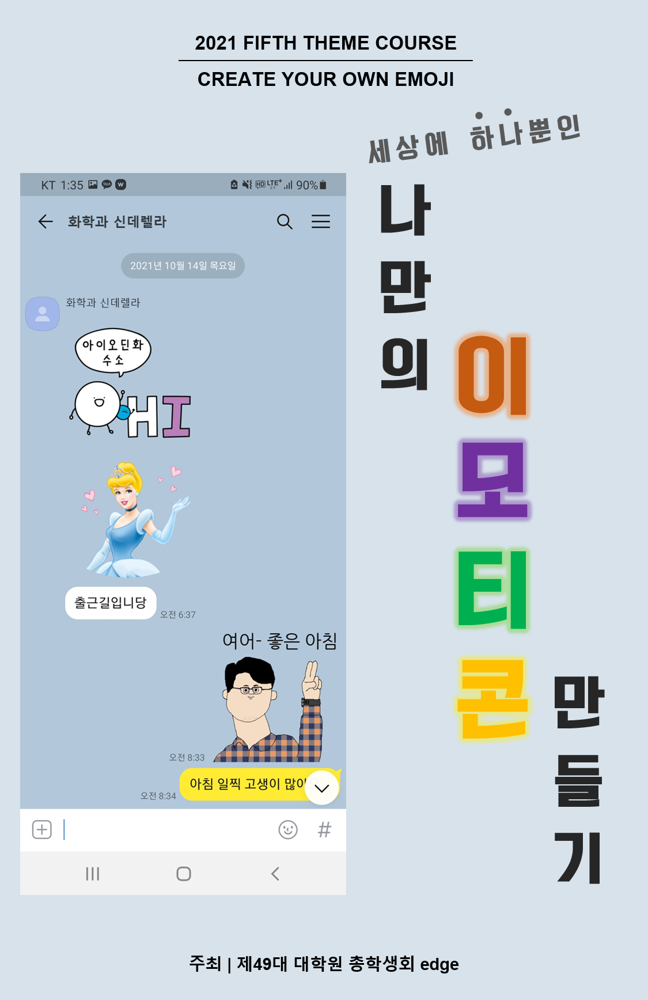

대학원 총학생회 집행부 2021년 하반기 테마강좌 사업보고서
===

## 공식 사업명
- 2021년 하반기 테마강좌 

## 담당자
- 제49대 대학원 총학생회 복지부장 

## 추진 배경
- 대학원생의 삶의 질 향상을 위해 문화생활을 체험하고 휴식을 즐길 기회를 제공할 필요성이 대두됨. 
- 코로나19의 영향으로 대규모 실내 강좌를 진행하기 어려운 현실을 고려하여 참가자들이 각자의 개인 공간에서 참여할 수 있는 비대면 및 DIY 강좌를 제공함. 

## 사업 목표
- KAIST 학생들의 삶의 질을 향상시킬 수 있는 유익하고 실질적인 강좌 제공 

## 일시
- 2021년 가을학기 (총 3회: 10월, 11월, 12월) 

## 장소
- 참가자들 각자의 개인 공간 

## 사업 진행 결과
- 총 3회의 강좌를 진행함. 
- 각 회차 별 참가 인원은 아래와 같음.
    - 1회차(나만의 이모티콘 만들기): 73 명 
    - 2회차(보석십자수): 160 명
    - 3회차(수채화 컬러링): 80 명
- 1회차 강연(나만의 이모티콘 만들기)은 외부 강사를 초청하여 ZOOM을 통한 비대면 강의 형태로 진행함. 참가자들이 사전에 이모티콘을 구상해 오도록 숙제를 내주고, 강의 시간에는 이모티콘에 대한 기초 이론 수업 및 포토샵 프로그램을 활용한 실습 수업을 진행함. 
- 2회차(보석십자수) 및 3회차(수채화 컬러링) 강연은 참가자들이 각자의 개인 공간에서 참여하도록 재료와 설명서를 제공함. 
- 참가자들의 적극적인 참여 독려 및 테마강좌 홍보를 위해 인스타그램 인증 이벤트를 진행함. 테마강좌 참여 과정 또는 결과물을 사진 또는 영상으로 인스타그램에 게시한 참가자들을 대상으로 추첨을 통해 상품을 지급함. 
    - 보석십자수 인스타그램 이벤트: https://www.instagram.com/p/CX0w0aJPaJn/
    - 수채화 컬러링 인스타그램 이벤트: 2022년 2월 예정 

## 결산: 총 예산 7,200,000 원 중 6,132,800 원 집행
- 일반회계: 6,000,000 원 중 5,995,300 원 집행
- 학생회계: 1,200,000 원 중 137,500 원 집행 

| **내용** | **단가** | **수량** | **예산** | **결산** | **회계구분** |
|:---:|:---:|:---:|:---:|:---:|:---:|
| 샘플제작비 | - | - | 200,000 | 137,500 | 학생회계 |
| 강연료 및 재료비 | - | - | 6,000,000 | 5,995,300 | 일반회계 |
| 예비비 | - | - | 1,000,000 | 0 | 학생회계 |
| **사업비 총액** |  |  | **7,200,000** | **6,132,800** |  |
| **일반회계 총액** |  |  | **6,000,000** | **5,995,300** |  |
| **학생회계 총액** |  |  | **1,200,000** | **137,500** |  |

## 홍보물

| **홍보일** | **제목** | **매체** |
|:---:|:---:|:---:|
| 2021-10-19 | 2021년도 하반기 테마강좌: 나만의 이모티콘 만들기 신청 안내 / 2021 Fall Theme lecture: “Making your own emoji” |  [GSA 홈페이지](https://gsa.kaist.ac.kr/notice/189064), [KAIST 포탈](https://portal.kaist.ac.kr/ennotice/student_notice/11634631951314), 단체메일, [ARA](https://newara.sparcs.org/post/238960), [인스타그램](https://www.instagram.com/p/CVNBt_tPv_j/) | 
| 2021-11-17 | 2021년도 하반기 테마강좌: 보석십자수 신청 안내 / 2021 Sixth Theme Course: Diamond Painting  |  [GSA 홈페이지](https://gsa.kaist.ac.kr/notice/190881), [KAIST 포탈](https://portal.kaist.ac.kr/ennotice/student_notice/11637125072566), 단체메일, [ARA](https://newara.sparcs.org/post/239692) | 
| 2021-12-13 | 같이 그림 그려 볼까요? 테마강좌 “수채화 컬러링”을 신청하세요! / Fall 2021 Third Theme Course: Watercolor coloring |  [GSA 홈페이지](https://gsa.kaist.ac.kr/notice/192186), [KAIST 포탈](https://portal.kaist.ac.kr/ennotice/student_notice/11639404125146), 단체메일, [ARA](https://newara.sparcs.org/post/240177) | 
| 2022-01-03 | 2021년도 하반기 테마강좌 잔여 재료 배포 안내 / 2021 Fall semester theme course leftover material free distribution |  [GSA 홈페이지](https://gsa.kaist.ac.kr/notice/193848), [KAIST 포탈](https://portal.kaist.ac.kr/ennotice/student_notice/11641270957752), 단체메일, [ARA](https://newara.sparcs.org/post/240573) | 

## 사진

## 경품 수여자
- 없음.