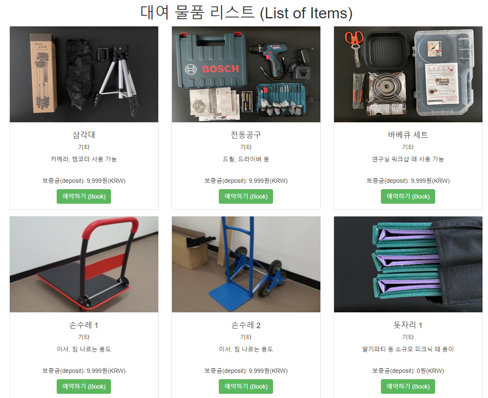

대학원 총학생회 집행부 복지국 2022년 상반기 물품대여사업 사업계획서
===

## 공식 사업명
- 2022년 상반기 물품대여사업

## 담당자
- 제50대 대학원 총학생회 복지국 복지국장

## 추진 배경
- 학생 개인이 자주 사용하지 않지만 반드시 필요한 물품들을 대여해줌으로서, 대학원 생활의 편리성을 증진시키고 학생회비 납부의 실질적 혜택을 제공하고자 본 사업을 계획하게 되었음

## 사업 목표
- 상반기 물품 대여 횟수 100회 달성

## 일시
- 3월 ~ 8월 (2022년도 상반기 상시 진행)

## 장소
- 온/오프라인 플랫폼을 함께 이용
- 오프라인: 서측 학생회관 (W2-1) 대학원 총학생회 사무실 (211호) 및 창고 (101호)
- 온라인: https://gsa.kaist.ac.kr/borrow/ 물품대여사업 온라인 예약 시스템을 운영

## 사업 내용
- 2022년도 상반기 학생회비 납부자를 대상으로 다양한 물품을 대여해줌. 온라인 페이지를 이용하여 특정 물품에 대해 예약한 후 학생증을 지참하여 대여 시작일 상근시간에 대학원 총학생회 사무실에 방문하면 물품 대여가 가능한 구조임
- 2021년도 하반기 기준으로 대여 물품 선정 및 구매, 비치 및 홍보 등 대여 물품에 대한 직접적인 관리를 수행해 왔음. 또한, 물품대여 사이트 운영, 물품 대여 및 반납 창구 운영 등 물품대여사업 전반에 대해 원총이 직접 관여함
- 하지만, 주기적인 홍보의 부재, 편리하지 않은 물품 대여 방식 등으로 인해 참여율이 저조한 편임. 원총에서 물품대여사업을 운영한다는 것을 주기적으로 알릴 방안을 고안하고, 매 학기 진행하는 슬기로운 대학원 생활 OT에서 본 사업을 꾸준히 언급하는 등 사업을 적극 홍보할 계획을 갖고 있음
- 보증금 제도 폐지, 대여 절차 간소화, 당일 신청 가능, 무인 대여 시스템 등을 도입하여 물품 대여의 편의성을 개선할 예정임
- 학생들의 의견을 주기적으로 수렴하여, 추가 배치할 물품 리스트를 선정하고 학생들이 필요로 하는 1등 사업으로 거듭나고자 함

## FAQ
- Q1. 학부생 / 학생회비 미납 대학원생들도 이용이 가능한가요?

    A. 본 사업은 대학원생 분들께서 납부해주신 소중한 학생회비로 운영되므로, 2022년도 상반기 학생회비를 납부한 대학원생에게 우선적으로 혜택이 돌아갈 수 있도록 운영하고 있습니다. 그러므로, 학생회비를 납부한 KAIST 대학원생으로 본 사업의 이용자 범위를 제한하고 있습니다.

- Q2. 물품 대여가 가능한 기간은 최대 몇 일인가요?

    A. 물품 대여는 대여일로부터 최대 2주일까지 가능하며, 대여 기간에는 주말과 공휴일이 포함됩니다.

- Q3. 반납 날짜를 지나서 반납하게 될 경우 어떠한 패널티가 있나요?

    A. (2021년 하반기 기준 정책으로, 2022년 상반기에는 패널티가 변경될 수 있음) 온라인 사이트에서 예약한 반납 날짜를 지날 경우 1일당 1,000원의 연체료가 부과됩니다. 연체료가 자동 차감된 만큼의 보증금 환불이 진행됩니다. 

## 예산
| 비목       | 세목                      | 예산      | 산출근거              |
|:-----------|:--------------------------|:----------|:----------------------|
| 장비구입비 | 무인대여 사업용 장비 구입 | 500,000   | 스마트 도어락 등 구입 |
| 일반회계   | 대여사업 물품 구입        | 2,000,000 | 대여 물품 미정        |
| 합계       |                           | 2,500,000 |                       |

단위:원