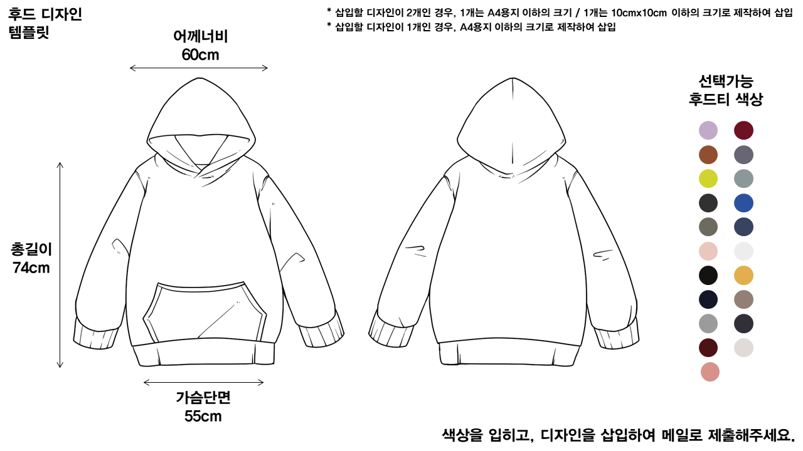

대학원 총학생회 집행부 복지국 2022년 상반기 굿즈제작사업 사업계획서
===

## 공식 사업명
- 2022년 상반기 굿즈제작사업

## 담당자
- 제50대 대학원 총학생회 복지국 복지국장

## 추진 배경
- 교내 굿즈 매장에서 판매하는 기념품의 경우 다양성이 부족하며, 학생들의 실질적인 관심을 끌지 못한다는 의견이 있음. 또한, 기념품 매장에서 판매하는 학교 굿즈의 종류가 학생들에게 잘 알려지지 않아, 기념품 매장 방문 전, 구매 의사를 결정하기가 쉽지 않음. 특히, 코로나19 사회적 거리두기 여파로 인해 학생들의 기념품 매장 방문이 꺼려짐에 따라, 굿즈에 대한 접근성이 최근들어 떨어지고 있음. 즉, 굿즈의 다양성을 개선하고, 온라인 플랫폼을 적극 활용해 굿즈에 대한 접근성을 높이는 것에 대한 필요성이 제기됨. 이러한 문제를 해결하고, 학생들의 문화생활을 장려/증진하고자 본 사업을 계획하게 됨

## 사업 목표
- 2차/3차 굿즈 발매 완료
- 굿즈 공동구매 신청 인원 총 1,000명 달성

## 일시
- 3월 ~ 8월

## 장소
- 서측 학생회관 (W2-1) 대학원 총학생회 회의실 (212호) 
- 구글폼, 크라우드펀딩 사이트 등 온라인 플랫폼도 동시 이용

## 사업 내용
- 굿즈제작사업에서 다룰 굿즈 종류 선정: 1차 굿즈공모전은 후드티를 대상으로 진행하였음. 굿즈 종류에 대한 선호도는 전체 학우 대상으로 투표를 진행하고자 계획했었지만, 시간관계상 원총 내부 투표를 통해 조사하였음
- 선정한 종류의 굿즈에 삽입할 디자인 소스 확보 방법 결정. (1) 디자인 공모전을 개최 (후드티, 플리스, 학잠, 항공점퍼, 롱패딩, 텀블러, 에어팟 케이스, 다이어리 및 머그컵 등 로고 삽입이 가능한 물품) (2) 이미 완성되어 있는 디자인을 사용 (이전 굿즈공모전에서 우승작으로 선정된 디자인 / 학교에서 공식적으로 사용하고 있는 디자인: 명함 등)
- 굿즈공모전 대상 굿즈 종류, 굿즈공모전 참여자격, 상금, 디자인 템플릿 등을 결정하여 굿즈공모전 진행(2021년 하반기 사업 이미지 참조).

- 공모작품에 대한 학생 선호도 조사 진행. 투표 조작 문제를 방지하기 위해 1인당 3개의 공모작품에 투표하도록 안내하고, 최다득표를 받은 디자인을 최종 우승작으로 선정함. 투표 활동을 독려하기 위해서 소정의 상품을 추첨식으로 제공
- 우승작에 대한 특허권/상표권 검토 이후, 디자인 굿즈에 대해 공동구매 진행 시 1인당 부담 금액 조사. 굿즈 시안 제작 후 굿즈 판매 관련 홍보진행(2021년 하반기 사업 이미지 참조)

- 공동구매 관련 홍보는 1주일간 진행하며, 신청자에 한하여 개별 입금 요청을 진행. 입금 기한은 3일이며, 이후 입금되는 금액에 대해서는 환불절차를 밟음. 입금 마감일 이전에 입금된 신청자에 한하여 공동구매 진행
- 사전에 선정한 굿즈 제작 업체에 디자인 굿즈 제작을 의뢰하며, 출고일 기준 3일 뒤부터 3주간 상근인력을 활용하여 오프라인 배포를 진행함.

## FAQ
- Q1. 굿즈 배포시 택배 배송이 가능한가요?

    A. 배포 기간 동안 원총 인원 외 추가 인력을 활용하지 않으므로, 기존에 안내드렸던 바와 같이 택배 등 다른 방안을 이용한 배포는 현실적으로 불가합니다.

- Q2. 아직 학생증을 발급받지 못한 신입생은 굿즈 공동구매 신청/수령이 가능한가요? 

    A. 학부/대학원생 무관하게 입학예정 신입생 모두 굿즈 공동구매 신청이 가능합니다. 본인인증의 수단으로 학사시스템 캡쳐(이름/학번)를 이용 부탁드립니다.

- Q3. 입금 이후 굿즈 수령까지 일반적으로 몇 일의 시간이 소요되나요?

    A. 공동구매 특성상 입금 확인, 디자인 굿즈 발주 및 제작 요청, 개별 포장, 출고 등 복잡한 절차를 거쳐야 하므로 약 3주의 시간이 소요됩니다.  

## 예산
| 비목     | 세목          | 예산      | 산출근거   |
|:---------|:--------------|:----------|:-----------|
| 일반회계 | 공모전 사례비 | 1,000,000 | 4회X25만원 |
| 일반회계 | 샘플제작비    | 600,000   | 4회X15만원 |
| 합계     |               | 1,600,000 |            |

단위:원