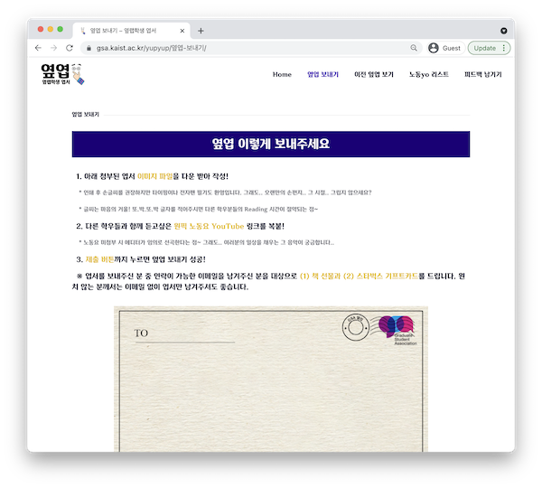

대학원 총학생회 집행부 홍보국 2022년 상반기 옆랩학생 엽서 사업계획서
===

## 공식 사업명
- 2022년 상반기 옆랩학생 엽서

## 담당자
- 제50대 대학원 총학생회 홍보국 홍보국장  

## 추진 배경
- 2021년 연구환경실태조사 결과에 의하면, 응답자의 약 16퍼센트는 대학원 생활을 '행복하지 않다'라고 평가하고 있습니다.
대학원 생활이 행복하지 못 한 원인은 다양하겠지만, 대학원 특유의 좁은 인간관계와 바쁜 생활은 이러한 어려움을 나누고 공감하기에도 너무 각박하게 흘러가고 있다고 생각합니다.
- 이러한 상황에서 대학원 총학생회는 익명성과 엽서라는 두 시스템을 결합해 본인의 상황을 많은 학우들과 함께 나누고, 이러한 과정에서 공감과 소통을 형성하기 위한 사업의 일환으로 '옆랩학생 엽서' 사업을 추진하고자 합니다.

## 사업 목표
- 전체 사업기간 약 12개월 간 최소 30개의 엽서를 학우들에게 발송, 기존 약 260명의 구독자를 300명까지 증가시키고, 기존 평균적으로 60퍼센트 후반이었던 오픈률을 70퍼센트까지 끌어올리는 것을 목표로함
- 또한 기존의 카이스트 대학원생 사회에서 범주를 확장하여 타 연구중심대학 대학원생 사회 등을 포괄하는 것을 추가적인 목표로 설정하고 있음 

## 일시
- 2022년 3월 ~ 8월 (월 3회 발송 (주간), 월 1회 휴재 예정)

## 장소
- 온라인 플랫폼, 구독자 대상 메일 발송 서비스 '스티비 (stibee.com)' 사용

## 사업 내용
-   이메일을 통한 뉴스레터 발송
-   발송된 엽서와 신규 엽서 신청은 옆랩학생 엽서 웹사이트를 통해 진행
    - 옆랩학생 엽서 웹사이트:  [https://gsa.kaist.ac.kr/yupyup](https://gsa.kaist.ac.kr/yupyup)
        
        
        
  -   스팸성 메일을 방지하기 위해 첫 메일은 단체메일로 발송하되, 후에는 원하는 학우를 대상으로 구독을 신청받아 발송함.
-   이메일 마케팅 서비스인  [Stibee](https://stibee.com/)를 통해 구독 및 발송 진행함.
-   뉴스레터를 통해 대학원 생활을 진행하며 겪었던 문제, 고민 등을 공유함.
-   글과 이미지가 주는 시너지에 착안해 메시지에 손그림, 사진 등의 첨부를 권장해 엽서 구독자들이 더욱 공감하고 기억할 수 있는 엽서를 구성하고자 함.
-   학우들로부터 엽서를 지원받아 발송하며, 선정된 엽서 작성자에게는 스트레스 해소 및 삶의 활력 증진에 도움이 될 수 있는 상품 (서적, 음료 쿠폰 등)을 제공할 예정임.

## FAQ
- Q1. 옆랩학생엽서는 어떤 학우들을 대상으로 하나요?
    
    A. 카이스트 소속 학우 누구든, 서로의 이야기를 나누고 공감하며 힘든 현실을 이겨나가고, 기쁨에 함께 공감하고자 한다면 참여하실 수 있습니다.

- Q2. 실질적으로 효과가 있다고 생각하시나요?
    
    A. 2021 상반기 담당자로써 실제 엽서를 보내주신 학우 분들을 만나뵙고, 댓글 등으로 소통해주시는 학우 분들을 접하면서 감사인사, 그리고 진심으로 위로와 공감음 얻을 수 있었다는 의견을 많이 전달 받았습니다. 이를 통해 우리가 자칫 사소하다고 생각하기 쉬운 이야기와 공감이 누군가에게는 소중한 존재가 될 수 있음을 느꼈고, 이 '옆랩학생 엽서'가 이러한 활동에 있어 하나의 장이 될 수 있다고 생각합니다.

- Q3. 사업의 발전 가능성에 대해 어떻게 생각하시나요?
    
    A. 기존 사업 담당자 및 학우분들의 열정적인 참여로 첫 엽서 발송 당시 25개 정도였던 게시물 반응이 현재는 평균 70개를 상회하고 있습니다. 늘 소통이나 공감이 어려운 대학원의 현실에서, 옆랩학생 엽서는 소박하더라도 꾸준히 발전해나가는 사업이 될 것으로 생각됩니다.

## 예산
| 비목   | 세목            | 예산    | 산출근거   |
|:-------|:----------------|:--------|:-----------|
| 홍보비 | 사연선정자 경품 | 200,000 | 2만원X10인 |
| 합계   |                 | 200,000 |            |

단위:원