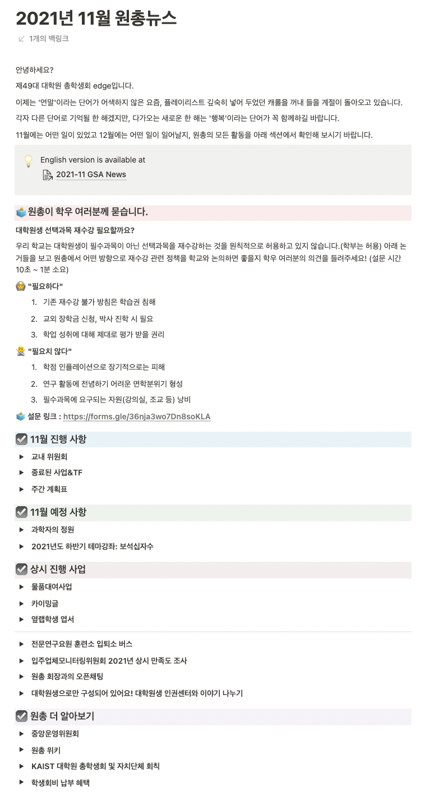

대학원 총학생회 집행부 홍보국 2022년 상반기 원총뉴스 사업계획서
===

## 공식 사업명
- 2022년 상반기 원총뉴스

## 담당자
- 제50대 대학원 총학생회 홍보국장

## 추진 배경
- 대학원 총학생회는 1년의 임기동안 학우들의 복지, 문화, 연구환경 등의 증진을 위해 많은 사업과 정책을 추진하고 있으나, 홍보 방식의 차이, 학우들의 바쁜 일상 등 다양한 원인으로 인해 모든 사업이 오롯이 전달되지못하고 있는 실정이다. 
- 이에 월 1회 대학원 총학생회의 활동과 다음 달 계획을 정리한 원총뉴스를 발간함으로써, 학우들에게 기존 사업 및 진행 예정 사업을 홍보하고, 정책 결정 과정 등 원총이 대학원 사회를 위해 노력했던 성과를 인식시키고자 한다.

## 사업 목표
- 월 1회 발간하는 원총뉴스를 통해 대학원 총학생회의 사업을 정리하고 홍보함으로써 학우들에게 대학원 총학생회의 활동을 인지시키는 것을 목표로 한다. 또한 이에 대한 구체적 목표로 월 150회 이상의 원총뉴스 조회수를 목표로 홍보 및 개선을 진행하고자 한다.

## 일시
- 2022년 3월~8월 (월 1회 발송)

## 장소
- 온라인 플랫폼, Notion 및 GSA 홈페이지 사용.

## 사업 내용
- 월 1회 발송하는 원총뉴스로써, 학우들에 대한 간단한 의견 조사, 대학원 총학생회의 위원회 참석 및 주간 계획표 공개, 진행했던 사업 및 계획 된 사업 홍보 등을 진행한다.
 

  

## FAQ
- Q1. 원총뉴스의 홍보 방식은 무엇인가요?

    A. 노션으로 정리한 내용을 이메일과 GSA 홈페이지를 통해 학우들에게 공개함으로써 홍보를 진행하게 됩니다.

- Q2. 홍보목적 이외에 역할이 있다면 무엇일까요?

    A. 제49대 대학원 총학생회부터 원총뉴스를 통해 대학원 총학생회가 참여한 위원회, 그리고 활동 내역을 담은 주간계획표를 공개함으로써 기존에는 학우들이 접근하는데 어려움이 있었던 대학원 총학생회의 활동 내역을 더욱 투명하게 공개하는데 일조하고 있습니다. 이를 통해 학우들과 대학원 총학생회 사이의 신뢰 관계 형성에도 기여할 수 있을 것으로 기대하고 있습니다. 
 
- Q3. 더 개선할 사항은 없을까요?

    A. Notion 홍보의 특성상 내용 확인이 한눈에 되기 어렵고, 이로 인해 학우들에게 전달되는 과정이 조금 더 번거로운 편입니다. 이를 개선하기 위해 홍보국 내에서 원총뉴스를 간결히 정리한 카드뉴스를 제작하고, 소셜미디어 등을 통해 전달함으로써 이러한 문제를 개선할 수 있을 것으로 기대하고 있습니다.

## 예산
| 비목   | 세목           | 예산    | 산출근거   |
|:-------|:---------------|:--------|:-----------|
| 홍보비 | 설문 참여 독려 | 200,000 | 5만원X4인  |
| 합계   |                | 200,000 |            |

단위:원