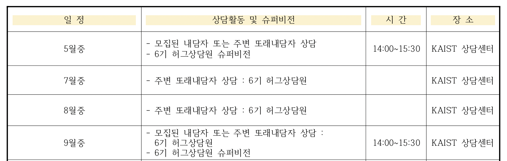

2022년 상반기 대학원 총학생회 인권센터 심리상담자 교육(허그) 프로그램 사업계획서
===

## 공식 사업명
- 2022년 상반기 인권센터 심리상담자 교육(허그) 프로그램 사업

## 담당자
- 대학원 총학생회 인권센터 김원일

## 추진 배경
- KAIST 상담센터는 1년에 상당히 많은 상담으로 인하여 과부하가 걸려 있으며 상담 인원에 비해 센터 내의 상담 인력은 상당히 부족함. (전임상담사 6명이 1년에 약 3500건 이상의 케이스를 처리- 현재는 3인 추가 채용)
- 또한 KAIST 교내 케어링 기구들의 한계를 보완할 수 있는 새로운 창구가 필요함. 
- 기존 멘토링의 경우 대학원 학생들이 겪는 갈등 및 고민에 대한 유경험자로서 훌륭하지만 상담에 관한 전문적인 교육 없이 진행된 경우가 많기 때문에 체계적인 상담이 부족함.

## 사업 목표
- KAIST 대학원 학생들이 원내 생활 중 발생하는 다양한 문제와 고민을 관하여 원활하게 소통할 수 있는 창구 마련.
- 대학원생 인권센터와 KAIST 상담센터가 공동으로 상담자 역할을 수행하는 학생들을 선발 및 교육을 시행. 
- 이를 통해 고민을 가진 학생들 주변에서 이에 대한 경청 및 공감대를 형성하여 학생들 내부에서 갈등을 해소.

## 일시
- 2022년 봄학기 시작일 ~ 2022년 가을학기 시작 전일
- 선발인원: 30명 내외 

## 장소
- 카이스트 상담센터 (※ 장소는 사정에 따라 변경될 수 있습니다.)

## 사업 내용
- 5기 대학원생 허그상담원 교육계획(안)

※ 상기 일정은 사정에 따라 변경될 수 있습니다.

- 대학원생 허그상담원 상담진행 및 슈퍼비전 운영 계획(안)
  
※ 상기 일정은 사정에 따라 변경될 수 있습니다.

- 대학원생을 대상으로 내담자를 상시 모집 
- 내담자를 상담교육생에게 배정하고 개인적으로 상담을 진행한 후, 상담일지를 작성하여 인권센터로제출
- 예산 지급 기준 (상담수당 및 상담운영비는 상담센터에서 전액 지원 예정)
		- 또래상담은 상담 1회당 50분 내외 시간으로 월 4회까지 상담활동 하도록 함 
		- 상담 1회당 또래상담원 수당 2만원과 활동경비 지원금 1만원을 지급 
		- 상담체험 주간 교육생에게는 수당 2만원을 제외한 활동경비 지원금 1만원을 지급
- 매달 1회 진행하는 슈퍼비전에서 교내에서 상담한 내용에 대해서 논의함(내담자의 신분 및 상담 내용에 대해서는 철저히 보장됨)

## FAQ
- Q1. 선발 인원 구성은 어떻게 되나요?

	A. 현재 대학원생 20명 학부생 10명, 총 30명을 선발할 예정이며 상황에 따라 조정될 수 있습니다. 

- Q2. 또래 상담원 배정은 어떻게 하나요?

	A. 상담을 원하는 내담자가 카카오톡 플러스친구로 상담을 신청하면 인권센터 내부 절차(성별, 학과, 연차 등을 고려)에 따라 적절한 상담사를 선택한 후 내담자의 동의 하에 상담사를 배정합니다.

## 예산

|  **비목** |   **세목**   | **예산** |
|:----------:|:------------:|:--------:|
|일반회계  | 슈퍼비전 운영비 (다과 및 식사 구입비) | 900,000 | (코로나로 인해 이전 상담원들이 상담을 진행할 수 있을지 확인 필요)
|일반회계  | 주별 교육비 (자료인쇄, 다과 및 식사 구입비) | 1,800,000 |
|업무추진비  | 기념품 구입비 | 600,000 |
|예비비  | 예비비 | 500,000 |
|   **합계**  |              |    3,800,000    |

단위:원

※ 추가 비용 및 상담수당 및 상담운영비는 상담센터에서 전액 지원 예정입니다.

