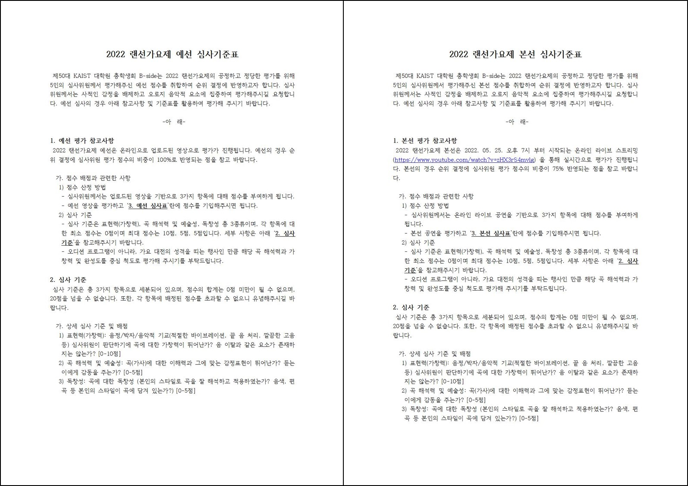
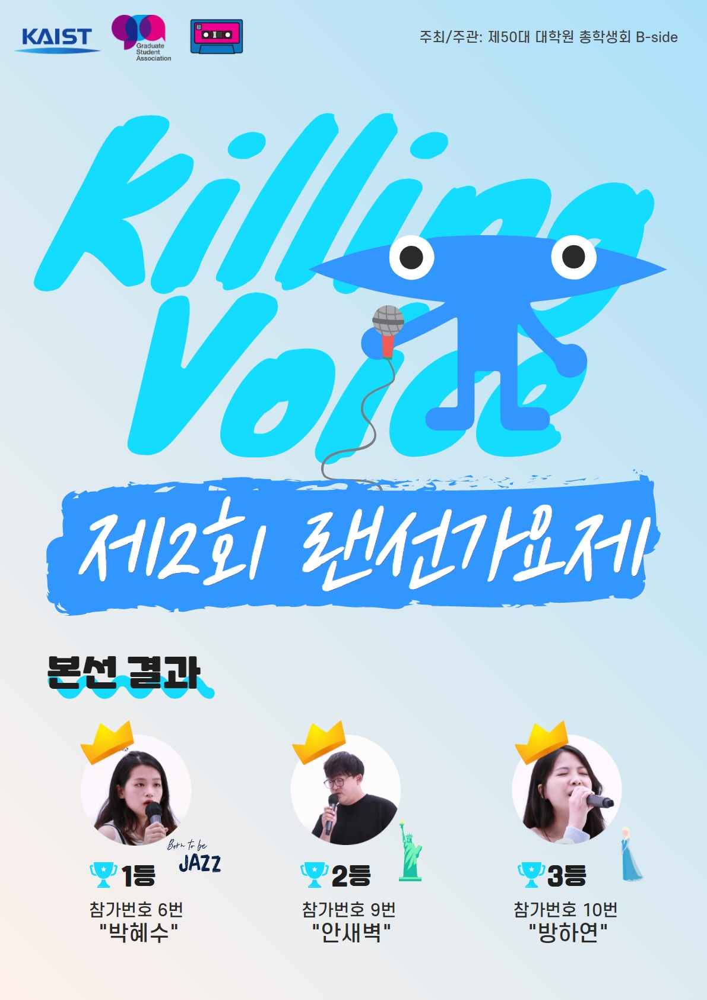

대학원 총학생회 집행부 문화국 2022년 상반기 랜선 가요제 사업보고서
===

## 공식 사업명
- 2022년 상반기 랜선 가요제

## 담당자
- 제50대 대학원 총학생회 문화국 국장

## 추진 배경
- 코로나 발생으로 인해 사회적 거리두기가 장기화 됨에 따라 학생들이 참여할 수 있는 행사와 공연이 적어졌음.
- 학생들이 즐길 수 있는 온라인 공연을 개최하여 잠시나마 스트레스를 해소할 수 있도록 돕고자 함.

## 사업 목표
- 예선 참여자 60명
- 실제 달성 여부: X (예선 참가자 34팀)

## 일시
|  **일시** |   **내용**   |
|:----------:|:------------:|
| 2022-05-04 |예선 접수 시작|
| 2022-05-15 |예선 접수 마감|
| 2022-05-15 ~ 2022-05-20 |예선 심사|
| 2022-05-25 오후 7시 |본선|
| 2022-05-26 ~ 2022-06-21 |랜선 가요제 시청자 대상 이벤트 경품 배포|

## 장소
- YouTube Live를 통한 온라인 중계
- 본선 장소:  IR Studio(학술문화관(E9) 3층)

## 사업 진행 결과
1. 예선
- KAIST 학부/대학원 학생을 대상으로 랜선 가요제 참가자 모집을 진행했으며, 총 34팀이 신청함.
- 사전 녹화된 YouTube 영상링크를 통해 본선 참가자 10팀을 선발함. (원총 외부에 심사 의뢰)
- 참가대상은 솔로 또는 듀엣으로만 한정함.
2. 본선
- 오프라인 공연을 진행하고 이를 실시간 방송 플랫폼(YouTube)을 통해 온라인 중계함.
- 실시간 방송 호응을 높이기 위해 치킨 기프트콘과 스타벅스 쿠폰을 랜덤 지급함.
- 본선 심사는 심사위원 75% 온라인 투표 25%로 합계함.
- 온라인 투표는 교내 구성원 대상으로 중복 투표를 방지하기 위해 KAIST 포탈 설문 기능을 이용함.
- 랜선가요제 홈페이지를 통해 공연 영상, 축사 영상(이수만/조수미 교수님), 참가자 안내, 이벤트 당첨자 안내를 공유함.
  - 웹사이트 링크: https://gsa.kaist.ac.kr/lan-sing/

 

## 결산: 총 예산 4,700,000 원 중 4,239,310 원 집행

- 일반회계: 0 원
- 학생회계: 4,700,000 원 중 4,239,310 원 집행

|  **비목** |   **세목**   | **산출 기준** | **예산** | **결산** |
|:----------:|:------------:|:--------:|:--------:|:--------:|
|홍보비| 참가자 경품비 |5만원X40인  | 2,000,000 | 1,985,000 |
|홍보비| 홍보물 제작비 | 포스터, 현수막 제작비 |500,000 | 240,000 |
|인건비| 심사위원 수당| 10만원X5인X2회(예선,본선) |1,000,000| 1,000,000 |
|위탁용역비| 스튜디오 대여 및 방송진행| 스튜디오 대여료 기준 |1,000,000| 1,000,000 |
|운영비| 진행물품 구입| 큐카드 등 진행 물품 구입 |100,000| 14,310 |
|업무추진비| 행사진행비| 행사 진행 음료 구입 등 |100,000| 0 |
|   **사업비 총액**  |          |      | **4,700,000** | **4,239,310** |
|   **일반회계 총액**  |         |      | **0** | **0**  | 
|   **학생회계 총액**  |        |       | **4,700,000** | **4,239,310** | 

단위:원

## 사진

 
 

## 경품 수여자

1. 수상자

|  **번호** |**성명** |**경품** |
|:------------:|:--------:|:--------:|
|1 |박혜수| 500,000 원 (1등 상금) |
|2 |안새벽| 300,000 원 (2등 상금) |
|3 |방하연| 200,000 원 (3등 상금) |
|4 |윤지상| 100,000 원 (본선 진출자) |
|5 |이신영| 100,000 원 (본선 진출자) |
|6 |박신우| 100,000 원 (본선 진출자) |
|7 |채수윤| 100,000 원 (본선 진출자) |
|8 |Anna Joya, Gianidita Nurani Pertiwi| 100,000 원 (본선 진출자) |
|9 |조형주| 100,000 원 (본선 진출자) |
|10 |한승호| 100,000 원 (본선 진출자) |

2. 본선 중 실시간 투표자 중 10명 추첨

|  **번호** |   **학번**   | **성명** |**경품** |
|:----------:|:------------:|:--------:|:--------:|
|11 |202253**|최은*|치킨 기프티콘 (2만원 상당) |
|12 |201952**|이승*|치킨 기프티콘 (2만원 상당) |
|13 |202260**|Mou******|치킨 기프티콘 (2만원 상당) |
|14 |202252**|이희*|치킨 기프티콘 (2만원 상당) |
|15 |202155**|이병*|치킨 기프티콘 (2만원 상당) |
|16 |202133**|오경*|치킨 기프티콘 (2만원 상당) |
|17 |202130**|구지*|치킨 기프티콘 (2만원 상당) |
|18 |201970**|김보*|치킨 기프티콘 (2만원 상당) |
|19 |201904**|이종*|치킨 기프티콘 (2만원 상당) |
|20 |201603**|서혜*|치킨 기프티콘 (2만원 상당) |

3. 본선 중 실시간 채팅 참가자 중 20명 추첨
- 2021년도의 제49대 대학원 총학생회에서 이월된 경품을 사용함.
- 총 20명을 추첨했으나 4명 미수령으로 총 16명에게 제공함.

|  **번호** |   **연락처**   | **닉네임** |**경품** |
|:----------:|:------------:|:--------:|:--------:|
|21 |010-49*0-53**|전석*|스타벅스 기프트카드 (5,000원) |
|22 |010-50*7-76**|김보*|스타벅스 기프트카드 (5,000원) |
|23 |010-22*2-48**|이승*|스타벅스 기프트카드 (5,000원)|
|24 |010-64*3-89**|Haeorm Pa**|스타벅스 기프트카드 (5,000원) |
|25 |010-44*9-61**|김루*|스타벅스 기프트카드 (5,000원) |
|26 |010-57*4-30**|Eas**|스타벅스 기프트카드 (5,000원) |
|27 |010-87*7-30**|KW L**|스타벅스 기프트카드 (5,000원) |
|28 |010-39*9-18**|딸기**|스타벅스 기프트카드 (5,000원)|
|29 |010-34*2-28**|신형 *|스타벅스 기프트카드 (5,000원) |
|30 |010-27*8-78**|준태 *|스타벅스 기프트카드 (5,000원)|
|31 |010-93*1-81**|박제*|스타벅스 기프트카드 (5,000원) |
|32 |010-45*0-58**|키다*|스타벅스 기프트카드 (5,000원) |
|33 |010-82*6-30**|Moon**|스타벅스 기프트카드 (5,000원)|
|34 |010-65*7-35**|주발*|스타벅스 기프트카드 (5,000원) |
|35 |010-72*7-17**|김종*|스타벅스 기프트카드 (5,000원) |
|36 |010-22*5-56**|Edward K**|스타벅스 기프트카드 (5,000원) |
