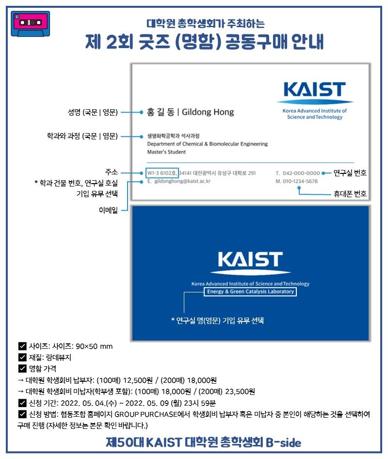

대학원 총학생회 집행부 복지국 2022년 상반기 굿즈제작사업 사업보고서
===

## 공식 사업명
- 2022년 상반기 굿즈제작사업

## 담당자
- 제50대 대학원 총학생회 복지국장

## 추진 배경
- 교내 굿즈 매장에서 판매하는 기념품의 경우 다양성이 부족하며, 학생들의 실질적인 관심을 끌지 못한다는 의견이 있음. 또한, 기념품 매장에서 판매하는 학교 굿즈의 종류가 학생들에게 잘 알려지지 않아, 기념품 매장 방문 전, 구매 의사를 결정하기가 쉽지 않음. 
-	특히, 코로나19 사회적 거리두기 여파로 인해 학생들의 기념품 매장 방문이 꺼려짐에 따라, 굿즈에 대한 접근성이 최근들어 떨어지고 있음. 즉, 굿즈의 다양성을 개선하고, 온라인 플랫폼을 적극 활용해 굿즈에 대한 접근성을 높이는 것에 대한 필요성이 제기됨. 
-	이러한 문제를 해결하고, 학생들의 문화생활을 장려/증진하고자 본 사업을 계획하게 됨

## 사업 목표
- 2차/3차 굿즈 발매 완료 (달성여부: X, 3차 굿즈 발매 추진중)
- 굿즈 공동구매 신청 인원 총 1,000명 달성 (달성여부: X, 총 신청 건수: 277건)

## 일시 및 장소
2차 굿즈 (명함): 2022년 5월/8월 중, 온라인 홈페이지를 통한 구매
3차 굿즈 (반팔티): 2022년 8월 중, 온라인 홈페이지를 통한 구매

## 사업 진행 결과
-	협동조합과의 협업을 진행함으로써 기존에 접수된 불편 사항들을 효과적으로 해결함
-	향후 꾸준한 굿즈발매를 위해 안정적인 사업 프로세스를 고안 및 마련하였음
-	고객경영팀 및 29개 학과에서 활용중인 명함 디자인을 수집하고, 수정함으로써 학생들에게 선호도가 높은 명함 디자인을 제작함
-	현장배포와 택배배송 서비스를 함께 제공함으로써, KAIST 재학생 전체에게 사업 참여의 기회를 제공하였음
-	총 2회의 홍보를 통해 277건의 명함 공동구매 신청을 접수하였으며, 공동구매 대행을 진행함
-	협동조합 및 대학원 총학생회 상근인력을 등을 활용함으로써 약 260개의 명함 배포를 완료하였으며, 8월 현재 명함 공동구매를 추가적으로 접수 받을 예정임

## 결산: 총 예산 1,600,000 원 중 174,750 원 집행

- 일반회계: 1,600,000 원 중 174,750 원 집행

|  **비목** |   **세목**   | **산출 기준** | **예산** | **결산** |
|:----------:|:------------:|:--------:|:--------:|:--------:|
|일반회계| 공모전 사례비 | 4회X25만원 | 1,000,000 | 0 |
|일반회계| 샘플제작비 | 4회X15만원 | 600,000 | 174,750 | 
|   **사업비 총액**  |        |        | **1,600,000** | **174,750** |
|   **일반회계 총액**  |        |        | **1,600,000** | **174,750** |
|   **학생회계 총액**  |         |       |**0** | **0** |

단위:원 

(비고) 반팔티 로고 및 캐릭터 디자이너 인건비로 500,000원 추가 집행 예정

## 홍보물

|  **홍보일** |   **제목**   | **매체** |
|:----------:|:------------:|:--------:|
|2022-05-03|[원총] 2022년 그 첫번째 굿즈: 명함 공동구매 안내|[GSA 홈페이지](https://gsa.kaist.ac.kr/notice/200882?page=2), 단체메일, [ARA](https://newara.sparcs.org/post/242793?from_view=all&current=1&search_query=%EB%AA%85%ED%95%A8)|
|2022-05-09|[원총] 2022년 그 첫번째 굿즈: 명함 공동구매 안내 (오늘 신청 마감!!)|단체메일|

## 사진

 

## 경품 당첨자
없음
