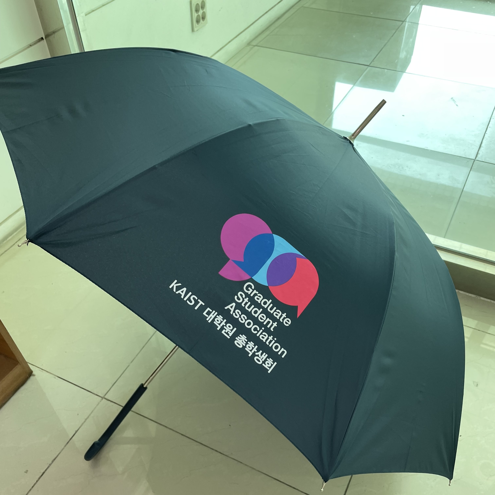

대학원 총학생회 집행부 복지국 2022년 상반기 물품대여사업 사업보고서
===

## 공식 사업명
- 2022년 상반기 물품대여사업

## 담당자
- 제50대 대학원 총학생회 복지국 복지국장

## 추진 배경
- 학생 개인이 자주 사용하지 않지만 반드시 필요한 물품들을 대여해줌으로서, 대학원 생활의 편리성을 증진시키고 학생회비 납부의 실질적 혜택을 제공하고자 본 사업을 계획함

## 사업 목표
- 상반기 물품 대여 횟수 100회 달성
- 달성여부 : X (27회 대여)

## 일시 및 장소
2022년 3월 ~ 8월 (2022년도 상반기 상시 진행), W2 211호

## 사업 진행 결과
- 2022년도 상반기 학생회비 납부자를 대상으로 계산기, 빔프로젝터, 테니스라켓 등 다양한 물품을 대여해 주었음. 
- 대여 물품 선정 및 구매, 비치 및 홍보 등 대여 물품에 대한 직접적인 관리를 수행했으며, 물품대여 사이트 운영, 물품 대여 및 반납 창구 운영 등 물품대여사업 전반에 대해 총괄하였음.
- 물품대여사업의 일환으로 우산대여사업을 진행함으로써 장마 기간 학우들의 생활 환경 개선을 도움.
- 2022년도 하반기에는 보증금 제도 폐지, 대여 절차 간소화, 당일 신청 가능, 무인 대여 시스템 등을 도입하여 물품 대여의 편의성을 개선할 예정이며 시스템 개편/웹사이트 개발 등을 진행하고 있음.

(비고) 2022년도 하반기 물품대여사업 무인화 관련한 상세 내용은 하반기 사업계획서에 별도 첨부 예정임

## 결산: 총 예산 2,500,000 원 중 1,228,000 원 집행

- 일반회계: 2,500,000 원 중 1,228,000 원 집행

|  **비목** |   **세목**   | **산출 기준** | **예산** | **결산** |
|:----------:|:------------:|:--------:|:--------:|:--------:|
|일반회계| 대여사업 물품 구입  | 대여물품 및 우산 구매비용  | 2,000,000 | 1,204,500 |
|일반회계| 무인대여 사업용 장비 구입 | 스마트 도어락 등 구입 | 500,000 | 23,500 | 
|   **사업비 총액**  |        |        | **2,500,000** | **1,228,000** |
|   **일반회계 총액**  |        |        | **2,500,000** | **1,228,000** |
|   **학생회계 총액**  |         |       |**0** | **0** |

단위:원 

## 홍보물

|  **홍보일** |   **제목**   | **매체** |
|:----------:|:------------:|:--------:|
|2022-06-23|[원총] 원총이 당신의 우산이 될게요: 우산 대여 서비스 시작 안내|[GSA 홈페이지](https://gsa.kaist.ac.kr/notice/204155), 단체메일, [KAIST 포탈](https://portal.kaist.ac.kr/ennotice/student_notice/11655964088450)|

## 사진

## 경품 당첨자
없음
