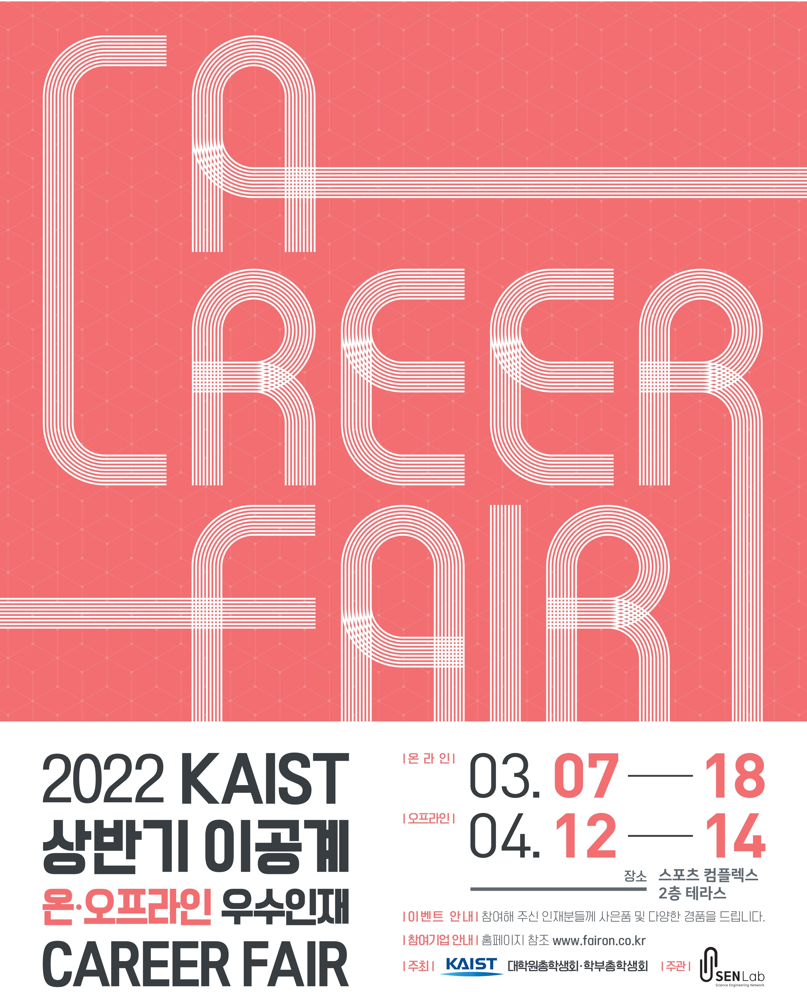

대학원 총학생회 집행부 복지국 2022년 상반기 취업박람회 사업보고서
===

## 공식 사업명
- 2022년 상반기 취업박람회

## 담당자
- 제50대 대학원 총학생회 복지국 복지국장

## 추진 배경
- 전공 분야의 범위가 학사 졸업생에 비해 좁고, 고도로 전문적인 석/박사 졸업생 특성상 학생 주도적인 정기/상시 채용 지원의 기회가 적음. 이러한 문제를 해결하고자 석/박사 경력직 채용 기업을 초청하여 학우들에게 취업 정보의 폭을 넓히고, 학생 주도적 구직이 적극적으로 일어날 수 있도록 장려함.
- 코로나19 사태 장기화 등으로 인해 취업난이 심화되고 구인 형태가 일부 변화함에 따라 취업 준비에 고충을 겪고 있는 학우들에게 온라인/오프라인 플랫폼의 이원화된 취업박람회를 운영하여 취업에 대한 정보를 효과적으로 제공.
- KAIST 학생들에게 석/박사 경력직 채용 및 전문연구요원 지정업체 입사에 관한 정보를 효율적이고 투명하게 제공함으로서, 학생들의 취업 및 진로 고민을 해소하도록 돕는 것이 본 사업의 궁극적인 목표임. 

## 사업 목표
- 원총의 목표 : 상담 건수 300회 이상 달성 (온/오프라인 플랫폼 통합)
- 달성 여부 : O (총 449회)

## 일시 및 장소
2022 상반기 온라인 취업박람회: 2022. 03. 08 ~ 2022. 03. 18 (총 10일)
2022 상반기 오프라인 취업박람회: 2022. 04. 12 ~ 2022. 04. 14 (총 3일)

## 사업 진행 결과
- Fairon 및 zoom 플랫폼을 이용한 상담창구를 운영함으로써 온라인 취업박람회를 개최하였음 (참가 기업 수: 40개, 참여 학생 수: 160명)
- 류근철 스포츠컴플렉스 2층 테라스를 활용하여 오프라인 취업박람회를 개최하였음 (참가 기업 수: 31개, 참여 학생 수: 118명)
- 온/오프라인 모니터링 스태프를 구성하여 취업박람회 운영 관련한 전반적인 피드백을 수집하였음. 특히, 취업에 직결되지 않은 학생이 참여하기 어려움/기업의 다양성이 부족하였음/상담 담당자가 실무자가 아님 등의 피드백이 주를 이루었음. 이러한 학생들의 피드백은 2022년도 하반기 취업박람회 기획에 적극적으로 활용하고 있음. 
- 2022년도 하반기 취업박람회 운영사 공개입찰을 진행하였으며 6인의 입찰평가위원의 공정한 평가를 통해 NHR communications (엔에이치알커뮤니케이션즈/대학내일 계열사)가 우선협상업체로 선정되었음. NHR communications와의 2회의 협의 후 최종 운영사로 결정하여 실무를 진행중에 있음. 

(비고) 2022년도 하반기 취업박람회 관련한 상세 내용은 하반기 사업계획서에 별도 첨부 예정임

## 결산: 총 예산 1,300,000 원 중 800,000 원 집행

- 학생회계: 1,300,000 원 중 800,000 원 집행

|  **비목** |   **세목**   | **산출 기준** | **예산** | **결산** |
|:----------:|:------------:|:--------:|:--------:|:--------:|
|학생회계| 스태프 수당 | 5인X4회X4시간X1만원 | 800,000 | 800,000 |
|학생회계| 홍보 경품비 | 10인X5만원 | 500,000 | 0 | 
|   **사업비 총액**  |        |        | **1,300,000** | **800,000** |
|   **일반회계 총액**  |        |        | **0** | **0** |
|   **학생회계 총액**  |         |       |**1,300,000** | **800,000** |

단위:원 

## 홍보물

|  **홍보일** |   **제목**   | **매체** |
|:----------:|:------------:|:--------:|
|2022-03-03|[원총] 2022 상반기 온라인 취업박람회 안내|[GSA 홈페이지](https://gsa.kaist.ac.kr/notice/196890?page=3), 단체메일, [KAIST 포탈](https://portal.kaist.ac.kr/ennotice/student_notice/11646292708443), [ARA](https://newara.sparcs.org/post/241682?from_view=topic&topic_id=grad-assoc&current=3&from_page=3)|
|2022-03-07|[원총] 2022 상반기 온라인 취업박람회 안내(삼성, 네이버 등 부스 일정 업데이트)|[GSA 홈페이지](https://gsa.kaist.ac.kr/notice/196924?page=3), 단체메일, [KAIST 포탈](https://portal.kaist.ac.kr/ennotice/student_notice/11646636811871), [ARA](https://newara.sparcs.org/post/241796?from_view=topic&topic_id=grad-assoc&current=3&from_page=3)|
|2022-03-14|[원총] (Reminder) 2022 상반기 온라인 취업박람회 안내|단체메일|
|2022-04-04|[원총] 2022 상반기 오프라인 취업박람회 안내|[GSA 홈페이지](https://gsa.kaist.ac.kr/notice/198846?page=3), 단체메일, [KAIST 포탈](https://portal.kaist.ac.kr/ennotice/student_notice/11649041927457), [ARA](https://newara.sparcs.org/post/242350?from_view=topic&topic_id=grad-assoc&current=2&from_page=2)|
|2022-04-08|[원총] 2022 상반기 오프라인 취업박람회 안내 (4월12일 (화) - 4월 14일 (목) 개최, 참여기업 업데이트)|단체메일|
|2022-04-12|[원총][장소변경] 2022 상반기 오프라인 취업박람회 안내 (4월12일 (화) - 4월 14일 (목) 개최, 참여기업 업데이트)|단체메일|

## 사진

## 경품 당첨자
없음
