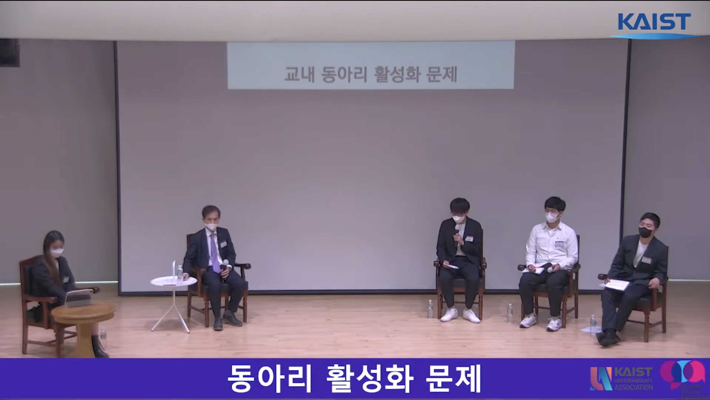

# 대학원 총학생회 집행부 2022년 상반기 KAIST 타운홀 미팅 사업보고서

## 공식 사업명
- KAIST 타운홀 미팅 

## 담당자
- 제50대 대학원 총학생회 정책부장

## 추진 배경
- 일반적인 학생들의 삶과 교수가 생각하는 학생들의 삶 사이에 거리가 존재하고, 이를 듣고자 하는 교수들의 요청에 따라 타운홀 미팅 개최 필요성 대두
- 보직자 교수들과 학생들의 원활한 소통과 이를 통한 학교의 발전을 위해 학부 총학생회/대학원 총학생회의 협력 하에 만남을 추진

## 사업 목표
- 학생(학부생, 대학원생)들의 입장에서 학교 생활을 하면서 어려운 점이 무엇이 있고, 학교 측에서 해결 가능한 문제라면 이에 대해 의제를 설정하고자 함

## 일시
- 2022년 5월 4일 (수) 16:00 ~ 18:30

## 장소
- 학술문화관 5층 정근모 컨퍼런스 홀, 온라인 유튜브 중계

## 사업 진행 결과

- 참여 인원
    - 약 60명의 학우가 오프라인으로 참여함, 30명의 학우가 유튜브 중계에 참여함 

- 참여 패널
   - 1부
      - 이광형 총장
      - 최동혁 대학원 총학생회 총학생회장
      - 이동헌 대학원 총학생회 부총학생회장
      - 허현 학부 총학생회 비상대책위원장
      - 사회자

   - 2부 
      - 이승섭 교학부총장
      - 이태식 교무처장
      - 이수진 학생정책처장
      - 신병하 학생생활처장
      - 배중면 안보융합원장
      - 최동혁 대학원 총학생회 총학생회장
      - 이동헌 대학원 총학생회 부총학생회장
      - 허현 학부 총학생회 비상대책위원장
      - 박정호 학부 총학생회 부비상대책위원장  
     - 사회자
  
- 논의 주제
   - 1부
     - 학부 동아리 활성화 문제
     - 학부 영어강의 문제
     - 카이스트의 비전 (총장님이 생각하는 인재)
     - 현장 질문
   - 2부
     - 이공계 대학원 기피 현상 (경제적 제도, 전문연구요원, 이공계의 진로 등)
     - 카이스트의 인재상 (카이스트의 비전, 연차초과자 등)
     - 교수와 학생 모두가 행복한 연구실 (휴가일수 명문화, 수료 요건 명문화)
     - 현장 질문

- 향후 계획
   - 보직교수와 학생이 자유롭게 이야기할 수 있는 KAIST 타운홀 미팅을 2학기에도 개최한다.
   - 시간 관계상 충분히 논의되지 못한 주제를 정리하여 추후 행사에서 논의될 수 있도록 한다.
   - 단순히 행사에서 논의되는 것만으로 그치지 않고 문제해결까지 이어질 수 있도록 학교와 학생 모두에게 지속적으로 의제화한다.

## 결산: 총 예산 1,100,000 원 중 590,600 원 집행
- 학생회계: 1,100,000 원 중 590,600 원 집행 

|  **비목** |   **세목**   | **산출 기준** | **예산** | **결산** |
|:----------:|:------------:|:--------:|:--------:|:--------:|
|홍보비| 질문지 응모함 구매 | | 0 | 51,000 |
|홍보비| 경품 지급 세금 | 4인X25만원 | 1,000,000 | 439,600 |
|인건비| 행사 당일 스태프 인건비 | 1만원X5인X2회 |100,000 | 100,000 |
|   **사업비 총액**  |          |      | **1,100,000** | **590,600** |
|   **일반회계 총액**  |         |      | **0** | **0**  | 
|   **학생회계 총액**  |        |       | **1,100,000** | **590,600** | 

## 사진
- 

## 경품 수여자

|  **번호** |**성명** |**경품** |
|:------------:|:--------:|:--------:|
|1 |엄*림| 갤럭시 탭 (추첨 1등) |
|2 |박*일| 상품권 (추첨 2등) |
|3 |이*형| 다이슨 헤어드라이기 (추첨 3등) |
|4 |손*규| 50,000원 커피 상품권 (현장 질문자) |
|5 |최*윤| 50,000원 커피 상품권 (현장 질문자) |
|6 |김*주| 50,000원 커피 상품권 (현장 질문자) |
|7 |윤*상| 50,000원 커피 상품권 (현장 질문자) |
|8 |강*우| 50,000원 커피 상품권 (현장 질문자) |
|9 |조*완| 50,000원 커피 상품권 (현장 질문자) |
|10 |한*희| 50,000원 커피 상품권 (현장 질문자) |
|11 |김*원| 50,000원 커피 상품권 (현장 질문자) |
|12 |이*형| 50,000원 커피 상품권 (현장 질문자) |
|13 |김*중| 50,000원 커피 상품권 (현장 질문자) |
|14 |이*연| 50,000원 커피 상품권 (현장 질문자) |
