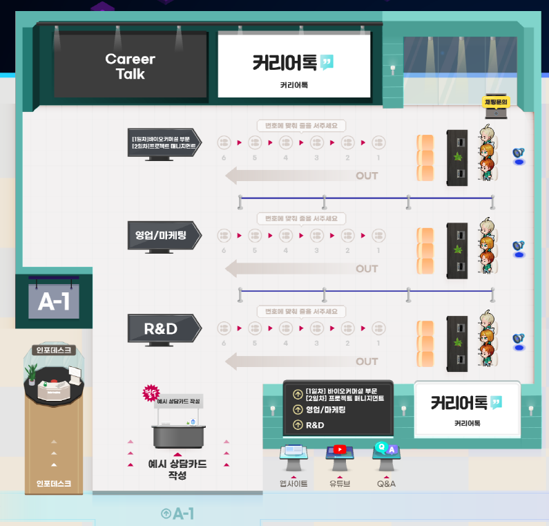

대학원 총학생회 집행부 복지국 2022년 하반기 취업박람회 사업계획서
===

## 공식 사업명
- 2022년 하반기 취업박람회

## 담당자
- 제50대 대학원 총학생회 복지국 복지국장

## 추진 배경
- 전공 분야의 범위가 학사 졸업생에 비해 좁고, 고도로 전문적인 석/박사 졸업생 특성상 학생 주도적인 정기/상시 채용 지원의 기회가 적음. 이러한 문제를 해결하고자 석/박사 경력직 채용 기업을 초청하여 학우들에게 취업 정보의 폭을 넓히고, 학생 주도적 구직이 적극적으로 일어날 수 있도록 장려함.
- 코로나19 사태 장기화 등으로 인해 취업난이 심화되고 구인 형태가 일부 변화함에 따라 취업 준비에 고충을 겪고 있는 학우들에게 온라인/오프라인 플랫폼의 이원화된 취업박람회를 운영하여 취업에 대한 정보를 효과적으로 제공.

## 사업 목표
- 상담 건수 500회 이상 달성 (온/오프라인 플랫폼 통합)

## 일시
- 2022 하반기 온라인 메타버스 취업박람회: 2022. 09. 15-16 / 2022. 09. 22-23 (총 4일)
- 2022 하반기 오프라인 취업박람회: 2022. 09. 05-07 / 2022. 09. 13-14 (총 5일)

## 장소
- 온라인: 메타버스 플랫폼
- 오프라인: 류근철 스포츠컴플렉스 2층 내부/외부 테라스

## 사업 내용
- 학/석/박사 경력직 채용을 계획하고 있는 기업을 교내에 초청하여 상담 창구를 개설함으로서 기업 담당자와 KAIST 학/석/박사 학생들이 간편하고 빠르게 인터뷰할 수 있는 기회를 제공함. 8/16기준 온/오프라인 통합 약 80개의 기업이 참여하는 만큼 학생들은 다양한 기업의 채용 정보를 한눈에 파악할 수 있으며, 향후 진로 방향을 설계할 수 있게 될 것으로 예상함. 
- 2022년도 하반기 취업박람회 운영사는 6인의 평가위원단 운영을 통해 공정하게 선정하였으며 NHR communications (엔에이치알커뮤니케이션즈/대학내일 계열사)와 최종 계약을 완료함
- 기존 온라인 취업박람회의 경우 fairon사이트 예약 및 zoom을 이용한 미팅으로 진행되어 노쇼 등 다양한 문제를 수반하였지만, 하반기에는 메타버스 플랫폼을 활용함으로써 예약제의 단점을 효과적으로 타파함. 또한, 운영사에서 2천만원 규모의 경품을 운영함으로써 학생들의 참여를 적극적으로 독려할 예정임
- 온라인 메타버스 취업박람회는 KAIST를 포함하여 서울대, 연세대, 고려대 외 5개교 대학 연합(총 9개교)으로 진행하여 기업 섭외력을 극대화 하였음
- 오프라인 취업박람회의 경우 학/석/박 모든 학생들의 접근성이 용이하도록 스포츠컴플렉스 2층을 활용할 예정이며, 코로나19로 인해 굳어있는 오프라인 활동을 독려하기 위해 옥외홍보 등을 적극적으로 활용할 예정임

## FAQ

- Q1. 9개 대학연합으로 메타버스 취업박람회를 진행하여 얻는 장점이 무엇인가요?

    A. 공동으로 취업박람회를 진행하게 될 경우, 박람회 기간 동안 부스를 운영해야하는 기업들의 부담이 감소하여 많은 분야의 여러 기업들의 참여가 이루어지게 됩니다. 결과적으로 취업박람회에 참여하는 학생들이 보다 더 많은 분야의 여러 기업들에 대해 상담을 진행할 수 있어서 선택의 폭이 넓어지는 장점이 있습니다.

- Q2. 기업 모집 등의 업무는 KAIST 대학원총학생회를 비롯한 9개 대학에서 총괄하여 진행하고 있으신가요?

    A. 취업 박람회를 위해 기업들을 모집하는 업무는 KAIST 대학원 총학생회에서 진행하기에 실무적으로 어렵고 업무량이 많습니다. 때문에 직접 진행하지 않고 업체에 위탁하여서 진행하고 있습니다.

- Q3. 오프라인 플랫폼과 비교하여 온라인 취업박람회가 갖는 장점은 무엇인가요?

    A. 본인의 연구 스킬 등 프로필을 바로바로 표시할 수 있고, 궁금한 세부 정보를 미리 기업에 물어보고 알 수 있습니다. 게다가 사람마다 다르겠지만, 북적북적한 공간 대신 매우 소수의 인원이 각자 편안한 공간에서 대화를 할 수 있어서 더욱 진지한 이야기를 나눌 수 있습니다. 실제로 몇몇 학생들이 위와 같은 이유로, 소수로 진행한 온라인 취업박람회의 만족도를 높게 평가해 주셨습니다.

- Q4. 취업박람회 참여는 어떻게 할 수 있나요?

    A. 오프라인 취업박람회는 별도의 예약 없이 스포츠컴플렉스 2층에 방문하여 자유롭게 참석할 수 있습니다. 온라인 취업박람회도 마찬가지로, 메타버스 플랫폼에 접속하여 별도의 예약 없이 참석할 수 있으니 많은 참여 부탁드립니다.

- Q5. 참여학생분들을 위한 경품이 준비되어 있나요?

    A. 운영사인 NHR communications에서 약 2천만원의 행사 예산을 지원할 예정입니다. 특히, 박람회 참가 접수자 전원 대상 아메리카노 기프티콘 지급, 온/오프라인 행사 상담 완료시 커리어톡 포인트 지급 (기업 부담/포인트로 기프티콘 교환가능), 온/오프라인 행사 경품 이벤트 운영, 만족도 설문 참가자 대상 아메리카노 기프티콘 지급 등 다양한 경품 획득 경로가 있으니 많은 참석 부탁드립니다. 

- Q6. 행사 참석 대상은 누구인가요?

    A. 취업박람회 행사는 재/휴학 상관없이 KAIST 학생이면 모두 참석이 가능합니다.

## 예산
|  **비목** |   **세목**   | **예산** | **산출근거** |
|:-----------|:--------------|:-----------|:-------------------------|
| 인건비 | 스태프 수당 | 800,000 원 | 5인X4회X4시간X1만원 |
| 홍보비 | 홍보 경품비 | 500,000 원 | 10인X5만원 |
| 합계       |   |  1,300,000 원 |                          |

단위:원
