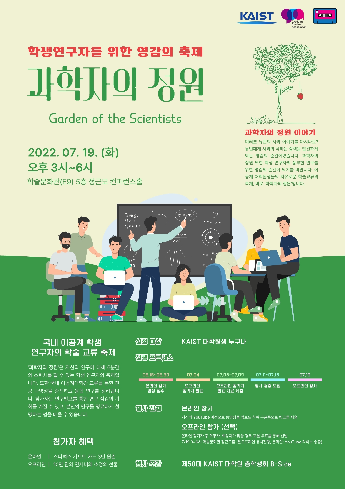

대학원 총학생회 집행부 문화국 2022년 상반기 과학자의 정원 사업보고서
===

## 공식 사업명
- 2022년 상반기 과학자의 정원

## 담당자
- 제50대 대학원 총학생회 문화국 국장

## 추진 배경
- 국내 이공계 대학원생들의 연구 교류 활동은 학회 등 공식적인 행사 등을 통해서 대체로 이루어지고 있으며, 새로운 인적 교류를 위한 네트워크는 부재한 상황.
- 온라인을 기반으로 TED talk과 유사한 형식으로 자신의 연구주제에 대해 스피치하는 컴피티션 프로그램으로 기획하여 시간적 공간적 제약이 없는 플랫폼을 마련하고자 함.
- 국내 이공계 대학교 대학원생들과 교류할 수 있는 새로운 플랫폼을 마련함을 물론 기업 및 연구원은 일종의 잡마켓으로서 참여할 수 있도록 유도하여, 대학원생이 학위 취득 후 자신의 연구와 최적합한 진로를 탐색할 수 있도록 함.

## 사업 목표
- 최소 3개 대학, 4개 분야, 20인 이상의 참여자를 모집
- 실제 달성 여부: X (연구 보안 문제로 외부인 발표자 모집이 어려웠음. 연사 1명과 발표자 6명으로 진행)

## 일시

|  **일시** |   **내용**   |
|:----------:|:------------:|
| 2022-06-16 ~ 2022-06-30 |온라인 참가 영상 접수|
| 2022-07-04 |오프라인 참가자 발표|
| 2022-07-05 ~ 2022-07-09 |오프라인 참가자 발표 자료 제출|
| 2022-07-11 ~ 2022-07-15 |오프라인 행사 청중 모집|
| 2022-07-19 오후 3시 |오프라인 행사 진행|

## 장소
- 학술문화관(E9) 5층 정근모 컨퍼런스 홀
- YouTube Live를 통한 온라인 중계 동시 진행

## 사업 진행 결과
- 오프라인 행사 개최됨 (첫 번째 테마: 도전)
  - [YouTube 실시간 라이브 영상](https://youtu.be/13msuiYNgjE), [편집영상](https://youtu.be/_t0e2-GcPfI)
- [홈페이지](https://gsa.kaist.ac.kr/garden-of-scientists/) (추후 업데이트 예정)

## 결산: 총 예산 2,900,000 원 중 1,801,980 원 집행

- 일반회계: 0 원 중 0 원 집행
- 학생회계: 2,900,000 원 중 1,801,980 원 집행

|  **비목** |   **세목**   | **산출 기준** | **예산** | **결산** |
|:----------:|:------------:|:--------:|:--------:|:--------:|
|홍보비|참가자 경품비| 5만원X40인 |2,000,000| 1,463,180 |
|인건비|행사 스탭 수당| 1만원X10시간X6인 |600,000| 288,800 |
|위탁용역비|웹사이트 유지보수비| 6회X5만원  |300,000| 50,000 |
|   **사업비 총액**  |         |       | **2,900,000**| **1,801,980** |
|   **일반회계 총액**  |        |       | **0** | **0**  |
|   **학생회계 총액**  |          |      |**2,900,000**| **1,801,980** |

단위:원

## 홍보물

|  **홍보일** |   **제목**   |   **매체**   |
|:----------:|:------------:|:------------:|
| 2022-06-16 |[원총] 과학자의 정원@KAIST: 우리 학교에서 TED나 FameLab 같은 행사가?!|[GSA 홈페이지](https://gsa.kaist.ac.kr/notice/203842), 단체메일, [ARA](https://newara.sparcs.org/post/243610?from_view=board&current=3&from_page=3)|
| 2022-06-28 |(재공지)[원총] 과학자의 정원@KAIST: 우리 학교에서 TED나 FameLab 같은 행사가?!|[KAIST 포탈](https://portal.kaist.ac.kr/ennotice/student_notice/11656394635237), 단체메일|
| 2022-07-13 |[원총] 우리의 연구가 맺어지는 곳: 과학자의 정원 오프라인 청중 모집|[GSA 홈페이지](https://gsa.kaist.ac.kr/notice/206019), [KAIST 포탈](https://portal.kaist.ac.kr/ennotice/student_notice/11657700741926), 단체메일|
| 2022-07-19 |[원총] 우리의 연구가 맺어지는 곳: 과학자의 정원 행사 안내 (오늘 15시, YouTube)|[GSA 홈페이지](https://gsa.kaist.ac.kr/notice/206361), [KAIST 포탈](https://portal.kaist.ac.kr/ennotice/student_notice/11658205893097), 단체메일, [ARA](https://newara.sparcs.org/post/244104?from_view=board&current=1&from_page=1)|

## 사진

 
 

## 경품 수여자

1. 오프라인 행사 발표자

|  **번호** |**성명** |**경품** |
|:------------:|:--------:|:--------:|
|1 |남궁민상| 100,000 원 (오프라인 연사비) |
|2 |장현수| 100,000 원 (오프라인 연사비) |
|3 |왕성필| 100,000 원 (오프라인 연사비) |
|4 |이동헌| 100,000 원 (오프라인 연사비) |
|5 |최혁진| 100,000 원 (오프라인 연사비) |
|6 |김보겸| 100,000 원 (오프라인 연사비) |

2. 오프라인 청중 10명 추첨

- 2021년도의 제49대 대학원 총학생회에서 이월된 경품을 사용함. (던킨 텀블러, 투썸 텀블러, 스타벅스 기프트 카드)
- 모든 오프라인 참석 청중분께 스타벅스 기프트카드 (5,000 원) 지급
- 추첨을 통해 WATCHA 프리미엄 구독권 3개원권 (1명), 1개월권 (2명), 던킨 텀블러 (3명), 투썸 텀블러 (4명) 

|  **번호** |   **학번**   | **성명** |**경품** |
|:----------:|:------------:|:--------:|:--------:|
|7 |201807**|허준*|WATCHA 프리미엄 구독권 3개월권 |
|8 |201802**|박규*|WATCHA 프리미엄 구독권 1개월권 |
|9 |201881**|김태*|WATCHA 프리미엄 구독권 1개월권|
|10 | 202032** | 민향* |던킨 텀블러 |
|11 | 202205** | 이연* |던킨 텀블러 |
|12 | 201980** | 권유* |던킨 텀블러|
|13 | 202200** | 강원* |투썸 텀블러 |
|14 | 201854** | 김지* |투썸 텀블러 |
|15 | 201853** | 최연* |투썸 텀블러 |
|16 | 202237** | 한소* |투썸 텀블러 |

