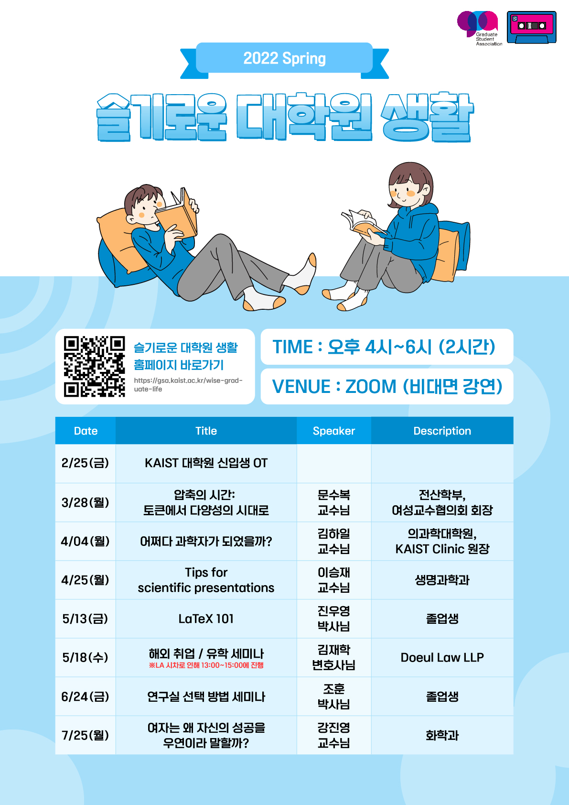
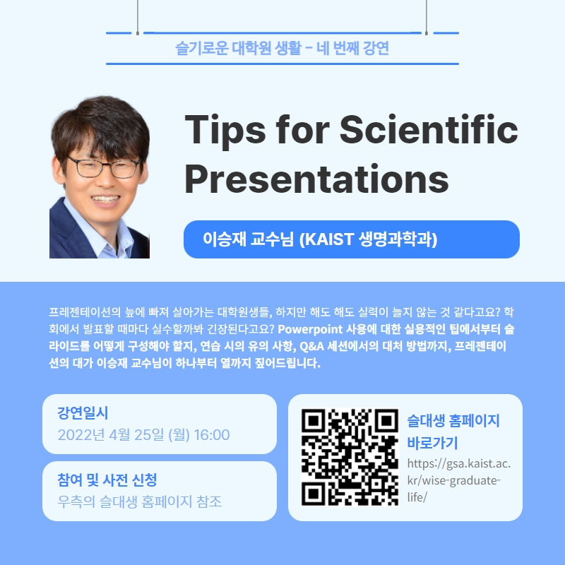
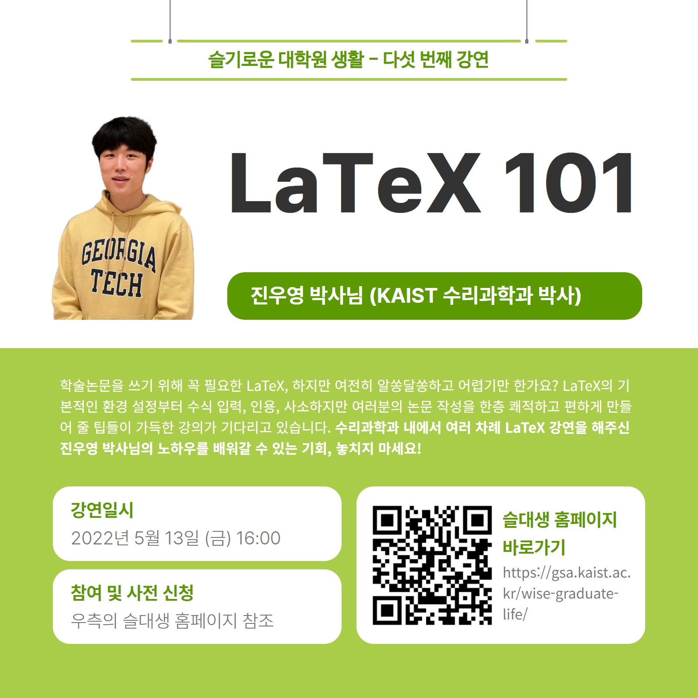
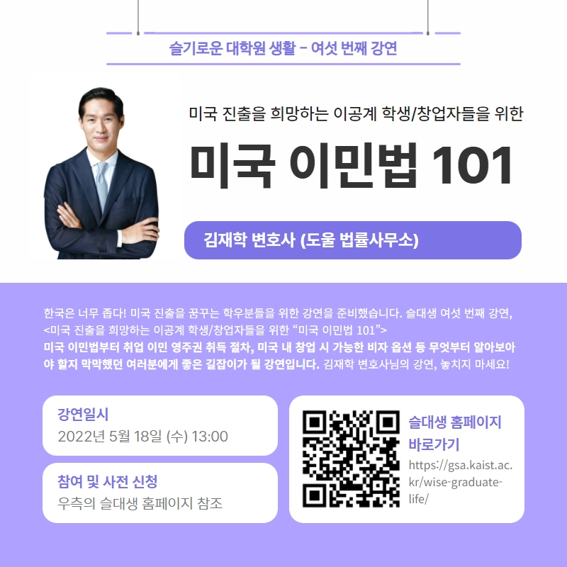
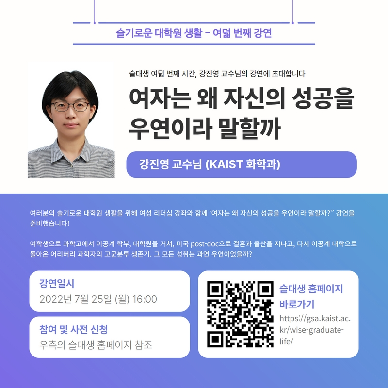

대학원 총학생회 집행부 문화국 2022년 상반기 슬기로운 대학원 생활 사업보고서
===

## 공식 사업명
- 2022년 상반기 슬기로운 대학원 생활

## 담당자
- 제50대 대학원 총학생회 문화국장

## 추진 배경
- 대학원 총학생회에서는 매년 대학원 신입생들을 대상으로 대학원 생활에 필요한 정보를 제공하고자 신입생 오리엔테이션을 진행해왔음.
- 신입생 오리엔테이션을 통해 제공되는 정보 외에도 대학원 신입생들이 궁금해하지만 답을 얻기 힘든 문제들이 많다는 의견이 제기되어옴.
- 신입생 오리엔테이션 외에도 다양한 주제들을 선정하여 다회에 걸쳐 대학원 신입생들에게 도움이 되는 강연을 진행하고자 함.

## 사업 목표
- 평균 참석자 60명
- 실제 달성 여부: O (2\~8회차 ⇒ 누적 참여자 584명)

## 일시
|  **회차** |   **일시**   | **연사** | **제목** |
|:----------:|:------------:|:--------:|:--------:|
|      1      |2022-02-23 (수) 4PM| 최동혁 대학원 총학생회장   김보겸 대학원 동아리연합회 회장   윤준보 전기및전자공학부 교수님   이현숙 전 대전성폭력상담소장   류석영 전산학부 교수님 | 오리엔테이션 |
|      2      |2022-03-28 (월) 4PM| 문수복 전산학부 교수님   (여성교수협의회 회장) | 압축의 시간: 토큰에서 다양성의 시대로 |
|      3      |2022-04-04 (월) 4PM| 김하일 의과학대학원 교수님   (KAIST Clinic 원장) | 어쩌다 과학자가 되었을까? |
|      4      |2022-04-25 (월) 4PM| 생명과학과 이승재 교수님 | Tips for Scientific Presentations |
|      5      |2022-05-13 (금) 4PM| 진우영 박사님 (졸업생) | LaTeX 101 |
|      6      |2022-05-18 (수) 1PM| 김재학 변호사 (Doeul Law LLP) | 미국 진출을 희망하는 이공계 학생/창업자들을 위한 “미국 이민법 101” |
|      7      |2022-06-24 (금) 4PM| 조훈 박사님 (졸업생) |연구실 선택 방법 세미나|
|      8      |2022-07-25 (월) 4PM| 강진영 화학과 교수님 |여자는 왜 자신의 성공을 우연이라 말할까?|

## 장소
- Zoom을 통한 온라인 세미나 형식

## 사업 진행 결과
- 신입생 가이드북을 제작하여 배포함.
- 학생정책처와 함께하는 여성리더십 강좌 2회 진행함. (2, 8회차)
- 졸업생을 연사로 초청하여 진행함. (5, 7회차)
- 강연 전 이메일, 포탈 공지, SNS 등을 활용하여 학생들에게 강연에 대해 홍보하여 참가자를 모집함.
- 강연은 Zoom을 활용한 실시간 온라인 회의 형식으로 진행 되었고, 연사와 학생들 간의 활발한 질의응답이 이루어짐.
    -   실시간 채팅을 통한 질의응답 이외에도 Padlet을 이용한 사전 질문 플랫폼을 제공함.
 
|  **회차** |   **Padlet 링크**   |
|:----------:|:------------:|
|      1      |   |
|      2      |[https://ko.padlet.com/gsa10/wise_graduate_life_lec2]|
|      3      |[https://ko.padlet.com/gsa10/wise_graduate_life_lec3]|
|      4      |[https://ko.padlet.com/gsa10/wise_graduate_life_lec4]|
|      5      |[https://ko.padlet.com/gsa10/wise_graduate_life_lec5]|
|      6      |[https://padlet.com/gsa10/ot5i7zob8vlrotsf]|
|      7      |[https://padlet.com/gsa10/pcni42yhha42u24]|
|      8      |[https://padlet.com/gsa10/w75c3o099uyynmyb]|

 - 일부 연사들로부터 강연자료를 공유 받아 학생들이 열람할 수 있도록 슬기로운 대학원 생활 웹사이트에 업로드 함.
	- 웹사이트 링크:  [https://gsa.kaist.ac.kr/wise-graduate-life](https://gsa.kaist.ac.kr/wise-graduate-life)

## 결산: 총 예산 4,800,000 원 중 4,300,000 원 집행

- 일반회계: 3,800,000 원 중 3,300,000 원 집행
- 학생회계: 1,000,000 원 중 1,000,000 원 집행

|  **비목** |   **세목**   | **산출 기준** | **예산** | **결산** |
|:----------:|:------------:|:--------:|:--------:|:--------:|
|일반회계| 연사비 | 30만원X1인+50만원X6인 | 3,300,000 | 3,300,000 |
|일반회계| 홍보물 제작비 |포스터, 현수막, 웹사이트 제작비 등 | 500,000 | 0 | 
|홍보비|참가자 경품비| 5만원X20인  |1,000,000| 1,000,000 |
|   **사업비 총액**  |        |        | **4,800,000** | **4,300,000** |
|   **일반회계 총액**  |        |        | **3,800,000** | **3,300,000** |
|   **학생회계 총액**  |         |       |**1,000,000** | **1,000,000** |

단위:원

## 홍보물

|  **홍보일** |   **제목**   | **매체** |
|:----------:|:------------:|:--------:|
|2022-02-17|[원총] 2022 “슬기로운 대학원 생활” 1차시: 대학원 신입생 오리엔테이션에 여러분을 초대합니다!|[GSA 홈페이지](https://gsa.kaist.ac.kr/notice/196102?page=3), [KAIST 포탈](https://portal.kaist.ac.kr/ennotice/student_notice/11645086449709), 단체메일, [ARA](https://newara.sparcs.org/post/241326?from_view=board&current=11&from_page=11), [인스타그램](https://www.instagram.com/p/CaGWhkGPZY1/?igshid=YmMyMTA2M2Y=)|
|2022-03-22|[원총] 당신의 '슬기로운 대학원 생활'을 응원합니다! (봄학기 강연 일정 안내)|[GSA 홈페이지](https://gsa.kaist.ac.kr/notice/198051?page=3), [KAIST 포탈](https://portal.kaist.ac.kr/ennotice/student_notice/11647934190349), 단체메일, [인스타그램](https://www.instagram.com/p/CbbmmEZrO56/?igshid=YmMyMTA2M2Y=)|
|2022-03-28|[원총] 슬대생 두 번째 시간, 문수복 교수님의 강연에 초대합니다. (3/28 4PM, Zoom, 추첨으로 치킨기프티콘 제공)|[GSA 홈페이지](https://gsa.kaist.ac.kr/notice/198373?page=3), [KAIST 포탈](https://portal.kaist.ac.kr/ennotice/student_notice/11648429062107), 단체메일, [ARA](https://newara.sparcs.org/post/242137?from_view=board&current=7&from_page=7)|
|2022-04-01|[원총] 슬대생 세 번째 시간, "슬기롭지 못한(?) 대학원 생활" 김하일 원장님의 강연에 초대합니다. (4/4 4PM, Zoom, 추첨으로 문화상품권제공)|[GSA 홈페이지](https://gsa.kaist.ac.kr/notice/198714?page=3), [KAIST 포탈](https://portal.kaist.ac.kr/ennotice/student_notice/11648789633481), 단체메일, [ARA](https://newara.sparcs.org/post/242249?from_view=board&current=7&from_page=7)|
|2022-04-21|[원총] 슬대생 네 번째 강연 - 아직 발표가 어려운 당신을 위해! (4/25 4PM, Zoom)|[GSA 홈페이지](https://gsa.kaist.ac.kr/notice/200067?page=2), [KAIST 포탈](https://portal.kaist.ac.kr/ennotice/student_notice/11650522856871), 단체메일, [ARA](https://newara.sparcs.org/post/242561?from_view=board&current=6&from_page=6), [인스타그램](https://www.instagram.com/p/Ccnh5N4vFtU/?igshid=YmMyMTA2M2Y=)|
|2022-05-10|[원총] 슬대생 다섯 번째 강연 - 이것만 알면 당신도 논문 작성 마스터: LaTeX 사용법 강연 (5/13 4PM, Zoom)|[GSA 홈페이지](https://gsa.kaist.ac.kr/notice/201477?page=2), [KAIST 포탈](https://portal.kaist.ac.kr/ennotice/student_notice/11652165617241), 단체메일, [ARA](https://newara.sparcs.org/post/242892?from_view=board&current=5&from_page=5)|
|2022-05-16|[원총] 슬대생 여섯 번째 강연 - ⭐미국 유학/취업/창업⭐하고 싶은 사람들 주목!!! (5/18 1PM, Zoom)|[GSA 홈페이지](https://gsa.kaist.ac.kr/notice/201841?page=2), [KAIST 포탈](https://portal.kaist.ac.kr/ennotice/student_notice/11652677678807), 단체메일, [ARA](https://newara.sparcs.org/post/242995?from_view=board&current=5&from_page=5)|
|2022-06-21|[원총] 슬대생 일곱 번째 강연 - 나에게 딱 맞는 연구실은 어떻게 찾나요?: 연구실 선택 방법 세미나 (6/24 4PM, Zoom)|[GSA 홈페이지](https://gsa.kaist.ac.kr/notice/204038), [KAIST 포탈](https://portal.kaist.ac.kr/ennotice/student_notice/11655812751774), 단체메일, [ARA](https://www.instagram.com/p/CfEWhMwv6Hv/?igshid=YmMyMTA2M2Y=)|
|2022-07-21|[원총] '우연하지 않았던' 여성 과학자의 성공기: 강진영 교수님 강연 (7/25 4PM, Zoom, 추첨으로 치킨기프티콘 제공)|[GSA 홈페이지](https://gsa.kaist.ac.kr/notice/206450), [KAIST 포탈](https://portal.kaist.ac.kr/ennotice/student_notice/11658390949432), 단체메일, [ARA](https://newara.sparcs.org/post/244138?from_view=board&current=1)|

## 사진

 

## 경품 당첨자

1. 대학원 신입생 오리엔테이션 경품 당첨자 명단

|  **번호** |**학번** |**경품** |**비고** |
|:------------:|:--------:|:--------:|:--------:|
|1 |202237*3 | 전동 킥보드 | 1등 |
|2 |202231*7| 에어팟 | 2등 |
|3 |202231*5 | 신세계 상품권 10만원권 | 3등 |
|4 |202250*5| 신세계 상품권 10만원권 | 3등 |
|5 |202280*1| 신세계 상품권 10만원권 | 3등 |
|6 |202230*7| 스타벅스 기프티콘 5천원권 | 추첨 |
|7 |202234*5| 스타벅스 기프티콘 5천원권 |추첨 |
|8 |202280*7| 스타벅스 기프티콘 5천원권 |추첨 |
|9 |202233*7| 스타벅스 기프티콘 5천원권 |추첨 |
|10 |202234*8| 스타벅스 기프티콘 5천원권 |추첨 |
|11 |202231*0| 스타벅스 기프티콘 5천원권 |추첨 |
|12 |202236*0| 스타벅스 기프티콘 5천원권 |추첨 |
|13 |202234*0| 스타벅스 기프티콘 5천원권 |추첨 |
|14 |202233*5| 스타벅스 기프티콘 5천원권 |추첨 |
|15 |202240*5| 스타벅스 기프티콘 5천원권 |추첨 |

2. 슬대생 2~8차시 경품 당첨자 명단

|  **번호** |**학번** |**경품** |**비고** |
|:------------:|:--------:|:--------:|:--------:|
|16 |202280*0 | 문화상품권 1만원권 |2회차 |
|17 |202131*3| 문화상품권 1만원권 |2회차 |
|18 |201854*2 | 문화상품권 1만원권 |2회차 |
|19 |202251*0| 문화상품권 1만원권 |2회차 |
|20 |202133*0| 문화상품권 1만원권 |2회차 |
|21 |202180*6| 문화상품권 1만원권 |2회차 |
|22 |201952*5| 문화상품권 1만원권 |2회차 |
|23 |201952*8| 문화상품권 1만원권 |2회차 |
|24 |202056*7| 문화상품권 1만원권 |2회차 |
|25 |202146*3| 문화상품권 1만원권 |2회차 |
|26 |202081*0 | 문화상품권 1만원권 |3회차 |
|27 |202054*1| 문화상품권 1만원권 |3회차 |
|28 |201855*7| 문화상품권 1만원권 |3회차 |
|29 |202236*9| 문화상품권 1만원권 |3회차 |
|30 |202237*3| 문화상품권 1만원권 |3회차 |
|31 |201780*9| BBQ 황금올리브 치킨 + 콜라 기프티콘 |4회차 |
|32 |202051*2| BBQ 황금올리브 치킨 + 콜라 기프티콘 |4회차 |
|33 |202070*4| BBQ 황금올리브 치킨 + 콜라 기프티콘 |4회차 |
|34 |202131*3| BBQ 황금올리브 치킨 + 콜라 기프티콘 |4회차 |
|35 |202143*6| BBQ 황금올리브 치킨 + 콜라 기프티콘 |4회차 |
|36 |202051*2| BHC 뿌링클 치킨 + 콜라 기프티콘 |5회차 |
|37 |202152*3| BHC 뿌링클 치킨 + 콜라 기프티콘 |5회차 |
|38 |202230*9| BHC 뿌링클 치킨 + 콜라 기프티콘 |5회차 |
|39 |202232*6| BHC 뿌링클 치킨 + 콜라 기프티콘 |5회차 |
|40 |202237*3| BHC 뿌링클 치킨 + 콜라 기프티콘 |5회차 |
|41 |202144*1 | BHC 뿌링클 치킨 + 콜라 기프티콘 |6회차 |
|42 |202144*2 | BHC 뿌링클 치킨 + 콜라 기프티콘 |6회차 |
|43 |202146*4 | BHC 뿌링클 치킨 + 콜라 기프티콘 |6회차 |
|44 |202052*7 | BHC 뿌링클 치킨 + 콜라 기프티콘 |6회차 |
|45 |202130*5 | BHC 뿌링클 치킨 + 콜라 기프티콘 |6회차 |
|46 |202144*5| BHC 뿌링클 치킨 + 콜라 기프티콘 |7회차 |
|47 |202230*8| BHC 뿌링클 치킨 + 콜라 기프티콘 |7회차 |
|48 |202131*3| BHC 뿌링클 치킨 + 콜라 기프티콘 |7회차 |
|49 |202237*3| BHC 뿌링클 치킨 + 콜라 기프티콘 |7회차 |
|50 |202152*3| BBQ 황금올리브 치킨 + 콜라 기프티콘 |8회차 |
|51 |202056*7| BBQ 황금올리브 치킨 + 콜라 기프티콘 |8회차 |
|52 |202144*1| BBQ 황금올리브 치킨 + 콜라 기프티콘 |8회차 |
|53 |202131*3| BBQ 황금올리브 치킨 + 콜라 기프티콘 |8회차 |
|54 |202155*8| BBQ 황금올리브 치킨 + 콜라 기프티콘 |8회차 |

