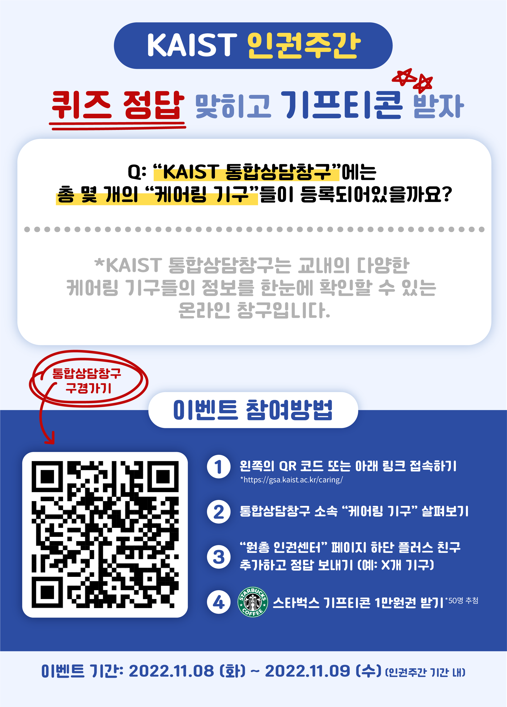
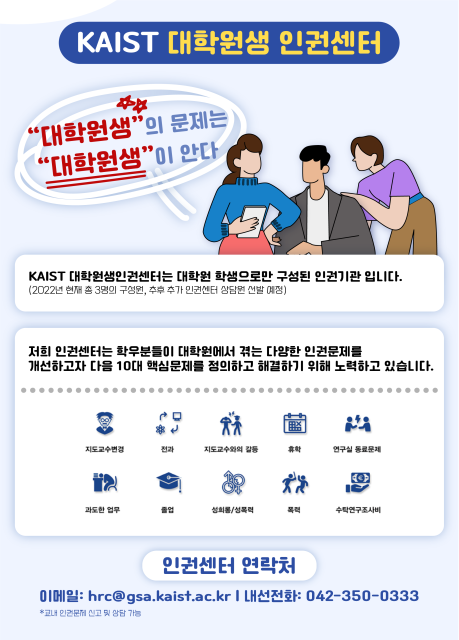

2022년 하반기 대학원 총학생회 인권센터 인권윤리센터 협력 사업
===

## 공식 사업명
- 2022년 하반기 인권센터 인권윤리센터 협력 사업 "인권 걸음" 인권주간 부스 운영

## 담당자
- 대학원 총학생회 인권센터장

## 추진 배경
- 인권윤리센터는 교내 대학원생 고충 상담 및 처리 기관 중 대학원생 인권센터와 더불어 현장에서 대학원생들이 겪을 수 있는 다양한 인권 문제의 접수창구로 이용되고 있음. 특히 인권윤리센터와 대학원생 인권센터는 상담을 인수/인계하는 등 상호 보완적인 관계이기에 지속적인 협력 관계를 유지하는 것이 필요
- 2017년 9월부터 격월로 추진되고 있는 대학원생 고충 상담 및 처리를 위한 정례모임(학생생활처, 옴부즈퍼슨, 상담센터, 인권윤리센터, 대학원생 인권센터)에 대한 주무 기관으로서 대학원생들이 겪을 수 있는 인권 문제 해결을 위해 다른 기관보다 더욱 긴밀한 협조가 필요
- 교내의 다양한 인권 문제에 대한 인식 및 대처를 위해서는 교내 인권 관련 부서 간의 유기적인 관계가 필요
- 다양화된 인권 문제를 해결하기 위해서는 교내 구성원의 인권 감수성 증진이 필요

## 사업 목표
-  교내에서 경험할 수 있는 다양한 인권 문제에 대해 인지하고, 이를 해결할 수 있는 방안에 대해 인권윤리센터와 소통하며 해결 방안 모색
-  인권이 보장되고 다양성이 존중되는 인권캠퍼스 조성을 목표로 KAIST 학생·소수자 인권위원회, KAIST 학부 총학생회와 인권윤리센터가 공동주최하는 인권주간 온라인 부스에 참여
-  인권센터 및 인권윤리센터에 대한 대학원생들의 피드백을 확인하고 이를 주요 활동에 반영
-  교내 케어링 기구들이 참여하는 정례모임을 통해 다양한 케이스를 공유하고 해결 방안과 재발 방지 방법을 논의

## 일시
- 2022년 11월 8일 \~ 2022년 11월 9일

## 장소
- 지정된 부스장소 (신학관 앞 운동장 가변)

## 사업 내용

- 다양한 인권 문제에 대한 유기적인 대응 체계 마련
  - 주기적인 학내 인권 문제 관련 회의 
  - 인권 관련 부서들의 유기적인 소통 담당
- 교내 구성원 대상 인권 주간 참여 부스 운영
  - **교내 케어링 기구 및 KAIST 통합상담창구 관련 질문을 통해 "인권 걸음" 이벤트를 진행**
  - **KAIST 대학원생 인권센터 선정 10대 핵심문제 안내 및 설명**
  - 인권 걸음 이벤트에 참여한 인원에게 10,000 원 상당의 스타벅스 기프트카드 증정
- 인권윤리센터와의 주기적인 미팅 
  - 신입 대학원생 인권센터 학생상담원들과 인권윤리센터 직원들 간의 상견례를 통해 추후 사업이나 상담 시 유기적 소통 진행
- 대학원생 인권개선을 위한 정례모임 (격월로 진행)
  - 학생생활처, 옴부즈퍼슨, 상담센터, 인권윤리센터, 대학원생 인권센터 등 여러 기관장들이 모이는 정례모임에 참석하여 학생들의 고충을 대변하고 해결 방안에 대해 논의

## 사업 진행 결과
- 총 47명의 인권 걸음 이벤트 설문 참여 및 답례품 증정
- KAIST 통합상담창구 내 참여 기구들에 대한 학우들의 인식 정도를 측정하고 이를 정례모임 안건 내용에 반영
- 인권센터 상담 제공 건에 대한 홍보 효과 (실제 부스 운영 전후의 상담 신청 수 차이 발생)

## 결산

-	인권윤리센터에서 강연 관련 예산 지원 요청
-	홍보 및 다른 비용 등에 대한 협의 필요로 대학원 총학생회에 예비비 요청
-	**인권윤리센터에서 전액 지원하여 예비비 반납**

|  **비목** |   **세목**   | **예산** |	**결산**	|
|:----------:|:------------:|:--------:|:--------:|
|	예비비	|	예비비	| 300,000 |	0	|
|   **합계**  |              |    300,000    |	0	|

	단위:원
