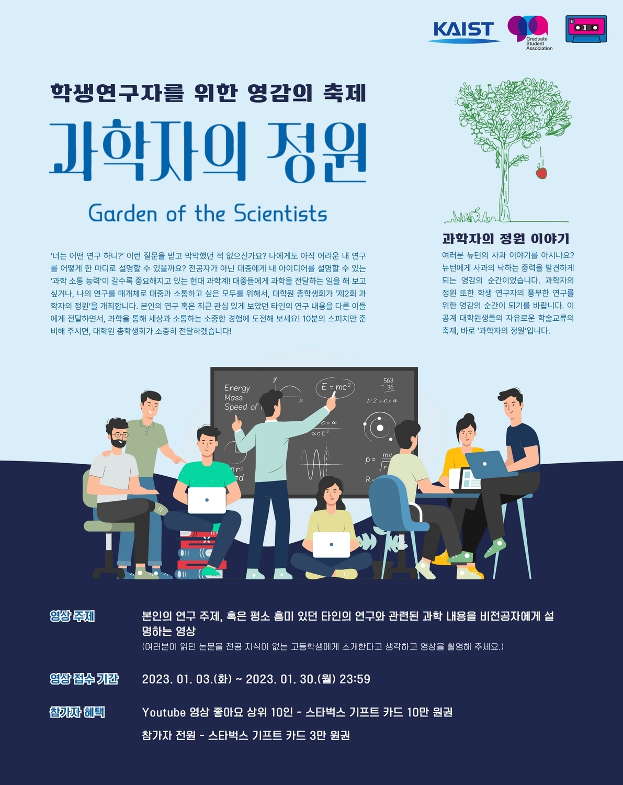

대학원 총학생회 집행부 문화국 2022년 하반기 과학자의 정원 사업보고서
===

## 공식 사업명
- 2022년 하반기 과학자의 정원

## 담당자
- 제50대 대학원 총학생회 문화부장

## 추진 배경
- 국내 이공계 대학원생들의 연구 교류 활동은 학회 등 공식적인 행사 등을 통해서 대체로 이루어지고 있으며, 새로운 인적 교류를 위한 네트워크는 부재한 상황.
- 온라인을 기반으로 TED talk과 유사한 형식으로 자신의 연구분야에 대해 스피치하는 프로그램으로 기획하여 시간적 공간적 제약이 없는 플랫폼을 마련하고자 함.
- 대학원생들이 비전공자를 대상으로 한 발표를 준비하면서, 과학 커뮤니케이션을 접하고 그 필요성과 접근방법에 대해 생각해보는 기회로 삼고자 함.
- 국내 이공계 대학교 대학원생들과 교류할 수 있는 새로운 플랫폼을 마련함을 물론 기업 및 연구원은 일종의 잡마켓으로서 참여할 수 있도록 유도하여, 대학원생이 학위 취득 후 자신의 연구와 최적합한 진로를 탐색할 수 있도록 함.

## 사업 목표
- 8인 이상의 발표자 모집
- 실제 달성 여부: X (2명의 발표 영상 모집)

## 일시

|  **일시** |   **내용**   |
|:----------:|:------------:|
| 2023-01-02 |과학자의 정원 1차 홍보|
| 2023-01-03 |유튜브 영상 접수 시작|
| 2023-01-13 |기간 연장 및 2차 홍보|
| 2023-01-30 |유튜브 영상 접수 마감|

## 장소
- 온라인(YouTube)

## 사업 진행 결과
- [홈페이지](https://gsa.kaist.ac.kr/garden-of-scientists/) (추후 업데이트 예정)

## 결산: 총 예산 4,400,000 원 중 0 원 집행

- 일반회계: 2,000,000 원 중 0 원 집행
- 학생회계: 2,400,000 원 중 0 원 집행

|  **비목** |   **세목**   | **산출 기준** | **예산** | **결산** |
|:----------:|:------------:|:--------:|:--------:|:--------:|
|일반회계|음향 및 영상|   |2,000,000| 0 |
|홍보비|참가자 경품비| 5만원X20인 |1,000,000| 0 |
|인건비|행사 스탭 수당| 1.5만원X10시간X4인 |600,000| 0 |
|인건비|심사위원 수당| 10만원X5인  |500,000| 0 |
|위탁용역비|웹사이트 유지보수비| 6회X5만원  |300,000| 0 |
|   **사업비 총액**  |         |       | **4,400,000**| **0** |
|   **일반회계 총액**  |        |       | **2,000,000** | **0**  |
|   **학생회계 총액**  |          |      |**2,400,000**| **0** |

단위:원

## 홍보물

|  **홍보일** |   **제목**   |   **매체**   |
|:----------:|:------------:|:------------:|
| 2022-06-16 |[원총] 과학자의 정원@KAIST: 우리 학교에서 TED나 FameLab 같은 행사가?!|[GSA 홈페이지](https://gsa.kaist.ac.kr/notice/203842), 단체메일, [ARA](https://newara.sparcs.org/post/243610?from_view=board&current=3&from_page=3)|
| 2022-06-28 |(재공지)[원총] 과학자의 정원@KAIST: 우리 학교에서 TED나 FameLab 같은 행사가?!|[KAIST 포탈](https://portal.kaist.ac.kr/ennotice/student_notice/11656394635237), 단체메일|
| 2022-07-13 |[원총] 우리의 연구가 맺어지는 곳: 과학자의 정원 오프라인 청중 모집|[GSA 홈페이지](https://gsa.kaist.ac.kr/notice/206019), [KAIST 포탈](https://portal.kaist.ac.kr/ennotice/student_notice/11657700741926), 단체메일|
| 2022-07-19 |[원총] 우리의 연구가 맺어지는 곳: 과학자의 정원 행사 안내 (오늘 15시, YouTube)|[GSA 홈페이지](https://gsa.kaist.ac.kr/notice/206361), [KAIST 포탈](https://portal.kaist.ac.kr/ennotice/student_notice/11658205893097), 단체메일, [ARA](https://newara.sparcs.org/post/244104?from_view=board&current=1&from_page=1)|

## 사진

 

## 경품 수여자

1. 참가자 중 YouTube 영상 좋아요 상위 10명

|  **번호** |**성명** |**경품** |
|:------------:|:--------:|:--------:|
|1 |김넙죽| 100,000 원 (스타벅스 기프트 카드 10만 원권) |
|2 |김넙죽| 100,000 원 (스타벅스 기프트 카드 10만 원권) |
|3 |김넙죽| 100,000 원 (스타벅스 기프트 카드 10만 원권) |
|4 |김넙죽| 100,000 원 (스타벅스 기프트 카드 10만 원권) |
|5 |김넙죽| 100,000 원 (스타벅스 기프트 카드 10만 원권) |
|6 |김넙죽| 100,000 원 (스타벅스 기프트 카드 10만 원권) |
|7 |김넙죽| 100,000 원 (스타벅스 기프트 카드 10만 원권) |
|8 |김넙죽| 100,000 원 (스타벅스 기프트 카드 10만 원권) |
|9 |김넙죽| 100,000 원 (스타벅스 기프트 카드 10만 원권) |
|10 |김넙죽| 100,000 원 (스타벅스 기프트 카드 10만 원권) |

2. 참가자

|  **번호** |**성명** |**경품** |
|:------------:|:--------:|:--------:|
|1 |김넙죽| 30,000 원 (스타벅스 기프트 카드 3만 원권) |