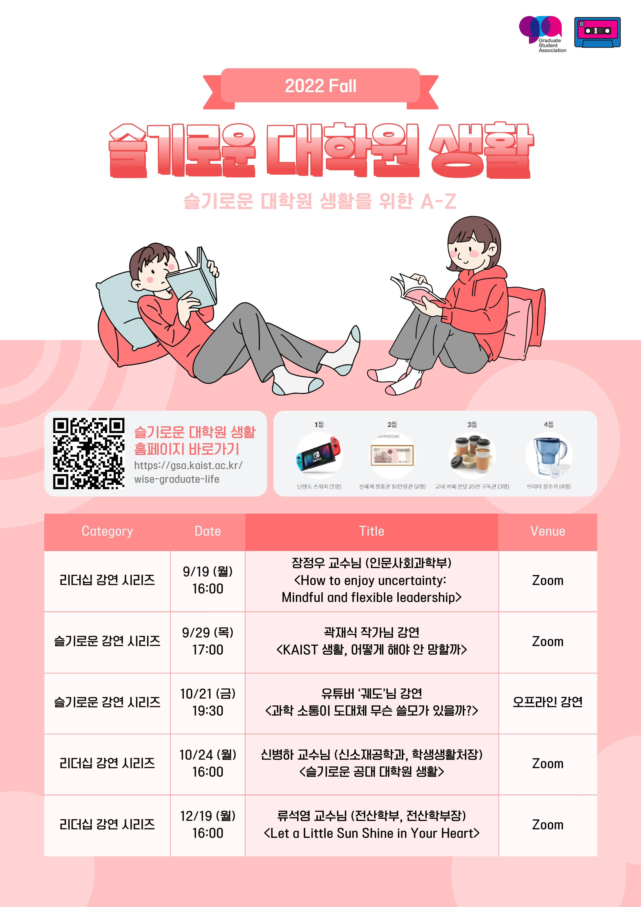
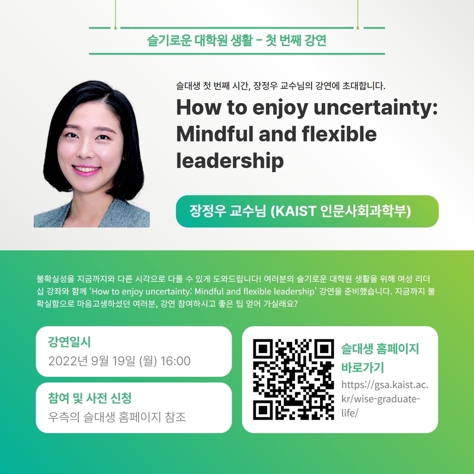
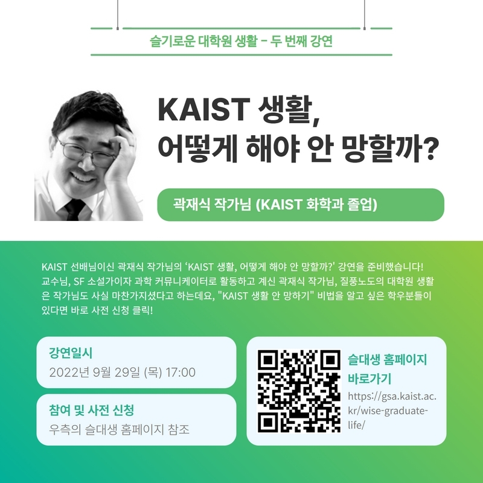
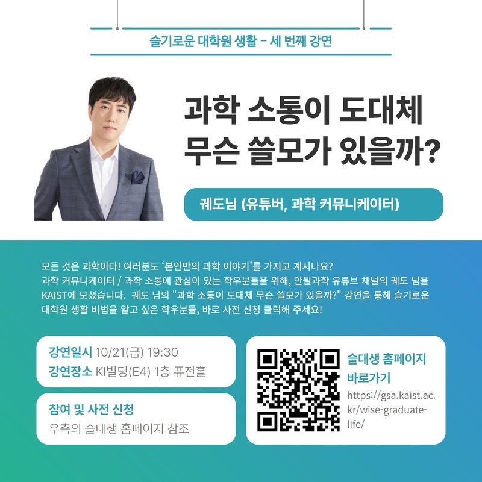
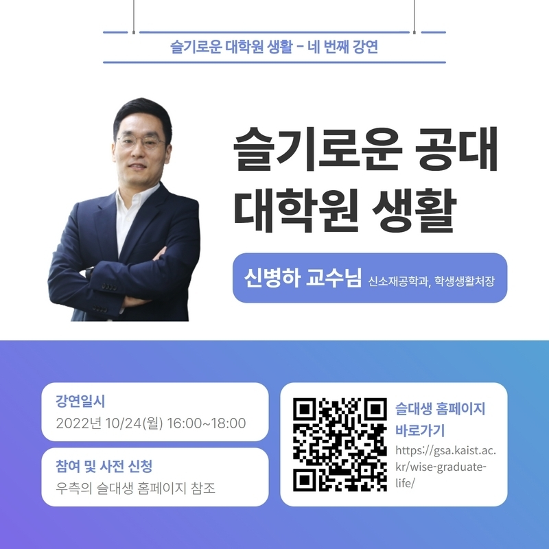
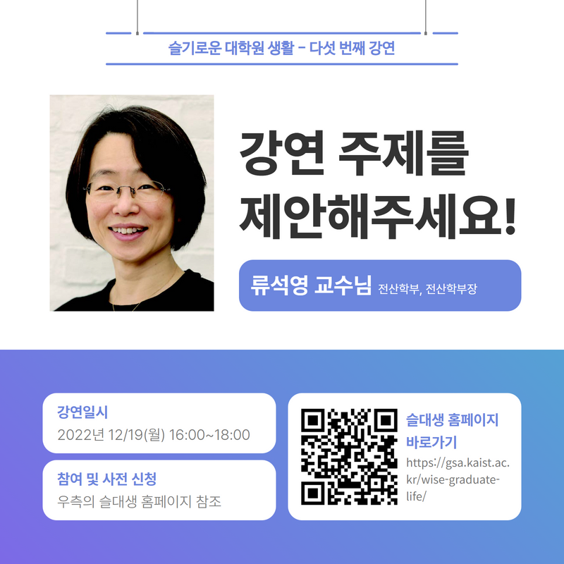

대학원 총학생회 집행부 문화국 2022년 하반기 슬기로운 대학원 생활 사업보고서
===

## 공식 사업명
- 2022년 하반기 슬기로운 대학원 생활

## 담당자
- 제50대 대학원 총학생회 문화국장

## 추진 배경
- 신입생 오리엔테이션을 통해 제공되는 정보 외에도 대학원 신입생들이 궁금해하지만 답을 얻기 힘든 문제들이 많다는 의견이 제기되어옴.
- 상반기에 이어 다양한 주제들을 선정하여 다회에 걸쳐 대학원 신입생들에게 도움이 되는 강연을 진행하고자 함.

## 사업 목표
- 평균 참석자 85명
- 실제 달성 여부: X (1\~5회차 ⇒ 누적 참여자 307명)

## 일시
|  **회차** |   **일시**   | **연사** | **제목** |
|:----------:|:------------:|:--------:|:--------:|
|      1      |2022-09-19 (월) PM 4:00| 장정우 인문사회과학부 교수님 | How to enjoy uncertainty: Mindful and flexible leadership |
|      2      |2022-09-29 (목) PM 5:00| 곽재식 작가님, 과학 커뮤니케이터   (숭실사이버대학교 환경안전공학과 교수님) | KAIST 생활, 어떻게 해야 안 망할까? |
|      3      |2022-10-21 (금) PM 7:30| 궤도 유튜버님, 과학 커뮤니케이터 | 과학 소통이 도대체 무슨 쓸모가 있을까? |
|      4      |2022-10-24 (월) PM 4:00| 신병하 신소재공학과 교수님   (학생생활처장) | 슬기로운 공대 대학원 생활 |
|      5      |2022-12-19 (월) PM 4:00| 류석영 전산학부 교수님   (전산학부장) | Let a Little Sun Shine in Your Heart |

## 장소
- Zoom을 통한 온라인 세미나 형식
- 3회차 강연은 KI빌딩 퓨전홀에서 진행

## 사업 진행 결과
- 학생정책처와 함께하는 여성리더십 강좌 2회 진행함. (1, 5회차)
- 오프라인 슬대생 강연을 진행함. (3회차)
- 강연 전 이메일, 포탈 공지, ARA 등을 활용하여 학생들에게 강연에 대해 홍보하여 참가자를 모집함.
- 강연은 Zoom을 활용한 실시간 온라인 회의 형식으로 진행 되었고, 연사와 학생들 간의 활발한 질의응답이 이루어짐.
    -   실시간 채팅을 통한 질의응답 이외에도 Padlet을 이용한 사전 질문 플랫폼을 제공함.
 
|  **회차** |   **Padlet 링크**   |
|:----------:|:------------:|
|      1      |[https://padlet.com/gsa10/350zykvjowtrtxuw]|
|      2      |[https://padlet.com/gsa10/cn2o534cp8aqduos]|
|      3      |[https://padlet.com/gsa10/uba2fzcdmigutidt]|
|      4      |[https://padlet.com/gsa10/r38zves5up4axp0b]|
|      5      |[https://padlet.com/gsa10/5vmnolm3ytshwj49]|

 - 일부 연사들로부터 강연자료를 공유 받아 학생들이 열람할 수 있도록 슬기로운 대학원 생활 웹사이트에 업로드 함.
	- 웹사이트 링크:  [https://gsa.kaist.ac.kr/wise-graduate-life](https://gsa.kaist.ac.kr/wise-graduate-life)

## 결산: 총 예산 2,400,000 원 중 2,082,000 원 집행

- 일반회계: 1,800,000 원 중 1,495,000 원 집행
- 학생회계: 600,000 원 중 587,000 원 집행

|  **비목** |   **세목**   | **산출 기준** | **예산** | **결산** |
|:----------:|:------------:|:--------:|:--------:|:--------:|
|일반회계| 연사비 | 50만원X2인 | 1,000,000 | 1,000,000 |
|일반회계| 홍보물 제작비 |포스터, 현수막, 웹사이트 제작비 등 | 800,000 | 495,000 | 
|홍보비|참가자 경품비| 2만원X5명X6회  |600,000| 587,000 |
|   **사업비 총액**  |        |        | **2,400,000** | **2,082,000** |
|   **일반회계 총액**  |        |        | **1,800,000** | **1,495,000** |
|   **학생회계 총액**  |         |       |**600,000** | **587,000** |

단위:원

## 홍보물

|  **홍보일** |   **제목**   | **매체** |
|:----------:|:------------:|:--------:|
|2022-09-19|[원총] 경품 팡팡 슬대생 첫 번째 시간, 장정우 교수님의 강연에 초대합니다. (9/19 4PM, Zoom)|[GSA 홈페이지](https://gsa.kaist.ac.kr/notice/196102?page=3), [KAIST 포탈](https://portal.kaist.ac.kr/ennotice/student_notice/11663559169146), 단체메일, [ARA](https://newara.sparcs.org/post/245147?from_view=user&created_by=90798&from_page=3)
|2022-09-26|[원총] 가을학기 슬대생 두 번째 시간, 곽재식 작가님의 강연에 초대합니다. (9/29 5PM, Zoom)|[GSA 홈페이지](https://gsa.kaist.ac.kr/notice/198051?page=3), [KAIST 포탈](https://portal.kaist.ac.kr/ennotice/student_notice/11664173305155), 단체메일, [ARA](https://newara.sparcs.org/post/245298?from_view=user&created_by=90798&from_page=3)|
|2022-10-18|[원총] 슬대생 세 번째 시간: 유튜버 궤도 님의 강연에 초대합니다. (10/21 7:30PM, KI 퓨전홀)|[GSA 홈페이지](https://gsa.kaist.ac.kr/notice/198373?page=3), [KAIST 포탈](https://portal.kaist.ac.kr/ennotice/student_notice/11666073088065), 단체메일, [ARA](https://newara.sparcs.org/post/245679?from_view=user&created_by=90798&from_page=2)|
|2022-10-20|[원총] 가을학기 슬대생 네 번째 시간, 신병하 교수님의 강연에 초대합니다. (10/24 4PM, Zoom)|[GSA 홈페이지](https://gsa.kaist.ac.kr/notice/198714?page=3), [KAIST 포탈](https://portal.kaist.ac.kr/ennotice/student_notice/11666258870855), 단체메일, [ARA](https://newara.sparcs.org/post/245778?from_view=user&created_by=90798&from_page=2)|
|2022-12-15|[원총] 함께 만드는 슬대생 다섯 번째 시간, 류석영 전산학부장님의 강연에 초대합니다. (12/19 4PM, Zoom)|[GSA 홈페이지](https://gsa.kaist.ac.kr/notice/200067?page=2), [KAIST 포탈](https://portal.kaist.ac.kr/ennotice/student_notice/11671094306157), 단체메일, [ARA](https://newara.sparcs.org/post/246839?from_view=user&created_by=90798&from_page=1)

## 사진

 

## 경품 당첨자

1. 포도알 경품 당첨자 명단

|  **번호** |**학번** |**경품** |**비고** |
|:------------:|:--------:|:--------:|:--------:|
|1 |202237*3 | 닌텐도 스위치 | 1등 |
|2 |202244*1| 신세계 상품권 10만원권 | 2등 |
|3 |202054*1| 신세계 상품권 10만원권 | 2등 |
|4 |202254*8| 파스쿠찌 아메리카노 25잔 구독권 | 3등 |
|5 |202234*2| 파스쿠찌 아메리카노 25잔 구독권 | 3등 |
|6 |202180*6| 파스쿠찌 아메리카노 25잔 구독권 | 3등 |
|7 |202255*7| 브리타 정수기 | 4등 |
|8 |202230*8| 브리타 정수기 | 4등 |
|9 |202243*2| 브리타 정수기 | 4등 |
|10 |202230*7| 브리타 정수기 | 4등 |

