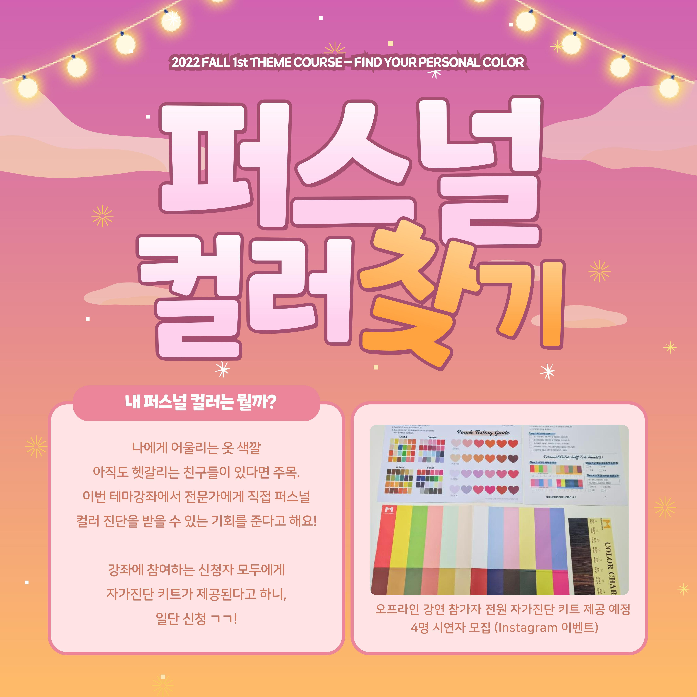
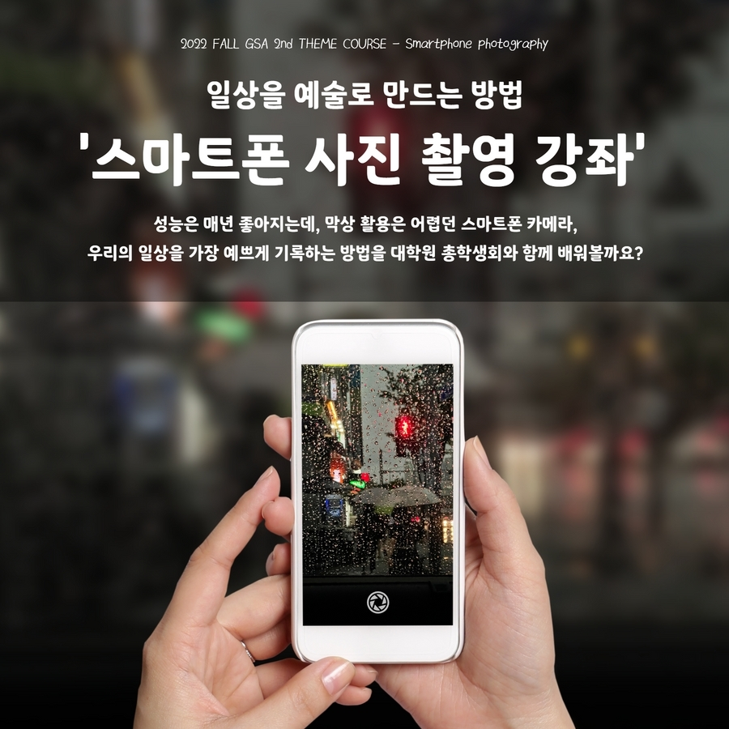
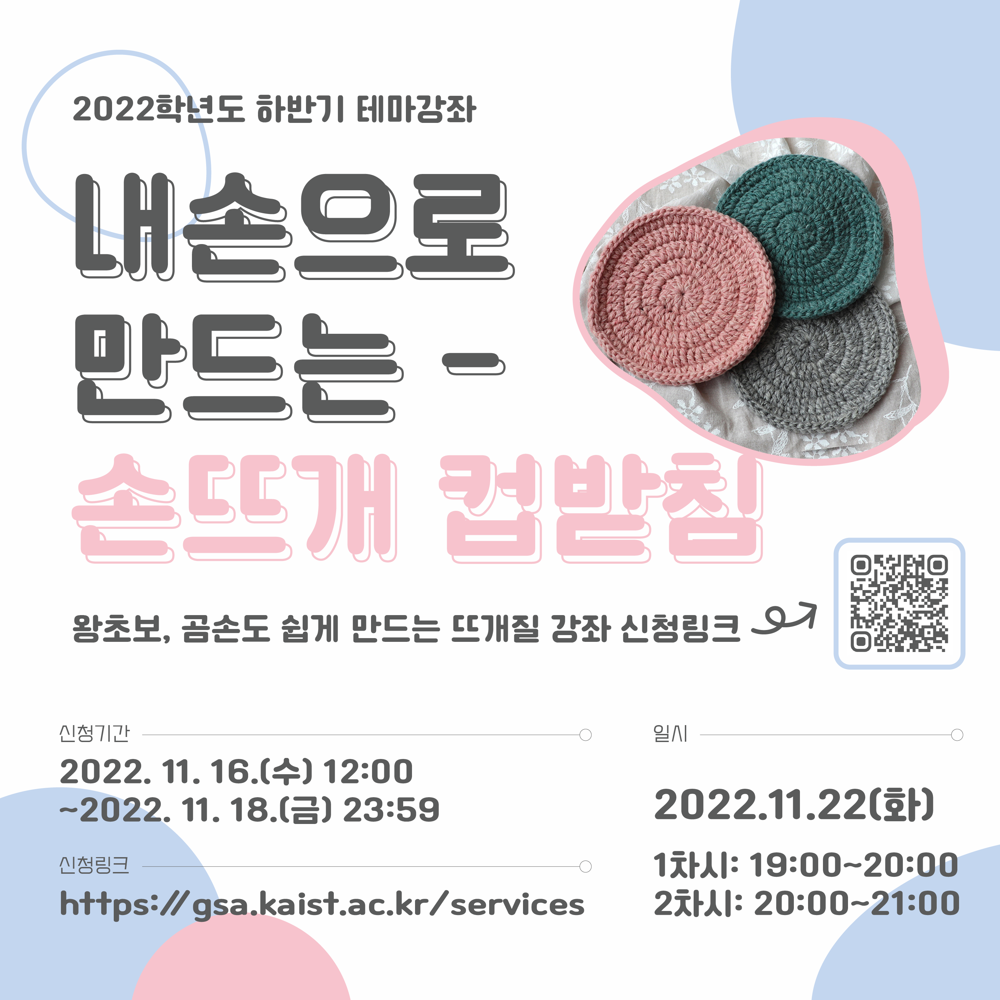
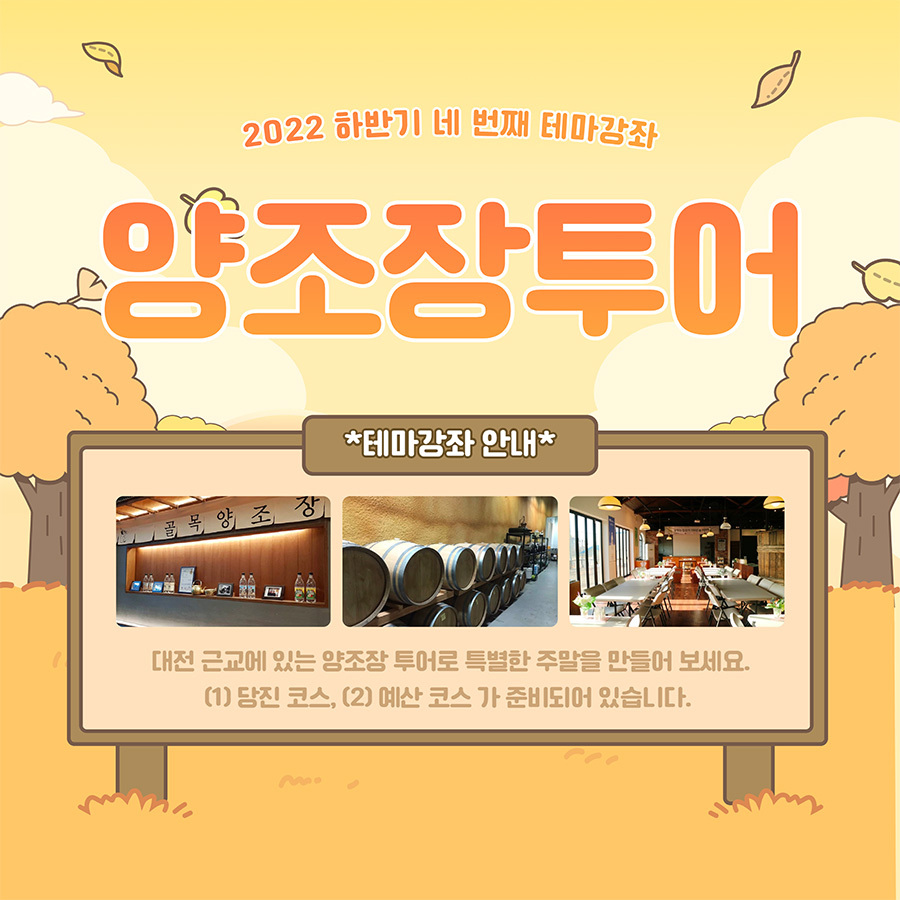

대학원 총학생회 집행부 문화국 2022년 하반기 테마강좌 사업보고서
===

## 공식 사업명
- 2022년 하반기 테마강좌

## 담당자
- 제50대 대학원 총학생회 문화국 국장

## 추진 배경
- 대학원생의 삶의 질 향상을 위해 문화생활을 체험하고 휴식을 즐길 기회를 제공할 필요성이 대두되어 왔음.
- 취미가 없는 분들에게는 취미를 찾아주는 기회를 만들고자 함.
- 재료 지원을 통해 부담 없이 참여할 수 있는 스트레스 해소 방안을 제공하고자 함.
- 연구 외적인 분야의 특강 또는 KAIST 학생들의 삶의 질을 향상시킬 수 있는 유익하고 실질적인 강좌를 제공하고자 함.

## 사업 목표
- 테마강좌 평균 신청자수 110명
- 실제 달성 여부: X (총 5회, 누적 신청자 469명)

## 일시 및 장소
|  **회차** |   **제목**   |   **신청 기간**   |   **배포 기간**   |   **강연일**   |   **장소**   |
|:----------:|:------------:|:------------:|:------------:|:------------:|:------------:|
| 1 |퍼스널컬러 찾기|2022-10-12 ~ 2022-10-14||2022-10-27| 인문사회과학부동(N4) 1125호 |
| 2 |스마트폰 사진 강좌|2022-10-26 ~ 2022-10-28|| 2022-11-02 | 창의학습관(E11) 101호 |
| 3 |뜨개질 강좌 (손뜨개 컵받침)| 2022-11-16 ~ 2022-11-18| | 2022-11-22 (1차) 19:00~20:00   (2차) 20:00~21:00 | 창의학습관(E11) 202호|
| 4 |양조장 투어| 2022-11-15 ~ 2022-11-17| | 2022-11-26 |(당진 코스) 신평 양조장   (예산 코스) 예산사과와인 및 골목양조장|
| 5 |음악회 단체관람| 2022-12-09 ~ 2022-12-11| 2022-12-20 ~ 2022-12-21 | 2022-12-22 |대전예술의전당 아트홀|

## 사업 진행 결과
- 총 5번의 테마강좌를 진행하였으며, 각 테마강좌 신청 인원 및 선정 인원은 다음과 같음.

|  **회차** |   **제목**   |   **지원자 수**   |   **선정자 수**   |
|:----------:|:------------:|:------------:|:------------:|
| 1 |퍼스널컬러 찾기|170|50| 
| 2 |스마트폰 사진 강좌|32|50| 
| 3 |뜨개질 강좌 (손뜨개 컵받침)|59| 40 |
| 4 |양조장 투어| 103|80 |
| 5 |음악회 단체관람| 105|40 |

- 테마강좌에 선정된 학우들에게 강좌를 위한 재료 배포를 위해, 대면 배포 담당자들은 마스크를 착용하고 코로나19 관련 안전 수칙을 준수함.
- 재학생이 강사가 되는 테마강좌를 진행함 (3회차).
- 주말을 이용하여 교외 테마강좌를 진행함 (4회차).
- 테마강좌에 참여한 학우들의 작업물 홍보 및 테마강좌 행사 자체의 홍보를 위해, 원총 인스타그램 이벤트를 통해 작업물을 대학원 총학생회 인스타그램 계정을 태그하고 테마강좌 해쉬태그를 담은 글과 사진을 게시하면 추첨을 통해 상품을 지급함.
  - 인스타그램 태그:  [#KAIST테마강좌](https://www.instagram.com/explore/tags/kaist테마강좌/)

## 결산: 총 예산 6,400,000 원 중 5,628,500 원 집행

- 일반회계: 6,000,000 원 중 5,555,300 원 집행
- 학생회계: 400,000 원 중 73,200 원 집행

|  **비목** |   **세목**   | **산출 기준** | **예산** | **결산** |
|:----------:|:------------:|:--------:|:--------:|:--------:|
|일반회계|재료비 | 100인X4회X1.5만원 | 6,000,000 | 5,555,300  |
|운영비|샘플제작비| 5만원X4회 |200,000| 73,200 |
|홍보비|참가자경품비| 1만원X5인X4회 |200,000| 0 |
|   **사업비 총액**  |       |       | **6,400,000**| **5,628,500** |
|   **일반회계 총액**  |       |       | **6,000,000** | **5,555,300**  |
|   **학생회계 총액**  |       |       |**400,000**| **73,200** |

단위:원

## 사진

 
 
 

## 경품 수여자
- 경품으로는 스타벅스 기프트카드 (5,000 원)을 사용했음.
- 2021년도의 제49대 대학원 총학생회에서 이월된 경품을 사용함.

|  **번호** |   **학번**   | **성명**  | **연락처** | **비고**  |
|:----:|:----:|:----:|:---------------:|:----------------------:|
|   1  |202154**|김다*| @d**one*_ | 뜨개질 강좌 |
|   2  |202181**|황지*| @z**_young*8 | 뜨개질 강좌 |
|   3  |201951**|서수*| @s**_man*o | 뜨개질 강좌 |
|   4  |201752**|정선*| @s**jin_*y | 뜨개질 강좌 |
|   5  |202180**|유현*| @y**_ri*a | 뜨개질 강좌 |
|   6  |202180**|공다*| @_**olly._*0 | 뜨개질 강좌 |
|   7  |202234**|이소*| @e**ln*s | 뜨개질 강좌 |
|   8  |202142**|권나*| @n**on*9 | 뜨개질 강좌 |