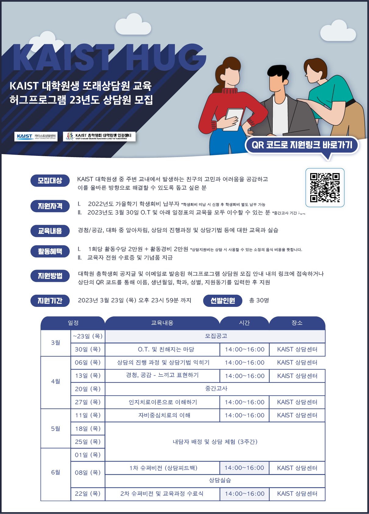

대학원생 인권센터: 2023년 상반기 또래 심리상담사 교육 허그프로그램 사업보고서
===

## 공식 사업명
- 대학원생인권센터 또래 심리상담사 교육 허그프로그램

## 담당자
- 대학원생인권센터 센터장

## 추진 배경
- KAIST 상담센터 내 상담서비스 제공 가능 인력 대비 학생 심리상담 수요가 월등히 높아 상담 운영에 과부하 발생했고, 스트레스클리닉 전문의 결원 문제가 동시에 가중되어 교내 학생상담 문제를 완화할 수 있는 제 3의 상담 창구가 필요함
	- 2023년도 기준 전임상담사 6명 중 4명 상담 서비스 제공 가능
	- 해당 인원이 평균적으로 연간 약 3500 건 이상의 케이스를 처리
	- 스트레스클리닉 상담진료 제공 가능 전문의 : 총 1명
- 기존 멘토링 (학과 CA 등)의 경우 대학원 학생들이 겪는 갈등 및 고민에 대한 유경험자로서 훌륭하지만 상담에 관한 전문적인 교육 없이 진행된 경우가 많기 때문에 체계적인 상담이 부족
	- 대부분 상담 내용이 진로, 인턴십, 취업 등 심리 및 고충상담 유형에 속하지 않음
- 외국인 학생의 경우 유학 생활 중 겪는 고충과 갈등이 빈번함에도 불구하고 이를 해소하기 위한 상담서비스를 교내에서 원활하게 이용할 수 없음
	- ISSS 및 상담센터 내 현재 외국인 학생 상담이 가능한 인력 : 총 1명

## 사업 목표
-   KAIST 대학원 학생들이 원내 생활 중 발생하는 다양한 문제와 고민을 관하여 원활하게 소통할 수 있는 창구 마련
-   대학원생 인권센터와 KAIST 상담센터가 공동으로 상담자 역할을 수행하는 학생들을 선발 및 교육을 시행
-   내국인/외국인 구분 없이 고민을 가진 학생들 주변에서 이를 전문적으로 경청 및 공감하는 인력을 형성하여 학생들 내부에서 협력을 통해 갈등을 해소하는 분위기를 조성하고자 함

## 일시
- 2023년 봄학기 시작일 ~ 2023년 가을학기 시작 전일

## 장소
- 슈퍼비젼 : 카이스트 상담센터
- 또래상담 : 각 상담마다 내담자 상황을 고려하여 변경

## 사업 진행 결과
- 2023년도 허그프로그램 신규 또래 상담사 교육 일정

|  **일정** |   **내용**   | **시간** | **장소** |
|:----------:|:------------:|:--------:|:--------:|
|	3월 2일~23일	|	모집공고	|
|	3월 30일	| 1차 교육 |	14:00~16:00 PM	|	KAIST 상담센터	|
|	4월 6일	| 2차 교육 |	14:00~16:00 PM	|	KAIST 상담센터	|
|	4월 13일	| 3차 교육 |	14:00~16:00 PM	|	KAIST 상담센터	|
|	4월 27일	| 4차 교육 |	14:00~16:00 PM	|	KAIST 상담센터	|
|	5월 11일	| 5차 교육 | 14:00~16:00 PM	|	KAIST 상담센터	|
|	5월 18일~6월 21일	| 상담 실습 | 	|		|
|	6월 8일	| 1차 슈퍼비전 | 14:00~16:00 PM	|	KAIST 상담센터	|
|	6월 8일	| 2차 슈퍼비전 및 수료식 | 14:00~16:00 PM	|	KAIST 상담센터	|

- **2023년도 허그프로그램 신규 또래 상담사 인원은 20명으로 전년도 대비 3명 증가하였고 기존 또래 상담사 10 명 활동을 포함하여 88명의 내담자에 대해 180회 이상의 상담을 진행**

|   **분류**   | **2022 하반기** | **2023 상반기** |
|:----------:|:------------:|:--------:|
|	신규 또래 상담사	|	17	|	20
| 상담 가능 인원 |	11	|	30	|
| 외국인 학생 상담 가능 상담원 |	1	|	3	|
| 내담자 수 |	27	|	88	|
| 총 상담수 |	38	|	180	|

- 전년도 대비 또래 상담사 수와 상담가능 인원 1인당 매칭 가능한 내담자 수가 증가함
- 전년도 대비 총 상담 총 수가 증가함
- 전년도 또래 상담사를 기준으로 익년도 추가활동 조사와 예산준비 프로세스 구축
- 외국인 학생 상담 가능 상담원 양성을 위해 ISSS과의 협력 관계 구축
	- ISSS로부터 상담 케이스를 연계 받아 대학원생인권센터와 허그 또래 상담사의 상담이 제공 (진행중)
- 총 2회의 슈퍼비젼을 진행하여 상담 기법과 구체적 사례 공유 (다과 지원)
- 2023년 상담교육 수료 기념품 (USB) 증정

## 결산
- 기존 추가비용 및 상담활동비는 상담센터에서 전액 지원
- 총 5,000,000 원 중 4,143,200 원 집행
	- 일반회계 : 2,500,000 원 중 2,450,000 원 집행
	- 학생회계 : 2,500,000 원 중 1,693,200 원 집행

|   비목  |  세목  |  예산  |   결산  |  
|---|---|---|---|
|   일반회계  |  신규내담자 모집 지원 (총 5차 교육)  |  1,500,000	|   1,500,000  |  
|   일반회계  | 슈퍼비전 지원비 (각 기수 별 총 2회)    |	1,000,000	|  950,000   |  
|   업무추진비  | 신규 구성원 기념품 구입비    |  1,000,000   |  893,200   |
|   업무추진비  | 신규 내담자 모집비    |  1,000,000   |  800,000   |
|   예비비  | 예비비    |  500,000   |  0   |  
|   합계  |     |  5,000,000   |  4,143,200   |   
	(단위: 원)

## 사진
 
