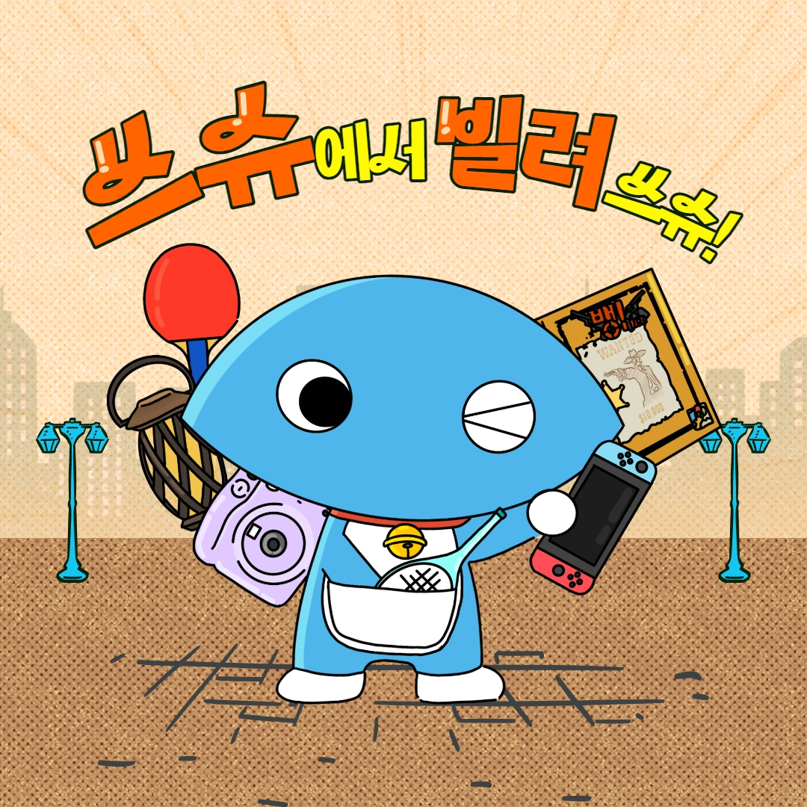
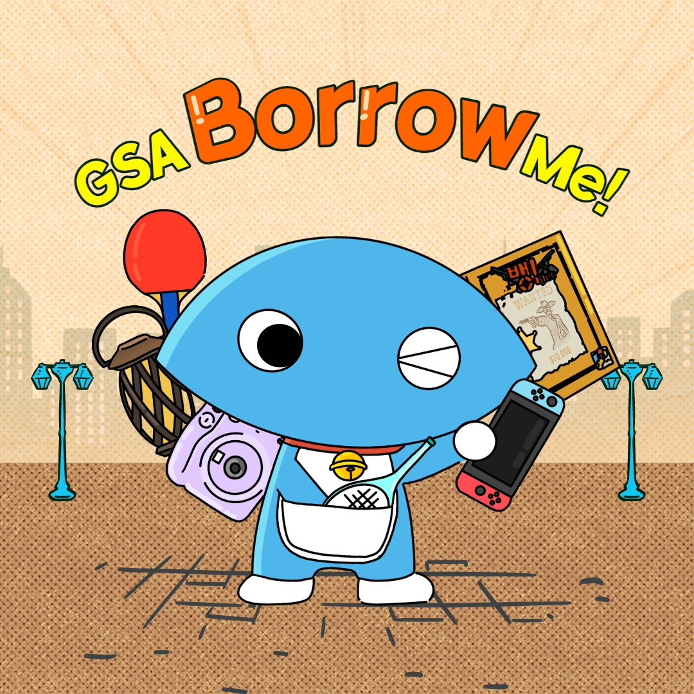
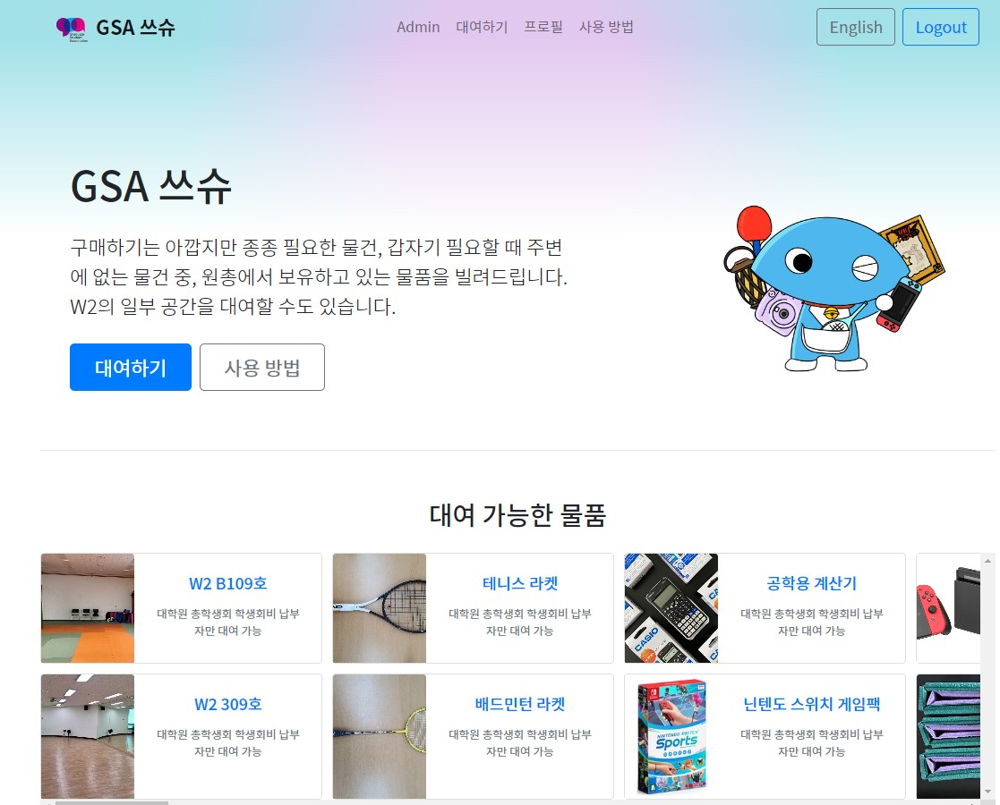

대학원 총학생회 집행부 복지국 2023년 상반기 GSA 쓰슈 사업보고서
===

## 공식 사업명
- 2023년 상반기 GSA 쓰슈

## 담당자
- 제51대 대학원 총학생회 복지국 복지국장

## 추진 배경
- 학생 개인이 자주 사용하지 않지만 반드시 필요한 물품들을 대여해줌으로서, 대학원 생활의 편리성을 증진시키고 학생회비 납부의 실질적 혜택을 제공

## 사업 목표
- 상반기 물품 대여 횟수 100회 달성
- 달성여부 : O (197회 대여)

## 일시
2023년 3월 ~ 2023년 8월 (2023년도 상반기 상시 진행)

## 장소
온/오프라인 플랫폼을 함께 이용
오프라인: 서측 학생회관 (W2-1) 대학원 총학생회 창고 (101호)
온라인: https://gsa.kaist.ac.kr/borrow/ 물품대여사업 온라인 예약 시스템을 운영 (무인 대여 시스템)

## 사업 진행 결과
- 2023년도 상반기 학생회비 납부자를 대상으로 계산기, 빔프로젝터, 보드게임, 전동공구, 닌텐도스위치, 테니스라켓, 배드민턴라켓, 운동용품 등 다양한 물품을 대여해 주었음. 온라인 페이지를 이용하여 특정 물품에 대해 예약한 후, 대여 시작일에 서측 학생회관 창고(101호)에 방문하여 자율적으로 대여가 가능한 구조임.
- 대여 물품 선정 및 구매, 비치 및 홍보 등 대여 물품에 대한 직접적인 관리를 수행했으며, 물품대여 사이트 운영, 물품 대여 및 반납 창구 운영 등 GSA 쓰슈 사업전반에 대해 총괄하였음.
- 특히, 2023년도 상반기에는 보증금 입금확인 자동화, 대여 절차 간소화, 당일 신청 제도, 무인 대여 시스템 개발 등을 도입하여 물품 대여의 편의성을 획기적으로 개선하였으며 시스템 개편/웹사이트 개발을 마무리 함. 
- 주기적인 홍보의 부재, 편리하지 않은 물품 대여 방식 등으로 인해 참여율이 저조했으나 원총에서 GSA 쓰슈를 운영한다는 것을 주기적으로 알릴 방안을 고안하고, 매 학기 진행하는 슬기로운 대학원 생활 OT에서 본 사업을 꾸준히 언급하는 등 사업을 적극 홍보함으로써 작년 상반기 대비 대여 횟수가 170회 증가하였음. 

(비고) 2023년도 상반기 추가물품 구매 건은 일반회계로 추가 집행될 예정임.

## 결산: 총 예산 2,500,000 원 중 0 원 집행

- 일반회계: 2,500,000 원 중 0 원 집행

|  **비목** |   **세목**   | **산출 기준** | **예산** | **결산** |
|:----------:|:------------:|:--------:|:--------:|:--------:|
|일반회계| 대여사업 물품 구입  | 대여사업 물품 구입  | 1,500,000 | 0 |
|일반회계| 무인대여 사업용 장비 구입 | 스마트 도어락 등 구입 | 500,000 | 0 | 
|   **사업비 총액**  |        |        | **2,000,000** | **0** |
|   **일반회계 총액**  |        |        | **2,000,000** | **0** |
|   **학생회계 총액**  |         |       |**0** | **0** |

단위:원 

## 홍보물

|  **홍보일** |   **제목**   | **매체** |
|:----------:|:------------:|:--------:|
|2023-04-23|아직도 사서 쓰슈? 이제 원총에서 빌려 "쓰슈"!|[GSA 홈페이지](https://gsa.kaist.ac.kr/notice/221422?page=2), 단체메일, [KAIST 포탈](https://portal.kaist.ac.kr/ennotice/student_notice/11682301851317)|
|2023-04-23|Want to borrow something? Use GSA BorrowMe!|[GSA 홈페이지](https://gsa.kaist.ac.kr/notice/221421?page=2), 단체메일|

## 사진

## 경품 당첨자
없음
