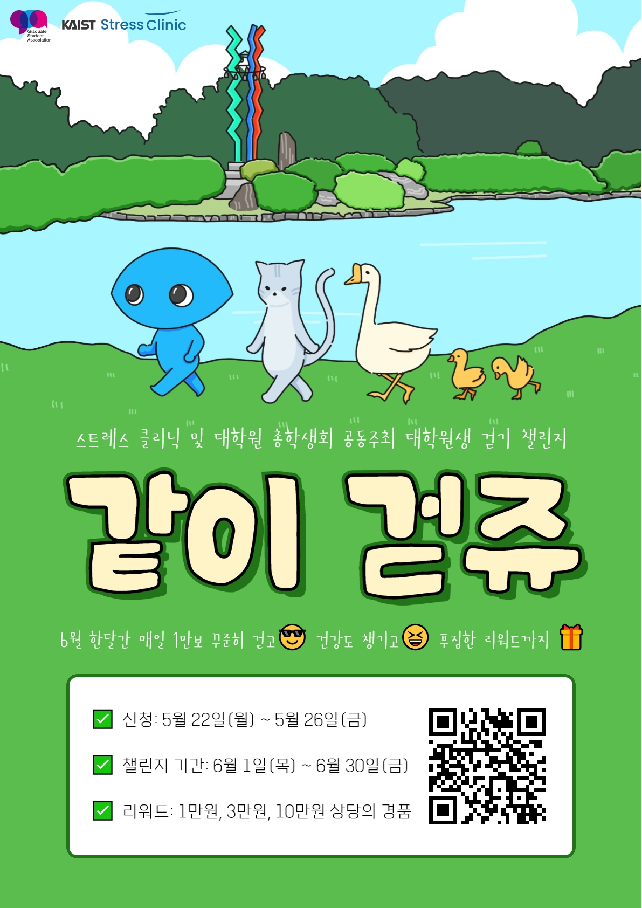
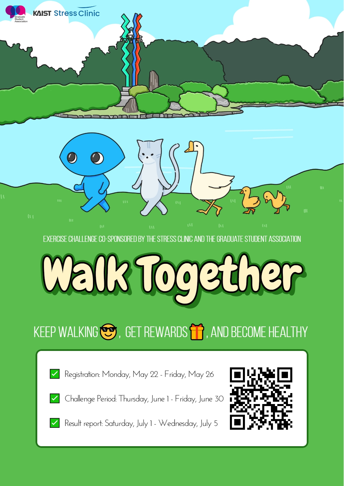

대학원 총학생회 집행부 복지국 2023년 상반기 같이 걷쥬 (KAIST walk challenge) 사업보고서
===

## 공식 사업명
- 2023년 상반기 같이 걷쥬 (KAIST walk challenge)

## 담당자
- 제51대 KAIST 대학원 총학생회 대외협력부장

## 추진 배경
- 현재까지 KAIST 대학원생의 건강 증진을 위한 운동 사업 프로그램이 부재함 
- 교내에서 주최하는 건강달리기, 인문사회과학부의 대학원생 체육 수업 등은 한정된 인원을 대상으로 함 

## 사업 목표
- 참가자 100명 달성
- 실제 달성 여부: O

- 다수의 대학원생이 참여할 수 있는 1인 걷기 챌린지로 스트레스 해소와 체력 유지 도움을 제공
- 운동량이 부족한 학생들에게 규칙적인 걷기를 독려하여, 사망위험 감소, 만성질환 발병위험 감소, 우울증 예방, 수면의 질 향상 등 육체건강 및 신체건강 증진, 인지기능 향상 효과를 기대함
- 교내 스트레스 클리닉과 공동 주관으로 정유 스트레스 클리닉에서 제공하는 건강 정보 활용

## 일시
- 2023년도 5-7월

## 장소
- "걷쥬" 플랫폼을 활용한 개인별 걸음수 집계 (온라인)

## 사업 진행 결과
- 카이스트 클리닉과의 협업을 통해 효과적인 사업 진행방향을 결정하고 진행하였음. 특히, 걷쥬 챌린지 홍보물 및 챌린지 리워드 등에 대해 카이스트 클리닉을 통해 지원받음으로써 참가자 유치에 힘썼음.
- 학생들의 건강 관리 및 증진을 위해 매주 챌린지 참여자에게 건강 정보와 함께 챌린지 독려 메일 발송함.
- 걷쥬 챌린지의 사업 진행 순서는 아래와 같음

(1) 5월 15일(월): 챌린지 홍보 시작 (~26일) [메일 및 포스터를 활용]
(2) 5월 22일(월) - 5월 26일(금): 챌린지 접수
(3) 5월 27일(토) - 5월 31일(수): 참가자 걷쥬 설치, 커뮤니티 가입 승인 및 개인별 걷쥬 앱 테스트 기간 운영
(4) 6월 1일(목) - 6월 30일(금): 걷쥬 챌린지 4주간 진행
(5) 7월 1일(토) - 7월 5일(수): 챌린지 결과 리포트
(6) 7월 6일(목) - 7월 14일(금): 챌린지 결과 집계 및 정리
(7) 7월 17일(월) - 7월 21일(금): 챌린지 리워드 배포

- 총 102명의 챌린지 참가자를 유치하였으며, 챌린지 결과 집계 및 리워드 배포를 수행함.
- 걷쥬 챌린지 참가 리워드의 편성 및 가용예산은 아래와 같음 (학생회비 납부에 상관없이 리워드 수령 가능)

(a) 의지의 카이인상 (151명): 30일동안 매일 1만보 이상, 1만원 스타벅스 카드. 추첨
(b) 꼼꼼 리뷰상 (3명): 챌린지 리뷰를 정성껏 작성해준 사람 3명을 추첨해서 3만원 파스쿠찌 카드 지급.
(c) 행운의 카이인상 (2명): 챌린지 결과 리포트를 제출한 참가자 중 2명을 추첨해서 10만원 상품권 지급 

- 경품 및 홍보 관련 예산은 스트레스트클리닉에서 전부 지원받아 활용하였음.
- 각 리워드는 (a) 의지의 카이인상: 김x희 외 33인, (b) 꼼꼼 리뷰상: XXX 외 2인, (c) 행운의 카이인상: XXX외 1인이 선정되어 지급되었음

## 결산: 총 예산 0원 중 0원 집행

|  **비목** |   **세목**   | **산출 기준** | **예산** | **결산** |
|:----------:|:------------:|:--------:|:--------:|:--------:|
|   **사업비 총액**  |        |        | **0** | **0** |
|   **일반회계 총액**  |        |        | **0** | **0** |
|   **학생회계 총액**  |         |       |**0** | **0** |

단위:원 

(비고) 경품 및 홍보 관련 예산은 스트레스트클리닉에서 전부 지원받아 활용하였음.

## 홍보물

|  **홍보일** |   **제목**   | **매체** |
|:----------:|:------------:|:--------:|
|2023-05-18|[원총] 대학원생 걷기 챌린지 ‘같이 걷쥬’가 6월 찾아옵니다! 꾸준히 걷고, 리워드도 받고, 건강도 챙기세요|[GSA 홈페이지](https://gsa.kaist.ac.kr/notice/223191), 단체메일, [KAIST 포탈](https://portal.kaist.ac.kr/ennotice/student_notice/11684410725607)|
|2023-05-18|[GSA] Walking challenge for grad students, 'Walk Together' is coming in June! Keep walking, get rewards, and become healthy|[GSA 홈페이지](https://gsa.kaist.ac.kr/notice/223192), 단체메일|

## 사진

 
 

## 경품 당첨자
없음
