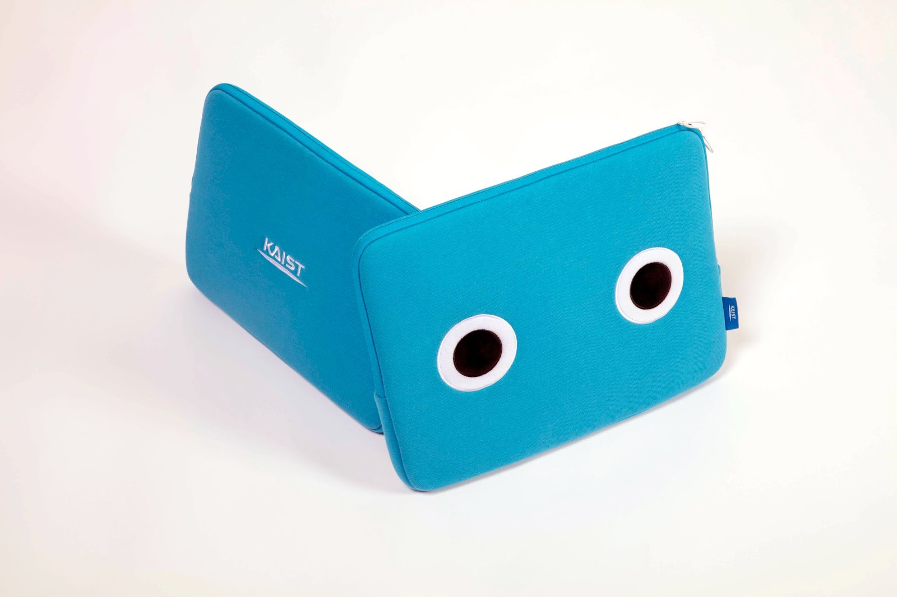
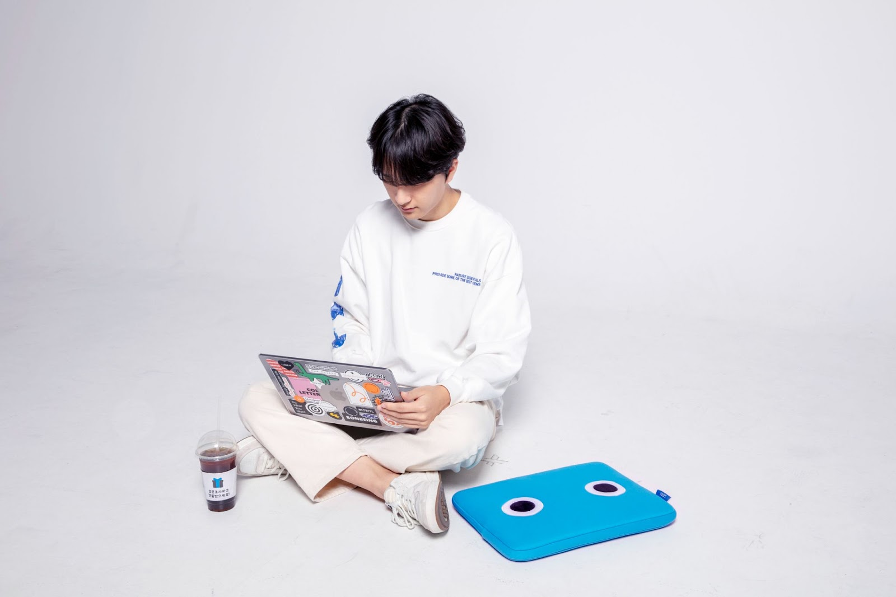
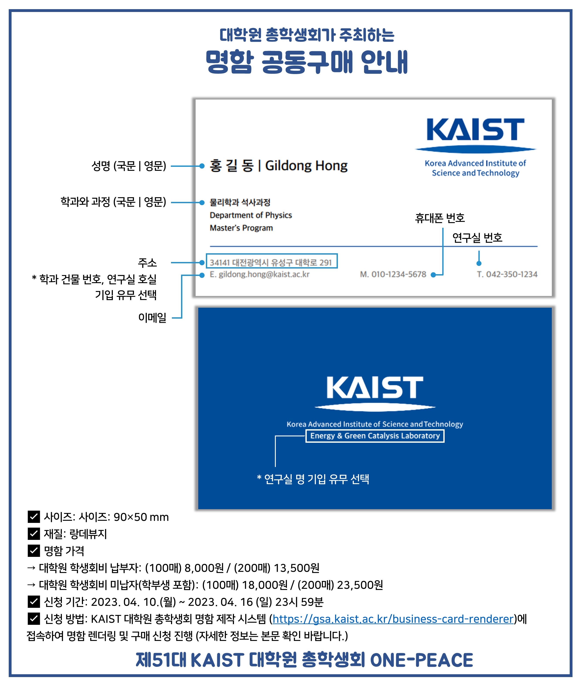
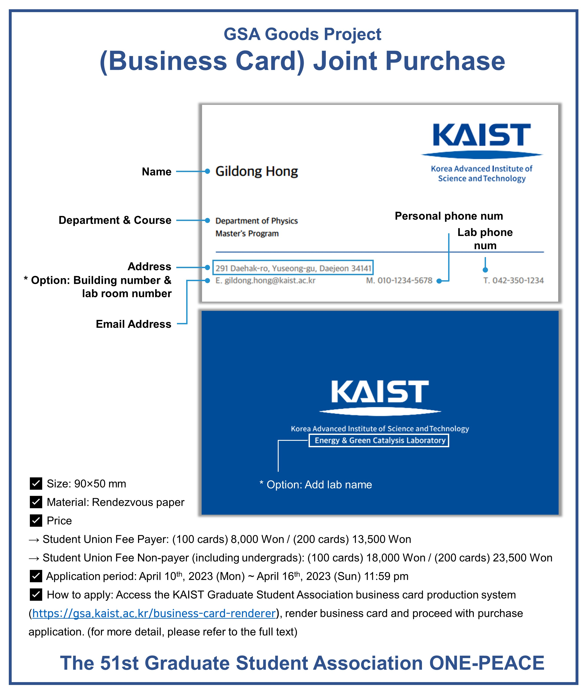

대학원 총학생회 집행부 복지국 2023년 상반기 굿즈제작사업 사업보고서
===

## 공식 사업명
- 2023년 상반기 굿즈제작사업

## 담당자
- 제51대 KAIST 대학원 총학생회 복지국장

## 추진 배경
- 교내 굿즈 매장에서 판매하는 기념품의 경우 다양성이 부족하며, 학생들의 실질적인 관심을 끌지 못한다는 의견이 있음. 또한, 기념품 매장에서 판매하는 학교 굿즈의 종류가 학생들에게 잘 알려지지 않아, 기념품 매장 방문 전, 구매 의사를 결정하기가 쉽지 않음. 
- 특히, 코로나19 사회적 거리두기 여파로 인해 학생들의 기념품 매장 방문이 꺼려짐에 따라, 굿즈에 대한 접근성이 최근들어 떨어지고 있음. 즉, 굿즈의 다양성을 개선하고, 온라인 플랫폼을 적극 활용해 굿즈에 대한 접근성을 높이는 것에 대한 필요성이 제기됨. 
- 이러한 문제를 해결하고, 학생들의 문화생활을 장려/증진하고자 본 사업을 계획하게 됨

## 사업 목표
- 브랜드카이스트와 협업하여 굿즈사업 진행 (달성여부: O)
- 대학원총학생회 자체 굿즈제작사업 진행 (1학기 당 1회) (달성여부: X)
- 명함 공동구매 사업 진행 (1학기 당 최소 2회) (달성여부: X / 1학기 1회 진행되었음)
- 굿즈 공동구매 신청 인원 총 1,000명 달성 (달성여부: X)

## 일시
명함 굿즈: 2023년 4월 중, 온라인 접수를 통한 구매 신청
브랜드카이스트 협업 굿즈 (노트북 파우치): 2023년 4월 중

## 장소
명함 굿즈: 온라인 접수를 통한 구매 신청
브랜드카이스트 협업 굿즈 (노트북 파우치): 브랜드 카이스트 직접방문을 통한 구매

## 사업 진행 결과
- 브랜드카이스트 협업 굿즈제작사업 (노트북 파우치): 브랜드카이스트와의 협업을 통해 특정 기간동안 해당 굿즈를 20% 저렴한 가격으로 구매할 수 있도록 하였음. 결과적으로 약 200여명의 학우분들께서 파우치 공동구매에 참여하였음. 향후 학우분들에게 양질의 굿즈를 저렴하게 제공할 수 있도록 브랜드카이스트와의 협업을 고려할 예정임.
- 명함 공동구매 사업: 원총 명함 렌더링 페이지에서 개인이 자신의 정보(이름, 학위 과정, 이메일, 전화번호, 랩실 이름 등)를 입력하여 명함 샘플 확인 후 주문을 진행할 수 있도록 하였음. 본인의 명함 시안을 직접 확인하는데 걸렸던 시간을 획기적으로 단축하여 학우분들에게 편리한 명함공동구매 서비스를 제공함. 상반기 원총 자체적으로 개발한 명함 렌더링 사이트는 아래와 같음 (https://gsa.kaist.ac.kr/business-card-renderer). 명함 배포는 상근인력을 활용하여 오프라인으로 진행하였음.

## 결산: 총 예산 1,600,000 원 중 149,400 원 집행

- 일반회계: 1,600,000 원 중 149,400 원 집행

|  **비목** |   **세목**   | **산출 기준** | **예산** | **결산** |
|:----------:|:------------:|:--------:|:--------:|:--------:|
|일반회계| 공모전 사례비 | 4회X25만원 | 1,000,000 | 0 |
|일반회계| 샘플제작비 | 4회X15만원 | 600,000 | 149,400 | 
|   **사업비 총액**  |        |        | **1,600,000** | **149,400** |
|   **일반회계 총액**  |        |        | **1,600,000** | **149,400** |
|   **학생회계 총액**  |         |       |**0** | **0** |

단위:원 

(비고) 
- 상반기 진행하지 못했던 신규 굿즈 제작은 하반기에 추가하여 2회 진행할 예정임.

## 홍보물

|  **홍보일** |   **제목**   | **매체** |
|:----------:|:------------:|:--------:|
|2023-04-10|[원총] 내 노트북 파우치는 '넙죽이 스페셜 에디션'! (*파격 할인 진행 중!)
|[GSA 홈페이지](https://gsa.kaist.ac.kr/notice/220376), 단체메일, [KAIST포탈](https://portal.kaist.ac.kr/ennotice/student_notice/11681089568006)|
|2023-04-10|[GSA] My laptop pouch is "Neop-juki Special Edition"! (*A huge discount is in progress!)
|[GSA 홈페이지](https://gsa.kaist.ac.kr/notice/220377?page=3), 단체메일|
|2023-04-13|학부생/대학원생 명함 공동 구매 안내: 2023 원총 굿즈제작사업
|[GSA 홈페이지](https://gsa.kaist.ac.kr/notice/220379?page=3), 단체메일, [KAIST포탈](https://portal.kaist.ac.kr/ennotice/student_notice/11681105778851)|
|2023-04-13|[GSA] Group purchase of business cards & "Neop-juki Special Edition" laptop pouch
|[GSA 홈페이지](https://gsa.kaist.ac.kr/notice/220380?page=3), 단체메일|

## 사진
  
  
  
  

## 경품 당첨자
없음
