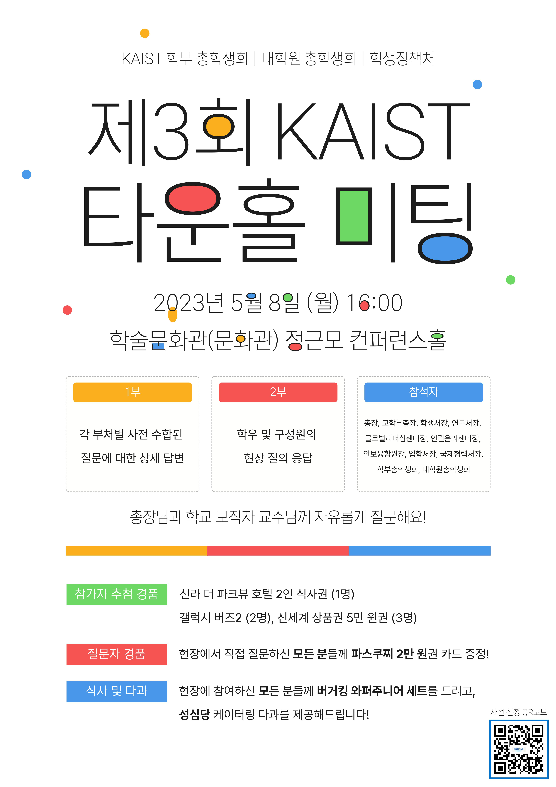

## 공식 사업명

- 제3회 KAIST 타운홀 미팅

  

## 담당자

- 제51대 대학원 총학생회 부총학생회장

  

## 추진 배경

- 2022년에  2번의 KAIST 타운홀 미팅이 성공적으로 개최되었으며, 구성원 모두 추가적인 논의를 위한 후속 행사 추진 희망하였음.
  

## 사업 목표

- 학생(학부생, 대학원생)의 입장에서 학교 생활을 하면서 어려운 점이 무엇이 있고, 학교에서 해결 가능한 문제라면 이에 대해 의제를 설정
-   제시된 의제들이 문제해결까지 이어질 수 있도록 학생과 보직교수가 함께 문제 해결의 방향성을 제시하고 해결 방안을 도모

  

## 일시

- 2023년 5월 8일

  

## 장소

- 정근모 컨퍼런스홀 

  

## 사업 진행 결과

- 1부 (16:00 ~ 16:40) : 사전 질문에 대한 보직 교수님 및 담당 부처의 상세 답변 시간
- 2부 (16:50 ~ 17:30) : 현장 질의응답 시간

- 이광형 총장님을 비롯한 11분의 보직 교수 구성원과 학부•대학원 총학생회장이 패널로 참석하였고, 학우분들의 질문에 직접 답하는 시간을 보냈음.

- 행사를 준비하며 학우분들께 사전 질문을 수합하였고, 총 100여개가 넘는 질문 대부분을 정리하여 관련 부처에 전달하였으며 이에 대한 부처의 답변을 수합하여 학우들에게 공유함.
- [링크](https://drive.google.com/drive/folders/14xwmgk1kbNm_zepLH_VHIfP7LkW_x1f4?usp=sharing) (부처별 질문 정리: 교무처, 교학부총장님, 국제협력처, 글로벌리더십센터, 안보융합원, 연구처, 인권윤리센터, 입학처, 학생생활처, 학생정책처, KAIST클리닉, 고객경영팀, 시설팀/안전팀, 총장님, 학술문화원)

  

## 결산: 총 예산 1,300,000 원 중 780,000 원 집행

- 일반회계: 0 원

- 학생회계: 1,300,000 원 중 780,000 원 집행

| **내용** | **단가** | **수량** | **예산** | **결산** | **회계구분** |
|:---:|:---:|:---:|:---:|:---:|:---:|
| MC 인건비(50,000 X 3인) | 50,000 | 3 | 300,000 | 150,000 | 학생회계 |
| 현수막(80,000 X 2장) | 80,000 | 2 | 200,000 | 160,000 | 학생회계 |
| 포스터(4,700 X 100장) | 4,700 | 100 | 800,000 | 470,000 | 학생회계 |
| **사업비 총액** | | | **1,300,000** | **780,000** | |
| **일반회계 총액** | | | **0** | **0** | |
| **학생회계 총액** | | | **1,300,000** | **780,000** | |

  
  

## 사진

  

## 경품 수여자
- 1등 (1명) 신라호텔 더 파크뷰 뷔페 2인 식사권
- 2등 (2명) 갤럭시 버즈 2
- 3등 (3명) 신세계 상품권 5만 원 
- 질문자 경품 (14명) 파스쿠찌 2만원 권
