대학원 총학생회 집행부 복지국 2023년 상반기 취업박람회 사업보고서
===

## 공식 사업명
- 2023년 상반기 취업박람회

## 담당자
- 제51대 대학원 총학생회 복지국 복지국장

## 추진 배경
- 전공 분야의 범위가 학사 졸업생에 비해 좁고, 고도로 전문적인 석/박사 졸업생 특성상 학생 주도적인 정기/상시 채용 지원의 기회가 적음. 이러한 문제를 해결하고자 석/박사 경력직 채용 기업을 초청하여 학우들에게 취업 정보의 폭을 넓히고, 학생 주도적 구직이 적극적으로 일어날 수 있도록 장려함
- 코로나19 사태 장기화 등으로 인해 취업난이 심화되고 구인 형태가 일부 변화함에 따라 취업 준비에 고충을 겪고 있는 학우들에게 온라인/오프라인 플랫폼의 이원화된 취업박람회를 운영하여 취업에 대한 정보를 효과적으로 제공.

## 사업 목표
- 상담 건수 1,000회 이상 달성 (온/오프라인 플랫폼 통합)
- 달성 여부 : O (총 2,946회 [오프라인 2,838건 + 온라인 108건])

## 일시
2023 상반기 오프라인 취업박람회: 2023. 03. 06 ~ 2023. 03. 08 (총 3일)
2023 상반기 오프라인 기업별 취업설명회: 2023. 03. 09 (총 1일)
2023 상반기 온라인 취업박람회: 2023. 03. 10, 2023. 03. 17 (총 2일)

## 장소
온라인: ZEP 메타버스 플랫폼
오프라인: 류근철 스포츠컴플렉스 2층 내부/외부 테라스
기업별 취업설명회: 학술문화관 5층 존해너홀 / 정근모콘퍼런스홀

## 사업 진행 결과
- 오프라인 취업박람회 개요 
- 오프라인 취업박람회에는 총 42개 기업이 참가하였음 (대기업 계열사 비율 80% 내외)
- 취업박람회 홍보를 위해, NHR communications와의 협업으로 JOB FAIR 홈페이지를 구축하였으며 학생들에게 하여금 사전신청 및 참가가 용이하도록 하였음
- 또한 포스터, 가로형 현수막, 대형 현수막, X-배너, A-배너 등의 홍보물을 교내에 적극적으로 배치하고, 홍보 리플렛, KAIST 에코백, 텀블러, 우산, 핫팩 등을 직접 배포함으로써, 학생들에게 취업박람회 개최를 실제로 체감할 수 있도록 적극적으로 홍보활동을 개진하였음. 
- KAIST 취업박람회 팝업창 및 홍보 링크 등을 커리어톡, 자소설닷컴, 자소설닷컴M, 캐치:캐치PC/MO, 에브리타임, 카카오톡 비즈보드, 인스타그램, 구글 GDN, 스펙업 등 학생 친화적 플랫폼에 메인 팝업 배너로 게재함으로써 총합 5,000,000회 내외의 노출 수와 50,000회 내외의 클릭수를 유도하는 등 개최 전 상시 온라인 홍보를 진행함.
- KAIST 포탈, 메일, ARA 등 KAIST 교내구성원과 직접적으로 맞닿아 있는 플랫폼에 홍보물을 발송함으로써 학생들의 적극적인 참여를 독려하였음. 
- 약 3,000만원 내외의 홍보 예산을 편성하고 운영함으로써 학생들이 취업박람회 행사를 통해 긍정적인 경험을 체감할 수 있도록 유도하였으며, 향후 개최될 취업박람회의 참여를 자연스럽게 독려하였음.

## 결산: 총 예산 1,300,000 원 중 100,000 원 집행

- 학생회계: 1,300,000 원 중 100,000 원 집행

|  **비목** |   **세목**   | **산출 기준** | **예산** | **결산** |
|:----------:|:------------:|:--------:|:--------:|:--------:|
|학생회계| 스태프 수당 | 5인X4회X4시간X1만원 | 800,000 | 100,000 |
|학생회계| 홍보 경품비 | 10인X5만원 | 500,000 | 0 | 
|   **사업비 총액**  |        |        | **1,300,000** | **100,000** |
|   **일반회계 총액**  |        |        | **0** | **0** |
|   **학생회계 총액**  |         |       |**1,300,000** | **100,000** |

단위:원 

## 홍보물

|  **홍보일** |   **제목**   | **매체** |
|:----------:|:------------:|:--------:|
|2023-02-24|[원총] 2023 상반기 KAIST JOB FAIR 온·오프라인 개최|[GSA 홈페이지](https://gsa.kaist.ac.kr/notice/217878?page=4), 단체메일, [KAIST 포탈](https://portal.kaist.ac.kr/ennotice/student_notice/11677217938709)|
|2023-03-01|[원총] [원총] (삼성, LG, SK 등 대기업 다수참여) 2023 상반기 KAIST JOB FAIR (취업박람회) 개최 안내|[GSA 홈페이지](https://gsa.kaist.ac.kr/notice/218149?page=4), 단체메일, [KAIST 포탈](https://portal.kaist.ac.kr/ennotice/student_notice/11677741576797)|
|2023-03-06|[원총] 취업박람회 D-day! (상담만해도 애플워치/치킨쿠폰 증정!) 2023 상반기 KAIST JOB FAIR 개최 안내 (삼성, LG, SK 등 대기업 다수참여)|단체메일, [KAIST 포탈](https://portal.kaist.ac.kr/ennotice/student_notice/11678064710890)|
|2023-03-08|[원총] 기업별 릴레이 취업설명회 start! (상담만해도 애플워치/치킨쿠폰 증정!) 2023 상반기 KAIST JOB FAIR 안내 (삼성, LG, SK 등 대기업 다수참여)|단체메일|
|2023-03-10|[원총] 온라인 메타버스 취업박람회 open! (상담만해도 애플워치/치킨쿠폰 증정!) |단체메일|

## 사진

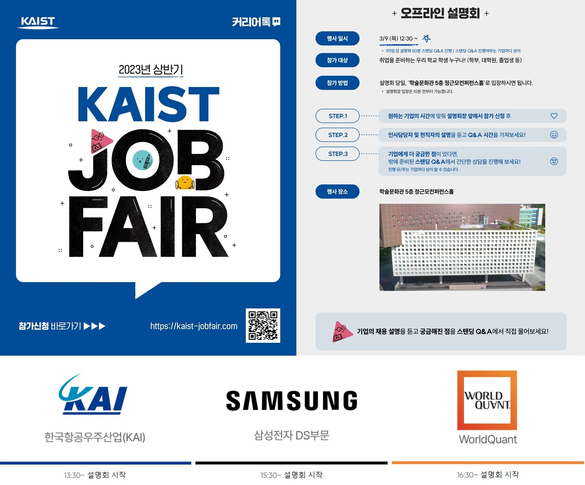
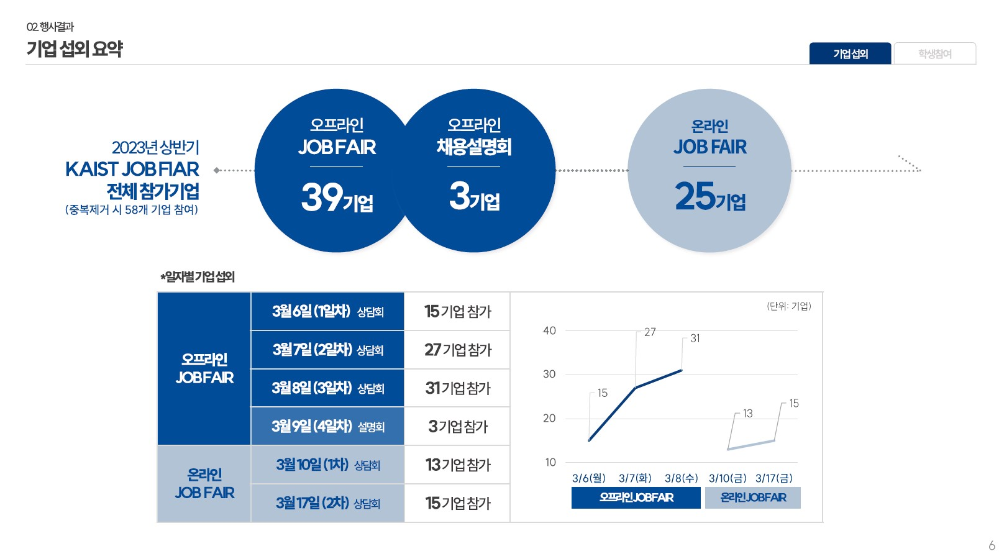
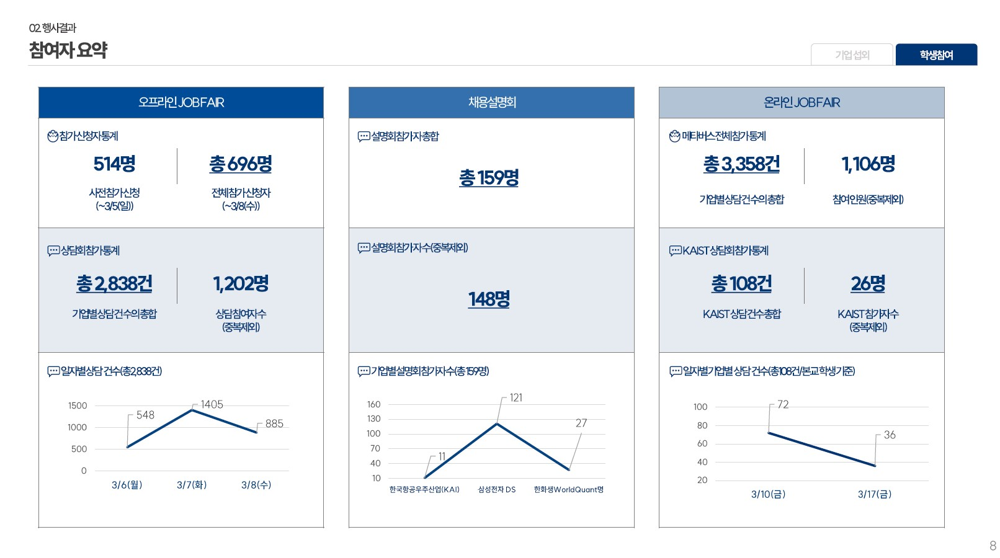
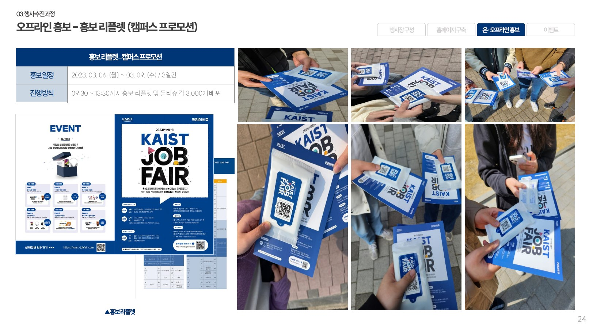
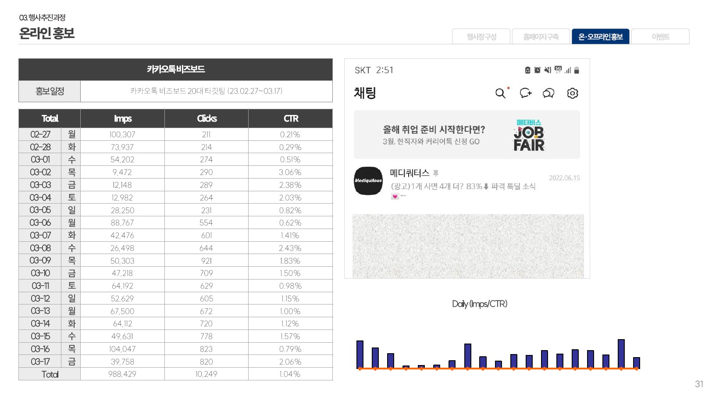
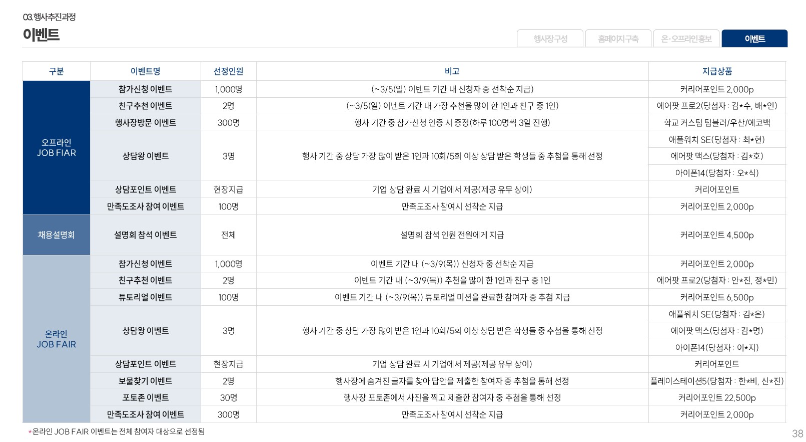
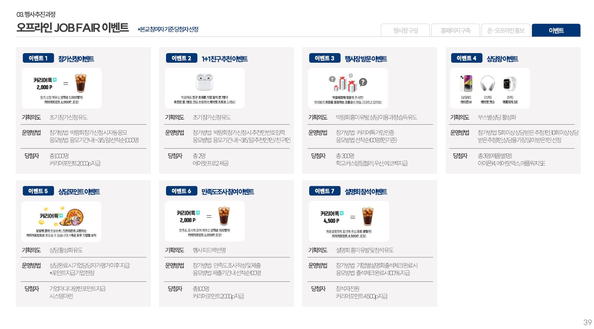
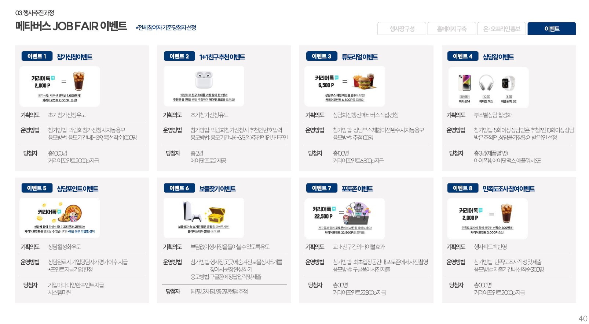
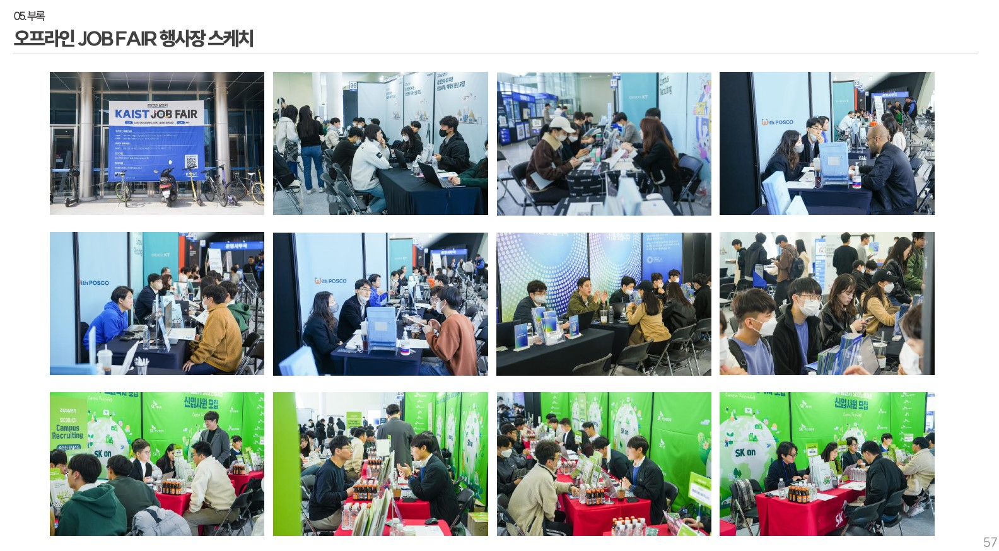
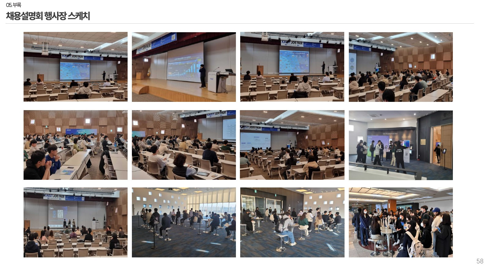
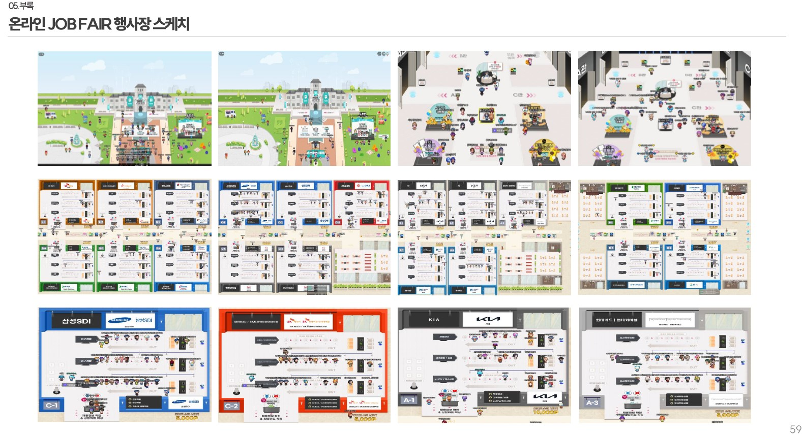

## 경품 당첨자
없음
