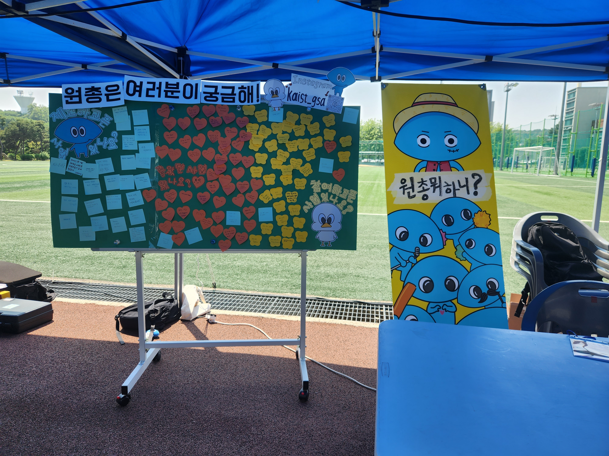
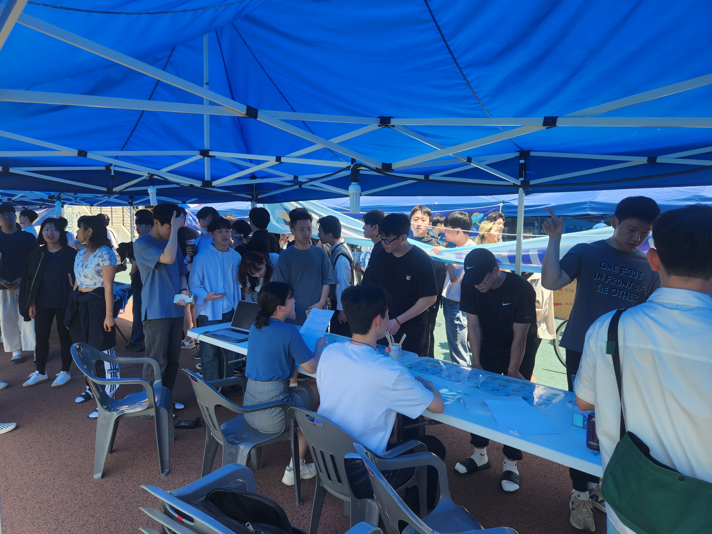

대학원 총학생회 집행부 2023년 석림태울제 원총 홍보부스 사업보고서
===

## 공식 사업명
- 2023년 석림태울제 원총 홍보부스

## 담당자
- 제51대 대학원 총학생회 부총학생회장

## 추진 배경
-   오프라인으로 원총의 사업과 성과, 비전을 효과적으로 홍보할 수 있음.

## 사업 목표
-   석림태울제 부스 운영을 통해 원총의 사업 및 성과를 적극 홍보
-   약 200명 분의 경품을 준비해 학우들의 참여를 유도

## 일시
- 2023년 5월 16일 - 2023년 5월 17일 (양일간 진행)

## 사업 진행 결과
- 5월 16일-17일 양일간 석림태울제 행사 부스를 운영함.
- 대학원 총학생회의 활동 및 성과에 관련한 퀴즈를 출제하고, 경품을 제공하는 방식으로 진행함.
- 대학원 총학생회 사업에 대한 학우분들의 피드백을 포스트잇으로 받고, 넙죽이 타투 스티커를 제공하였음. 
- 약 270명의 학우가 참여하여 매우 성공적으로 부스가 진행되었음.

## 사진

## 결산: 총 예산 0 원 중 0 원 집행

| **내용** | **단가** | **수량** | **예산** | **결산** | **회계구분** |
|:---:|:---:|:---:|:---:|:---:|:---:|
| **사업비 총액** |  | | **0** | **0** |  |
| **일반회계 총액** |  | | **0** | **0** |  |
| **학생회계 총액** |  | | **0** | **0** |  |

- 총학생회장단 홍보비를 사용하였음.
