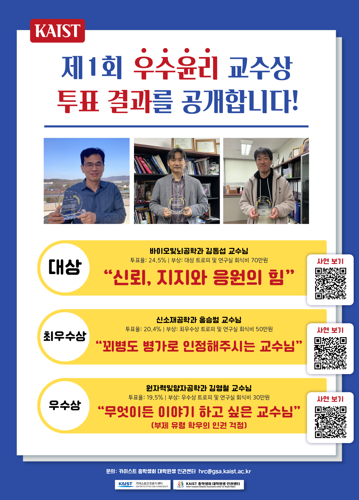

2023년 하반기 대학원 총학생회 인권센터 올해의 우수윤리 교수상 사업계획서
===

## 공식 사업명
- 2023년 하반기 대학원생인권센터 제 2회 올해의 우수윤리 교수상 사업

## 담당자
- 대학원생인권센터 센터장

## 추진 배경
- 교내 우수한 인권 사례를 가진 교수들이 많지만 해당 사례를 학생들이 접할 수 있는 기회가 적음
- 교수님들의 인권의식에 대한 전반적인 탐색과 더불어 우수윤리 사례들을 찾아 교내구성원들과 공유하여 서로에게 모범과 귀감이 되고자 함

## 사업 목표
- 교내 교수님들의 인권 의식에 대한 전반적인 탐색
- 우수 인권 사례 공유를 통해 타 교수들에게 모범과 귀감이 될 수 있음
- 사례 공모와 우수 사례 투표를 통한 학생들의 참여를 통해 인권에 대한 관심 증진

## 일시
- 2023년 가을학기 시작일 ~ 2024년 봄학기 시작 전일

## 장소
- 카이스트 교내 (온라인 투표 진행예정)

## 사업 내용
사업진행 및 심사방식: 
 - 접수 
    - 학생들이 “인권윤리 우수"사례를 구글폼으로 접수
 - 1차 내부심사 
    1. 접수 사례중 심사불가한 사례 (너무 짧거나, 접수 포맷에 안맞거나 등)들을 필터링
    2. 해당 연구실을 대상으로 정량평가 진행 (학생들 대상의 연구환경실태조사 느낌, 접수 사례와 접수자 이름은 익명 유지) 
    3. 연구실 구성원 대상의 인터뷰 진행 
 - 최종심사
    - 접수된 사례를 카테고리화 하여 다양한 플렛폼으로 가공하여 정성적 평가요소로 사용
    - 내부심사에서 진행된 연구실 구성원대상의 정보를 정량적 평가요소로 사용 
    - 1, 2의 평가요소들을 익명으로 학생들에게 공개 후 투표 진행 
- 시상
    - 득표수 1, 2, 3위를 뽑아 트로피와 연구실 사교활동을 위한 상금 지급 

수상자 및 참가자 보상
- 참가상 : 참가인원 중 추첨으로 총 10명에게 1만원권 바우처 제공 
- 투표자 : 최종투표 참여자들 중 총 10명에게 1만원권 바우처 제공
- 대상 : 최종심사 후 최다투표사례의 주인공 교수님에게 대상 트로피 및 연구실 사교활동비용 100만원 지급 
- 최우수상 : 투표순위 2위 사례의 교수님에게 최우수상 트로피 및 연구실 사교활동비용 50만원 지급 
- 우수상 : 투표순위 3위 사례의 교수님에게 우수상 트로피 및 연구실 사교활동비용 30만원 지급 
- 인기상 : 1차심사 통과한 사례들을 4컷툰 등 적절한 플랫폼으로 가공 후 SNS 게시하고 가장 반응도가 높은 사례의 연구실에게 바우처 제공

*사진자료: 2022 우수윤리교수상

## 예산

|  **비목** |   **세목**   | **예산** |
|:----------:|:------------:|:--------:|
|	일반회계  | 수상자 및 참가자 보상 | 2,500,000 |
|	일반회계  | 플랫폼 제작 및 홍보비 | 1,000,000 |
|	예비비  | 예비비 | 500,000 |
|   **합계**  |              |    4,000,000    |
	단위:원
