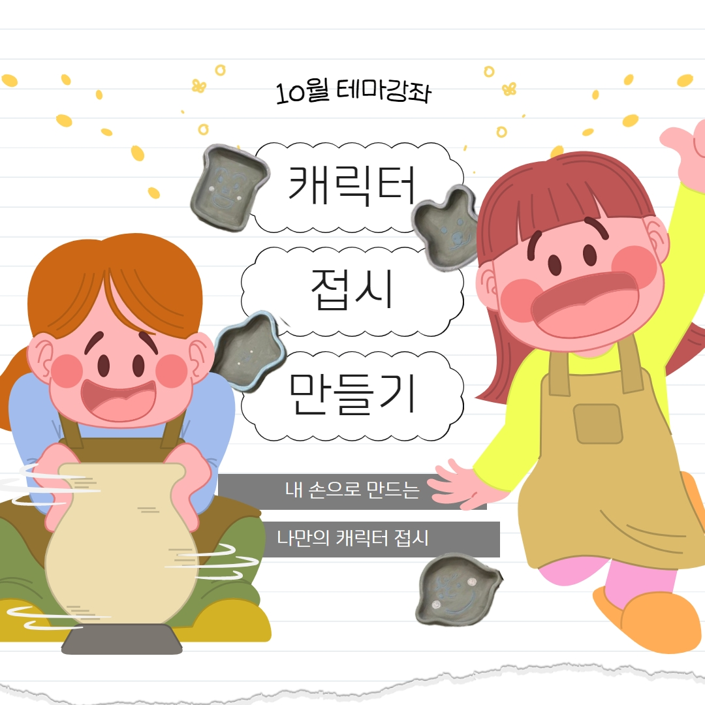
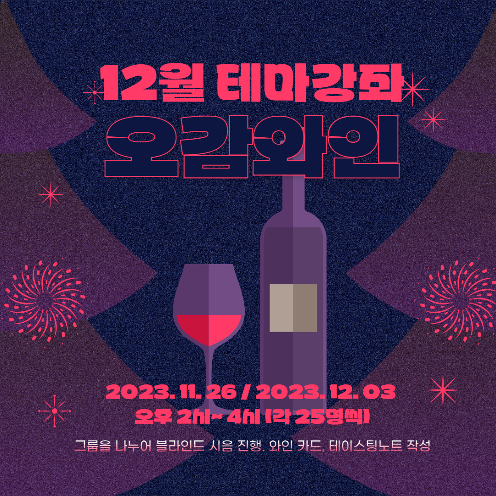

대학원 총학생회 집행부 문화국 2023년 하반기 테마강좌 사업보고서
===

## 공식 사업명
- 2023년 하반기 테마강좌

## 담당자
- 제51대 대학원 총학생회 문화국장

## 추진 배경
- 대학원생의 삶의 질 향상을 위해 문화생활을 체험하고 휴식을 즐길 기회를 제공할 필요성이 대두되어 왔음.
- 적잖은 대학원생들의 생활 반경이 학교 근처에 국한되어, 교내에서 즐길 수 있는 취미를 찾아주는 기회를 만들고자 함.
- 재료 지원을 통해 부담 없이 참여할 수 있는 스트레스 해소 방안을 제공하고자 함.
- 연구 외적인 분야의 특강 또는 KAIST 학생들의 삶의 질을 향상시킬 수 있는 유익하고 실질적인 강좌를 제공하고자 함.

## 사업 목표
- 테마강좌 평균 신청자수 150명
- 실제 달성 여부: O (총 4회, 평균 신청자 172.25명)

## 일시 및 장소
|  **회차** |   **제목**   |   **신청 기간**   |   **배포 기간 / 강연일**   |   **장소**   |
|:----------:|:------------:|:------------:|:------------:|:------------:|:------------:|
| 1 |업사이클링 키트|2023-09-19 ~ 09-21|2023-09-25 ~ 09-26| 서측학생회관(W2) 211호 |
| 2 |캐릭터 접시 만들기|2023-10-13 ~ 10-16| 2023-10-25 | KI빌딩(E4) 501호 |
| 3 |사랑의 빼빼로 만들기| 2023-10-31 ~ 11-02| 2023-11-07 ~ 11-09 | 서측학생회관(W2) 211호 |
| 4 |오감와인| 2023-11-15 ~ 11-17| 2023-11-26  2023-12-03 |장영신 학생회관(N13-1) 울림홀|
| 번외 1 |대전 예술의전당 회원음악회 <필하모닉스>| 2023-12-13 ~ 12-14 | 2023-12-19 |대전예술의전당 아트홀|
| 번외 2 |조수미 교수님 토크콘서트| 2024-01-03 ~ 01-04|  2024-01-09 |학술문화관(E9) 존해너홀|

## 사업 진행 결과
- 총 4번의 테마강좌와 2번의 추가 문화행사를 진행하였으며, 각 테마강좌 신청 인원 및 선정 인원은 다음과 같음.

|  **회차** |   **제목**   |   **지원자 수**   |   **선정자 수**   |
|:----------:|:------------:|:------------:|:------------:|
| 1 |업사이클링 키트|100|50|
| 2 |캐릭터 접시 만들기|116|50|
| 3 |사랑의 빼빼로 만들기|358|78|
| 4 |오감와인|115|50|
| 번외 1 |대전 예술의전당 회원음악회 <필하모닉스>|75|40|
| 번외 2 |조수미 교수님 토크콘서트|99|99|

- 테마강좌에 참여한 학우들의 작업물 홍보 및 테마강좌 행사 자체의 홍보를 위해, 원총 인스타그램 이벤트를 통해 작업물을 대학원 총학생회 인스타그램 계정을 태그하고 테마강좌 해쉬태그를 담은 글과 사진을 게시하면 추첨을 통해 상품을 지급함.
  - 인스타그램 태그:  [#KAIST테마강좌](https://www.instagram.com/explore/tags/kaist테마강좌/)
 - KAIST 예술융합센터, 문화기술대학원의 제안으로 2회의 추가 문화행사를 진행함

## 결산: 총 예산 7,600,000 원 중 7,702,800 원 집행

- 일반회계: 7,200,000 원 중 7,435,800 원 집행
- 학생회계: 400,000 원 중 267,000 원 집행

|  **비목** |   **세목**   | **산출 기준** | **예산** | **결산** |**비고**|
|:----------:|:------------:|:--------:|:--------:|:--------:|:--------:|
| 일반회계 | 재료비     | 120인 X 4회 X 1.5만원 |7,200,000 | 7,435,800 |타 사업에서 남은 일반회계를 추가로 사용|
| 홍보비   | 참가자 경품비 | 1만원 X 5인 X 4회       | 200,000   | 87,000 ||
| 운영비   | 샘플제작비 | 5만원X4회       |200,000   | 0 ||
| 인건비   | 행사 스탭 수당 |        | 0 |180,000|추가 문화행사로 인해, 타 사업에서 남은 인건비를 추가로 사용|
|   **사업비 총액**  |       |       | **7,600,000**| **7,702,800** ||
|   **일반회계 총액**  |       |       | **7,200,000** | **7,435,800**  ||
|   **학생회계 총액**  |       |       |**400,000**| **267,000** ||

단위:원

## 사진

 
 
 
