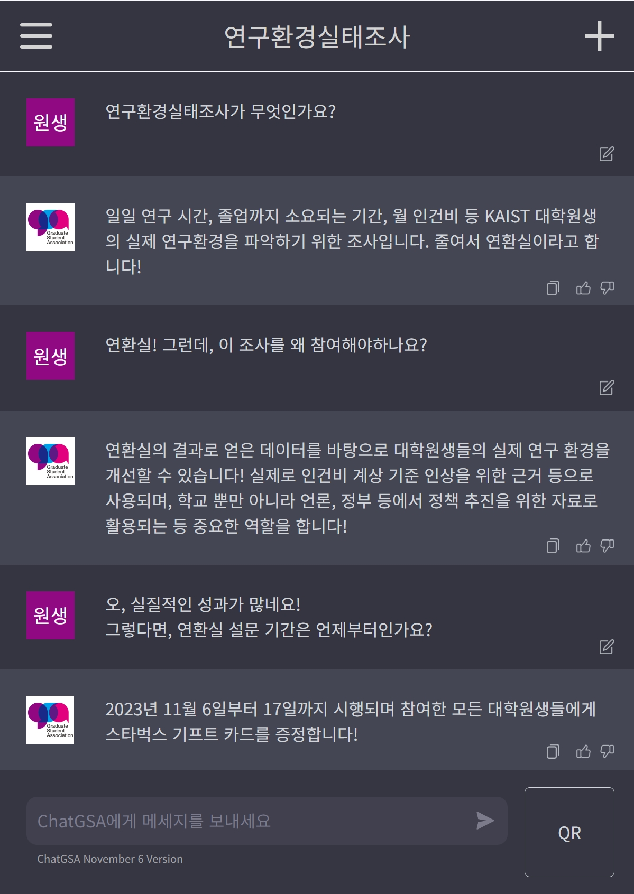

대학원 총학생회 집행부 2023년 하반기 연구환경실태조사 사업보고서
===

## 공식 사업명
- 2023년 하반기 연구환경실태조사 

## 담당자
- 제51대 대학원 총학생회장

## 추진 배경
- 2004년부터 매년 KAIST 대학원생들의 연구 환경 실태 파악 및 원활한 연구 환경을 조성하기 위한 목적으로 전 대학원생을 대상으로 설문조사를 진행해 옴. 
- 설문조사를 바탕으로 당해연도 및 연도별 추이를 분석, 정리하여 KAIST 대학원생 및 교내 구성원에게 연구 환경 실태를 공유하고 관련 문제점을 해결하기 위한 자료로 사용할 필요가 있음. 

## 사업 목표
- 대학원생들의 연구 환경에 대한 정보를 공유하고 관련 문제점을 해결하는데 기여하고자 함. 

## 일시
- 설문조사 기획: 2023년 9월 ~ 2023년 11월
- 설문조사 실시: 2023년 11월 7일(월) ~ 2023년 11월 25일(금)
- 설분조사 분석 및 시각화: 2023년 11월 ~ 2024년 1월

## 장소
- Google Form 등의 온라인 서비스를 이용 

## 사업 진행 결과
- 연구환경실태조사 문항 개선을 위한 전문가(사회통계 전공 교수진 등) 피드백 진행 
- 연구환경실태조사 (가. 대학원 생활 / 나. 연구 수행 환경 / 다. 연구 및 진로 지도 / 라. 경제적 환경 / 마. 연구 과제 및 행정 업무 / 바. 연구 윤리 및 관행 / 사. 2023년 연구 환경 변화 / 아. 재학 정보 / 자. 인적사항 / 차. 기타 의견) 및 인권실태조사 설문조사 항목 작성 및 구성 
- 오프라인 홍보(포스터, 현수막) 진행 및 전체 메일, 포탈, 인스타그램, GSA 홈페이지 등을 통한 온라인 홍보 진행 
- 수집된 응답을 바탕으로 결과 분석 및 시각화 진행 
- 대학원생 권리 향상을 위한 연구 및 정책 분석 목적을 위하여 데이터 공개 시스템 마련. 추후 대학원생이 연구 목적으로 신청 시 심사 후 연구위원 계약 및 일부 데이터 제공 예정(단, 연구윤리 등 민감한 항목이나 주관식 응답 등은 데이터 제공 불가) 
- 경품 추첨 및 경품 배포 (아이패드 M1 / 애플워치 SE / 오노마 호텔 2인 식사권 / 신세계 5만원권 / CJ 또는 문화상품권 1만원권 / 스타벅스 5,000원권) 
- CJ 또는 문화상품권 1만원권과 스타벅스 5,000원권을 제외한 모든 경품은 학생회비 납부자를 대상으로 추첨. 스타벅스 5,000원권을 제외한 모든 경품은 집행부원 제외하여 추첨 
- 응답자의 익명성 보장을 위해 경품 코드 시행 
- 총 1,737명 응답 
- 연구환경 실태조사 시각화 웹페이지 (https://gsa.kaist.ac.kr/labsurvey2022/)

## 결산: 총 예산 16,200,000 원 중 17,068,000 원 집행
- 일반회계: 15,200,000 원 중 15,090,000 원 집행 
- 학생회계: 1,000,000 원 중 1,978,000 원 집행 

|  **비목** |   **세목**  | **단가** | **수량** | **예산** | **결산** |
|:---:|:---:|:---:|:---:|:---:|:---:|
| 일반회계| 홍보물 제작 | - | - | 700,000 | 990,000 | 
| 일반회계| 설문조사자 음료 쿠폰 제공 | 5,000 | 1,500 |  7,500,000  | 7,500,000 | 
| 일반회계| 설문조사자 경품 (신세계 5만원권) | 50,000 | 6 | | 300,000 | 
| 일반회계| 설문조사자 경품 (신세계 5만원권) | 10,000 | 30 | | 300,000 | 
| 일반회계| 문항 컬설팅 및 결과 분석 | - | - | 3,000,000 | 2,000,000 | 
| 일반회계| 인센티브 | 200,000 | 20 | 4,000,000 |  4,000,000 | 
| 홍보비| 설문조사자 경품비 (1-3등 경품) | 1,000,000 | - | 1,000,000 | 1,978,000 |  
| **사업비 총액** |  ||  | **16,200,000** | **17,068,000** |  |
| **일반회계 총액** |  ||  | **15,200,000** | **15,090,000** |  |
| **학생회계 총액** |  ||  | **1,000,000** | **1,978,000** |  |

## 웹페이지 (설문조사)
https://gsa.kaist.ac.kr/labsurvey/

## 사진
 

## 웹페이지 (시각화)
https://gsa.kaist.ac.kr/labsurvey2023/
