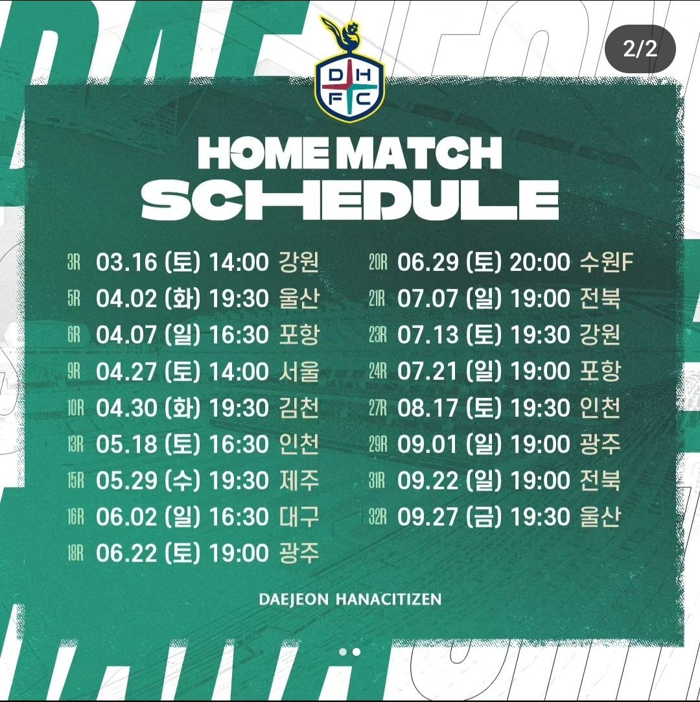

대학원 총학생회 집행부 문화국 2024년 상반기 프로축구 단체관람 사업계획서
===
  

## 행사 주체

-   담당자: 대학원총학생회 문화국 왕성필 (010-4964-3281)
    

## 추진 배경

-   프로축구 단체 관람을 통해 KAIST 학생들의 문화생활 향상 및 소통의 기회 제공.
    
-   대전 연고 구단인 대전하나시티즌 경기를 관람하며 지역 경제 활성화 및 학교 홍보에 일조.
    

## 행사 개요

-   대학원 구성원들을 대상으로 대전하나시티즌 홈경기 단체관람
    
-   180명 분의 티켓 구매 후 대전하나시티즌과의 협업 행사 진행
    
-   현장 참여자에게 간식 비용(쿠폰 혹은 할인권 형태)로 제공 예정

## 행사 일정

-   대전하나시티즌 봄 혹은 가을 홈경기 일정 중 하루를 대전하나시티즌 측과 협의하여 채택

 

## 장소

대전광역시 유성구 한밭대로 지하155 대전월드컵경기장

##  FAQ

-   Q1. 대학원생이 아닌 경우 참여가 어렵나요?  
    A. 대학원생을 우선으로 선정하나, 좌석이 남을 경우 학부생도 참여 가능합니다.
    
-   Q2. 당일에 축구장까지는 어떻게 가나요?  
    A. 따로 교통편이 마련되어 있지 않습니다. 경기 당일에는 경기장 부근이 혼잡하오니 가급적 대중교통을 이용해주시길 바랍니다. 월드컵 경기장 역 혹은 정류장에 도착하면 경기장을 찾는 것은 어렵지 않습니다.
    
-   Q3. KAIST 소속이 아닌 사람과 함께 가도 되나요?  
    A. 교내 구성원에게만 티켓을 배부할 예정입니다.

## 예산

|  **비목** |   **세목**   | **예산** | **산출근거** |
|:----------:|:------------:|:--------:|:--------:|
|일반회계| 티켓비용 | 2,700,000 | 1.5만원X1회X180인 |
|인건비| 행사스텝수당 | 150,000 | 1.5만원X5시간X2인 |
|일반회계|간식비|1,800,000| 1만원X1회X180인 |
|   **합계**  |              | **4,650,000**|  |
