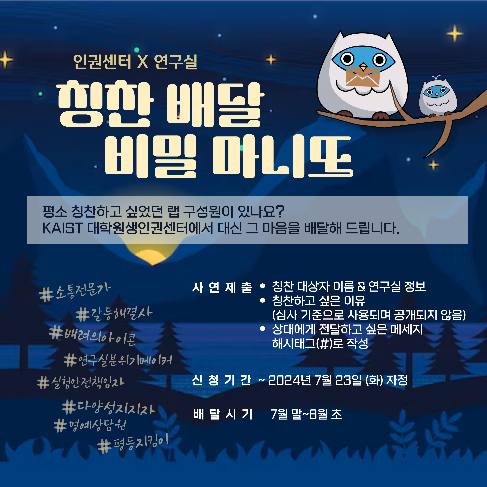



# 2024년 상반기 대학원생인권센터 <[인권센터 X 연구실] 칭찬 배달 비밀 마니또> 사업보고

## 공식 사업명
- 2024년 상반기 대학원생인권센터 <[인권센터 X 연구실] 칭찬 배달 비밀 마니또> 사업

## 담당자
- 대학원생인권센터 센터장

## 추진 배경
-   **칭찬과 격려의 문화 조성**: 대학원 생활에서 학우 간의 칭찬과 격려가 자연스럽게 이루어질 수 있는 문화를 형성하기 위해 본 사업을 기획함. 평소에 표현하기 망설였던 칭찬을 대신 전달함으로써 구성원 간의 유대감을 강화하고, 따뜻한 학내 분위기를 조성하는 데 기여하고자 함.
-   **인권 감수성 증진**: 학내 인권 감수성을 높이는 프로그램이 필요함에 따라, 이 사업을 통해 인권 및 생활 면에서 귀감이 되는 학우들을 찾아내어 그들의 노고를 인정하고 칭찬함으로써 전체적인 인권 의식을 향상시키고자 함.

## 사업 목표
-   **긍정적인 학내 문화 형성**: 학우들이 직접 칭찬하고 싶은 상대를 추천하고, 그 칭찬을 대신 전달함으로써 긍정적이고 따뜻한 학내 문화를 형성하고자 함. 이를 통해 학우들 간의 유대감과 소속감을 강화하고, 더욱 협력적이고 배려하는 환경을 조성하고자 함.
-   **인권 의식 향상**: 인권 및 생활 면에서 귀감이 되는 학우들을 찾아내어 그들의 기여를 인정하고 칭찬함으로써, 학내 인권 의식을 높이고, 모든 구성원이 서로의 인권을 존중하는 문화를 조성하고자 함.
-   **소통과 협력 증진**: 칭찬을 통한 긍정적인 피드백 문화를 정착시켜, 학우들 간의 소통과 협력을 증진시키고, 건강하고 활기찬 연구실 환경을 구축하는 데 기여하고자 함.
-   **인권센터 홍보**: 본 사업을 통해 인권센터의 활동을 자연스럽게 홍보하고, 학생들 사이에서 인권센터에 대한 인지도를 높여, 향후 다양한 인권 관련 프로그램에 대한 참여를 증진시키고자 함.

## 일시
- 2024년 7월 중 

## 장소
- 온라인, 오프라인 (온라인을 통한 사례 수집, 오프라인으로 선물 전달)

## 사업 결과

### 활동 내용 및 참여 현황

-   "칭찬 배달 비밀 마니또" 사업은 현재 활발히 진행 중임. 시작 2일 만에 30명 이상의 학생들이 참여하여 큰 호응을 얻고 있음. 평소에 표현하기 어려웠던 칭찬과 격려의 메시지를 전달함으로써 학우들 간의 유대감을 강화하고 있음. 이로 인해 긍정적인 학내 문화를 조성하는 데 기여하고 있음.

### 향후 계획 및 기대 효과
-   사연 작성 기한은 7월 23일 자정까지임. 이후 접수된 사연들을 인권센터에서 심사 및 각색하여 전체 학생들에게 재배포할 예정임. 이를 통해 학생들이 서로의 노고를 인정하고 격려하는 문화를 더욱 확산시키는 계기가 될 것으로 기대됨. 
- 칭찬받는 학생들에게는 인권센터의 메시지와 칭찬하는 학생이 작성한 해시태그가 포함된 디자인 엽서를 제공하여 보관할 수 있도록 함 
- 추가적으로 1만원 상당의 서브웨이 상품권을 함께 전달하여 감사의 메세지를 전할 예정임. 이로써 학생들 사이의 유대감을 강화하고, 학교 내 긍정적인 분위기를 조성하는 데 크게 기여할 것으로 예상됨.

## 첨부 자료
 

## 결산

  
|  **세목** |   **비목**   | **예산** |**결산**		|
|:----------:|:------------:|:--------:|:--------:|
| 답례품 및 상품구매 비용  | 홍보비 | 500,000 |500,000|
| 예비비  | 예비비 | 500,000 | 496,560 |
|   **합계**  |              |     | 996,560  |

*예비비의 390,000원은 답례품 구매에, 106,560원은 스티커 인쇄비로 활용하였음

	단위:원

