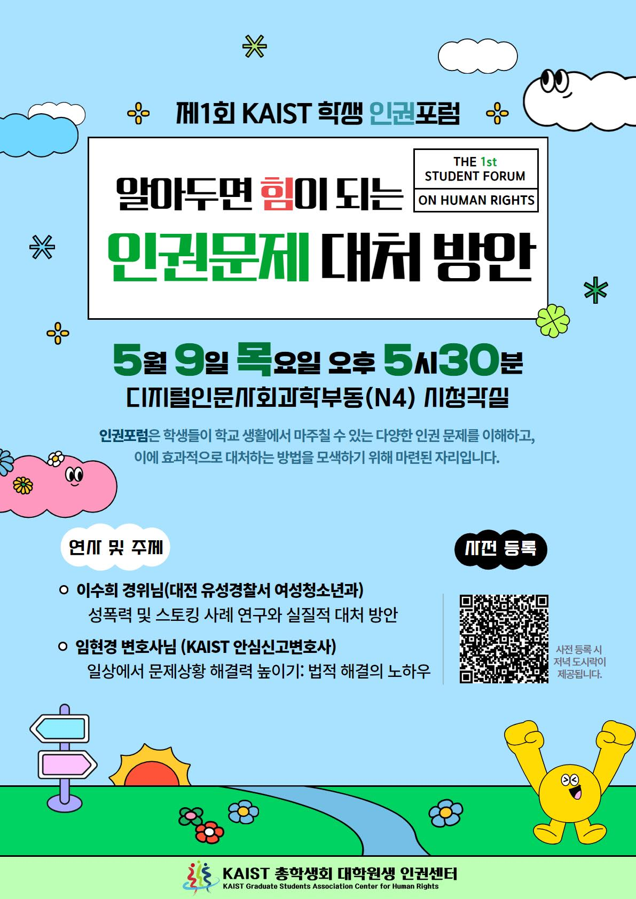
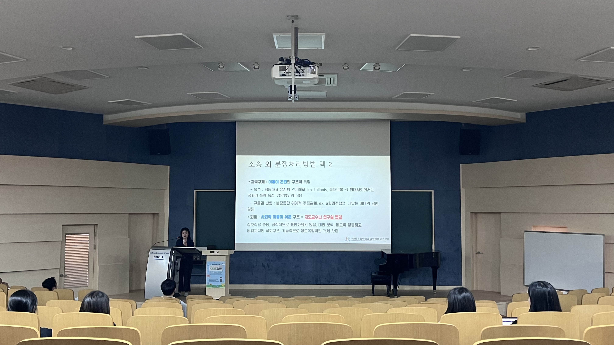
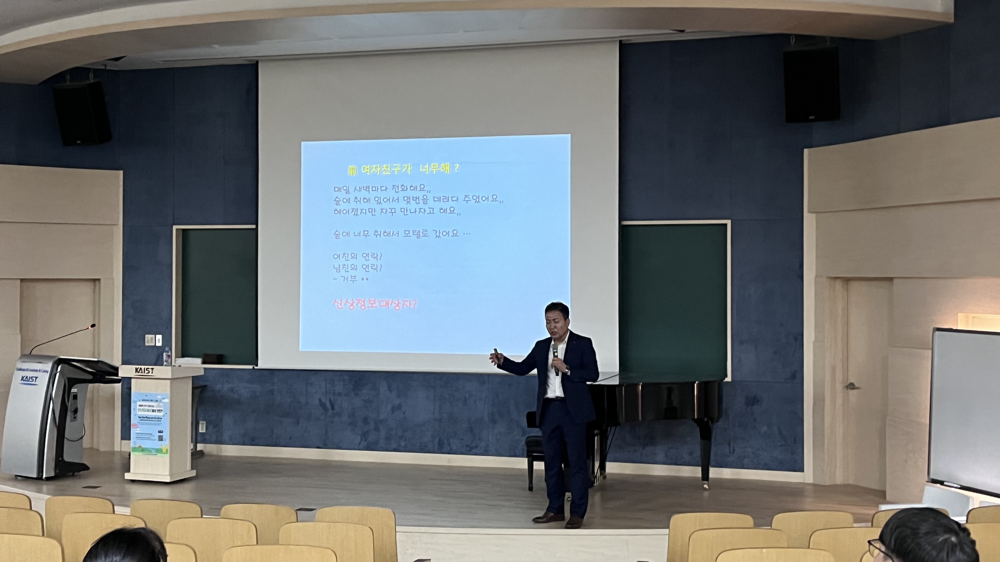



2024년 상반기 대학원생인권센터 < 제1회 학생 인권포럼 "알아두면 힘이 되는 인권 문제 대처 방안"> 사업보고
===

## 공식 사업명
- 2024년 상반기 대학원생인권센터 < 제1회 학생 인권포럼 "알아두면 힘이 되는 인권 문제 대처 방안"> 사업

## 담당자
- 대학원생인권센터 센터장

## 추진 배경
- **전반적인 교내 인권의식 확산** : 교내에서 인권에 대한 의식을 확산시키고 모든 구성원의 관심을 끌어냄으로써 인권을 보다 중요시하도록 노력하는 프로그램이 다소 부족함.
-  **인권 문제 대처 방안 제공** : 학생들이 인권 문제에 직면했을 때 효과적으로 대처할 수 있는 방법을 배우고, 이를 통해 자신의 권리를 보호하고 증진할 수 있도록 도움을 주는 것이 필요함.

## 사업 목표
-  **토론/토의 기반 문제 해결책 모색**  : 다양한 인권문제에 대한 토론과 분석의 장이 필요하며, 이를 통해 인권침해와 불평등에 대한 전반적인 이해도를 높이고, 더 나아가 적절한 해결방안을 모색할 필요가 있음.
-   **인권 관련 네트워킹 구축기회 마련**  : 인권포럼은 관련 전문가, 인권단체, 정부 및 비정부 기관 등 다양한 이해당사자들이 모여 네트워킹할 수 있는 플랫폼을 제공함으로 보다 폭넓은 협업을 촉진하고 협력 구조를 강화시킬 수 있음.
-   **정책 개선 및 개발기회 마련**  : 인권관련 정책개선을 위한 플랫폼을 마련함으로써 현실적으로 생산 가능하며, 기존 대비 더 나은 효과적 결과를 도모하는 포용적 정책을 개발 및 시행하고자 함.

## 일시
- 2024년 5월 9일 목요일 오후 5시 30분

## 장소
- KAIST 디지털인문사회과학부동 (N4) 1층 시청각실

## 사업 진행 결과
-   2024년 5월 9일. 대학원생인권센터에서 제1회 학생 인권포럼 "알아두면 힘이 되는 인권 문제 대처 방안"을 성공적으로 개최하였음.
-   본 포럼의 주요 목적은 학생들이 학교 생활에서 마주칠 수 있는 다양한 인권 문제를 이해하고, 효과적으로 대처하는 방법을 배우는 것이었음.
-   **연사 및 주제**:
    -   이수희 경위님 (대전 유성경찰서 여성청소년과): 성폭력 및 스토킹 사례 연구와 실질적 대처 방안에 대해 발표. 참석자들은 실제 사례를 통해 문제의 심각성과 대처 방안을 구체적으로 배울 수 있었음.
    -   임현경 변호사님 (KAIST 안심신고변호사): 일상에서 문제 상황 해결력 높이기: 법적 해결의 노하우에 대해 강연. 학생들은 법적 절차와 권리 보호 방법에 대해 실질적인 조언을 얻을 수 있었음.
-   **참석자 수**: 총 30여 명의 학생이 참석하였으며, 이 중에는 학부생과 외국인 학생들도 포함되었음. 다양한 배경의 학생들이 참여하여 포럼이 다문화적인 분위기에서 진행됨.
-   **통역 서비스**: 한국어로 진행된 본 포럼에서 외국인 학생들이 소외되지 않도록 국제학생서비스센터(ISSS)에서 동시통역을 지원. 이로 인해 외국인 학생들도 원활하게 포럼 내용을 이해할 수 있었음.
-   **편의 제공**: 사전 신청자들에게는 포럼 당일 저녁 도시락이 제공되어, 참석자들이 편안한 분위기에서 포럼에 집중할 수 있도록 하였음.
-   이번 포럼은 학생들이 인권 문제를 보다 깊이 이해하고, 효과적으로 대처할 수 있는 방법을 배우는 중요한 기회가 되었으며, 향후 더 많은 학생들이 참여할 수 있도록 지속적으로 노력할 계획임.

## 첨부 자료
 

 

## 결산

|  **세목** |   **비목**   | **예산** | **결산**	|
|:----------:|:------------:|:--------:|:--------:|
| 전문가초청 비용 (임현경 변호사,이수희 경위)  | 일반회계 | 1,000,000 |	1,000,000	|
| 홍보 및 식사 구매 비용  | 일반회계 | 500,000 |	495,000	|
| 포스터 인쇄, 연사 식사 등  | 예비비 | 500,000 |	180,000	|
|   **합계**  |            |   |    1,675,000    |

	단위:원

