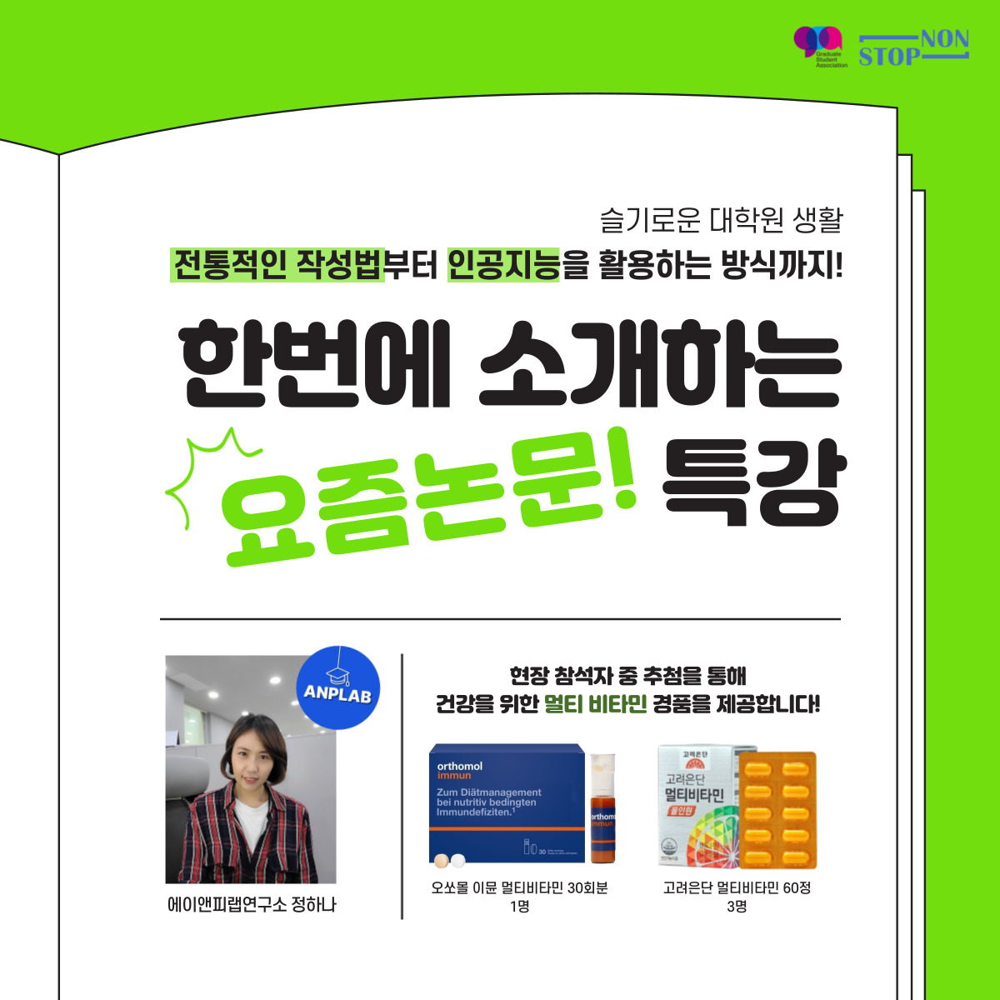

대학원 총학생회 집행부 문화국 2024년 상반기 슬기로운 대학원 생활 사업보고서
===

## 공식 사업명
- 2024년 상반기 슬기로운 대학원 생활

## 담당자
- 제52대 대학원 총학생회 문화국장

## 추진 배경
- 신입생 오리엔테이션을 통해 제공되는 정보 외에도 대학원 신입생들이 궁금해하지만 답을 얻기 힘든 문제들이 많다는 의견이 제기되어옴.
- 연구자로서, 학생으로서, 성인으로서 대학원생들에게 도움이 될 만한 주제들을 선정하여 다회에 걸친 강연을 진행하고자 함.

## 사업 목표
- 평균 참석자 75명
- 실제 달성 여부: X (1~3회차 ⇒ 누적 현장 참석자 약 120명)
- 온오프라인 동시 송출로 변경하면서 현장 참석자 수가 감소한 것으로 추정됨.
 
## 일시
|  **회차** |   **일시**   | **연사** | **제목** | **장소** |
|:----------:|:------------:|:--------:|:--------:|:--------:|
|      1      |2024-04-25 (목) 1:00PM| 김서영 강사님(전직 은행원& 보험 설계사) | 사회초년생을 위한 보험 가이드: 돈 관리부터 노후 준비까지! |KI 빌딩 Matrix hall |
|      2      |2024-05-17 (금) 7:00PM| 에이앤피랩연구소 정하나님 | 전통적인 작성법부터 인공지능을 활용한 방식까지! 요즘논문! 특강 | 의과학연구센터 하자유욱준홀 |
|      3      |2024-06-28 (화) 1:00PM| 서민금융진흥원 위촉강사 정현주님 |기타소득자와 청년의 금융생활 | 의과학연구센터 하자유욱준홀 |

## 사업 진행 결과
- 강연 전 이메일, 포탈 공지, SNS 등을 활용하여 학생들에게 강연에 대해 홍보하여 참가자를 모집함.
- 강연은 Zoom을 활용해 온오프라인 동시 송출을 지향하여 진행하여 더 많은 학우들이 유익한 정보를 얻어갈 수 있는 기회를 제공함.  
- 일부 연사들로부터 강연자료를 공유 받아 학생들이 열람할 수 있도록 슬기로운 대학원 생활 웹사이트에 업로드 함.
	- 웹사이트 링크:  [https://gsa.kaist.ac.kr/wise-graduate-life](https://gsa.kaist.ac.kr/wise-graduate-life)

## 결산: 총 예산 2,850,000 원 중 1,407,770 원 집행

- 일반회계: 2,400,000 원 중 1,000,000 원 집행
- 학생회계: 450,000 원 중 407,770 원 집행
- 3회차 강연은 서민금융진흥원을 통한 강연으로 연사비를 받지 않았음. 

|  **비목** |   **세목**   | **예산** | **결산** |**비고**|
|:----------:|:------------:|:--------:|:--------:|:--------:|
|일반회계| 연사비 | 2,000,000 | 1,000,000 | 50만원 X 2회 |
|일반회계| 홍보물 제작비 |400,000 | 0 ||
|홍보비|참가자 경품비| 450,000| 407,770 ||
|   **사업비 총액**  |     | **2,850,000** | **1,407,770** ||
|   **일반회계 총액**  |    | **2,400,000** | **1,000,000** ||
|   **학생회계 총액**  |     |**450,000** | **407,770** ||

단위:원

## 사진
 
 
 
