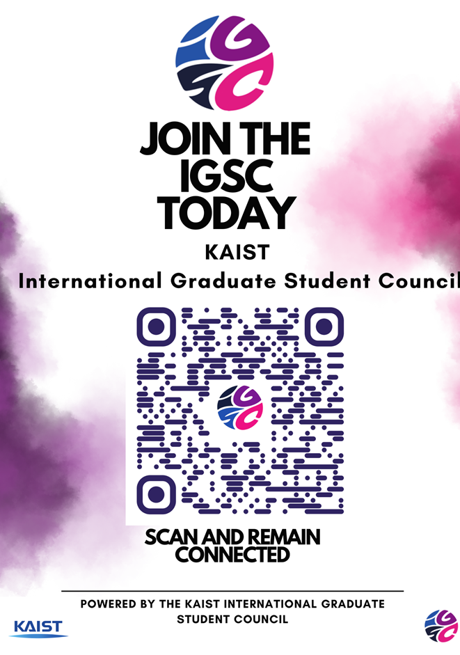

# 외국인대학원생자치회: 교외 거주 외국인 대학원생 KVPN 이용 지원 사업

**공식 사업명**

- 교외 거주 외국인 대학원생 KVPN 이용 지원 사업

**담당자**

- 외국인 대학원생 자치회 임원진

**추진 배경**

- 교외 거주 외국인 대학원생(특히 궁동동(Munji/Gundong) 기혼자 아파트 거주자)의 경우 KAIST 내부 네트워크에 직접 연결되지 않아 학술논문, 전자저널 및 교내 전산서비스 이용에 어려움을 겪는 사례가 지속적으로 접수됨.
- KVPN 이용 방법에 대한 안내 자료가 대부분 한국어 또는 분산되어 있어 신규 유학생들이 접근하기 어려운 문제가 확인됨.
- 연구환경 개선과 정보 접근성 향상을 위해 영문 안내자료를 제작하고 적극적인 홍보가 필요하다고 판단함.

**사업 목표**

- 교외 거주 외국인 대학원생의 연구환경 개선 및 학술정보 접근성 향상
- KVPN 이용 절차를 영문으로 표준화하여 신규 학생들의 이용 편의성 증대
- 반복적으로 발생하는 KVPN 관련 문의 감소 및 행정 효율성 향상

**사업 진행 개요**

- 영문 KVPN 이용 가이드라인 제작
- 시각자료(포스터) 디자인 및 제작
- 기혼자 아파트 및 교외 학생 거주지역 게시판, 엘리베이터, 계단 등에 안내 포스터 게시 (예정)
- 온라인 채널을 통한 안내자료 병행 배포 (예정)

**사업 진행 세부**

- KVPN 설치 방법, 로그인 절차 및 주요 오류 해결 방법을 포함한 영문 가이드라인 작성
- 외국인 학생이 쉽게 이해할 수 있도록 단계별 이미지와 설명을 포함한 안내 포스터 제작
- 문동 기혼자 아파트를 중심으로 주요 게시판 및 공용공간에 홍보물 게시
- 향후 신규 입학생 대상 안내자료로 지속 활용할 수 있도록 디지털 파일을 보관 및 관리

**결산**

본 사업은 자체 제작 자료를 활용하여 학생회계상의 지출은 발생하지 않음.
