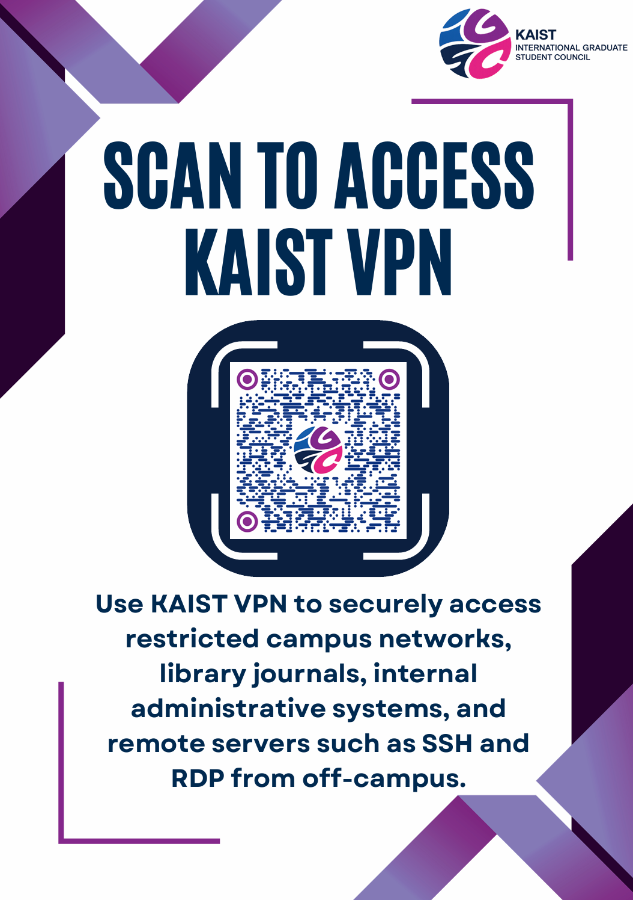

# 외국인대학원생자치회: 2026년도 상반 사업 보고서 1

**공식 사업명**

- 외국인 대학원생 자치회 출범 홍보 사업

**담당자**

- 외국인 대학원생 자치회 임원진

**추진 배경**

- 외국인 대학원생 자치회가 신규 설립됨에 따라 학생들에게 자치회의 역할과 기능을 알리고 참여를 확대할 필요가 있었음.
- 외국인 대학원생과의 소통 창구를 구축하고 향후 사업 참여 기반을 마련하기 위해 적극적인 홍보가 요구됨.

**사업 목표**

- 외국인 대학원생 자치회의 인지도 제고
- 공식 SNS 및 온라인 소통 채널 활성화
- 신규 학생들의 자치회 참여 확대 및 네트워크 구축

**사업 진행 개요**

- 2026 국제 푸드 페스티벌 행사 참여
- 대학원총학생회 및 청렴시민가사관와 협력하여 현장 홍보 진행
- 홍보 포스터 제작 및 SNS 홍보 병행

**사업 진행 세부**

- 감사위원회 부스를 활용하여 외자회 소개 자료를 전시
- 행사 참가 학생들에게 자치회의 설립 목적과 주요 활동을 소개
- 인스타 QR코드를 포함한 홍보 포스터를 제작하여 현장 배치
- SNS 팔로우 이벤트를 통해 학생들의 참여를 유도
- 행사 종료 후 인스타 신규 팔로워 **27명**을 확보하였으며, 이후 학생들의 문의 및 참여가 증가하는 성과를 확인함.
- 향후 외국인 대학원 신입생 OT에서도 동일한 홍보 방식을 확대 적용할 계획임.

**결산**

본 사업의 홍보물 제작 및 행사 운영은 감사팀 지원을 받아 진행되었으며, 학생회계상의 지출은 발생하지 않음.